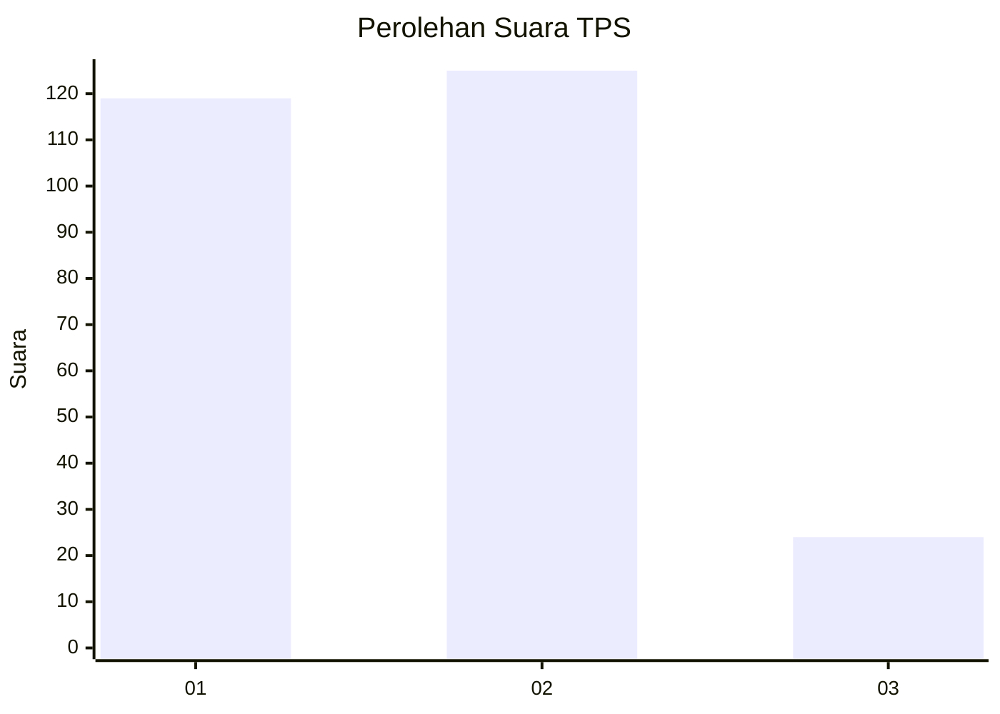
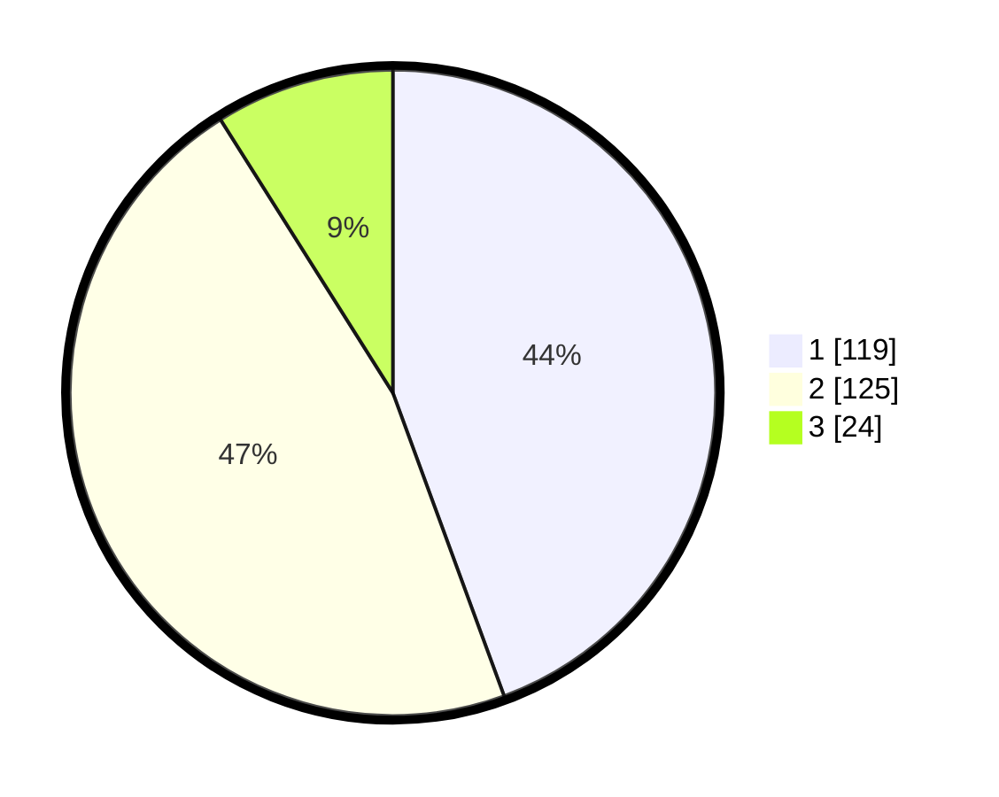

# Hasil

## Grafik

## Tabel

| No. | Nama Paslon    | Suara | Suara (raw) | Persentase |
|:--- |:-------------- | -----:| -----------:| ----------:|
| 1   | ANIES MUHAIMIN | 119   | [119][p-1]  | 44,40      |
| 2   | PRABOWO GIBRAN | 125   | [125][p-2]  | 46,64      |
| 3   | GANJAR MAHFUD  | 24    | [24][p-3]   | 8,96       |

[p-1]: https://github.com/gigit-pemilu/pemilu-2024/blob/main/pilpres/hitung-suara/sub/36-banten/sub/03-tangerang/sub/23-cisauk/sub/2005-suradita/sub/057-tps/sub/paslon-1.txt
[p-2]: https://github.com/gigit-pemilu/pemilu-2024/blob/main/pilpres/hitung-suara/sub/36-banten/sub/03-tangerang/sub/23-cisauk/sub/2005-suradita/sub/057-tps/sub/paslon-2.txt
[p-3]: https://github.com/gigit-pemilu/pemilu-2024/blob/main/pilpres/hitung-suara/sub/36-banten/sub/03-tangerang/sub/23-cisauk/sub/2005-suradita/sub/057-tps/sub/paslon-3.txt

## Foto C Plano

https://sirekap-obj-formc.kpu.go.id/631c/pemilu/ppwp/36/03/23/20/05/3603232005057-20240224-162739--5eb4977b-a54d-4cb2-b4c4-708be625461c.jpg

https://sirekap-obj-formc.kpu.go.id/631c/pemilu/ppwp/36/03/23/20/05/3603232005057-20240224-162931--2e6883ea-4004-495e-bf3c-3cfc238bad29.jpg

https://sirekap-obj-formc.kpu.go.id/631c/pemilu/ppwp/36/03/23/20/05/3603232005057-20240224-163103--35e8c7ae-1583-4852-9115-b2d92b7a643c.jpg

## Metadata

| Key        | Value               |
| ---------- | ------------------- |
| Time Stamp | 2024-02-24 22:31:28 |

