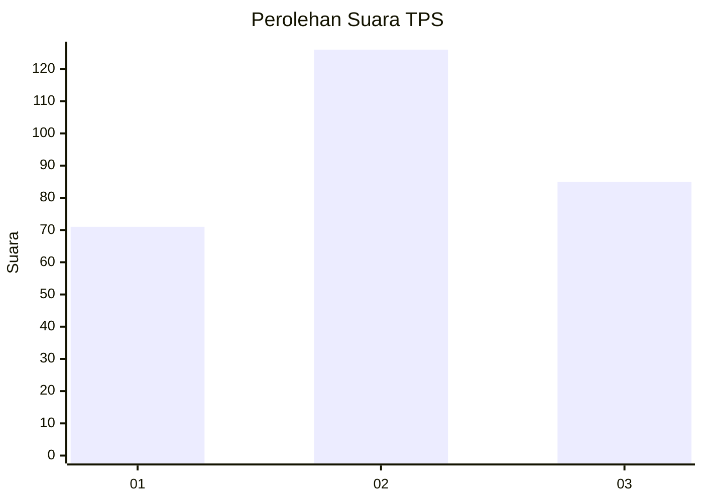
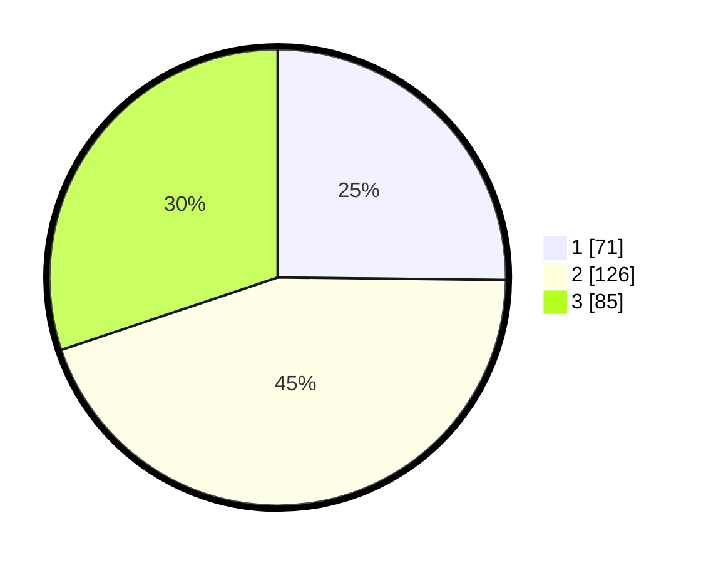

# Hasil

## Grafik

## Tabel

| No. | Nama Paslon    | Suara | Suara (raw) | Persentase |
|:--- |:-------------- | -----:| -----------:| ----------:|
| 1   | ANIES MUHAIMIN | 71    | [71][p-1]   | 25,18      |
| 2   | PRABOWO GIBRAN | 126   | [126][p-2]  | 44,68      |
| 3   | GANJAR MAHFUD  | 85    | [85][p-3]   | 30,14      |

[p-1]: https://github.com/gigit-pemilu/pemilu-2024-36-banten/blob/main/pilpres/hitung-suara/sub/36-banten/sub/03-tangerang/sub/23-cisauk/sub/2005-suradita/sub/076-tps/sub/paslon-1.txt
[p-2]: https://github.com/gigit-pemilu/pemilu-2024-36-banten/blob/main/pilpres/hitung-suara/sub/36-banten/sub/03-tangerang/sub/23-cisauk/sub/2005-suradita/sub/076-tps/sub/paslon-2.txt
[p-3]: https://github.com/gigit-pemilu/pemilu-2024-36-banten/blob/main/pilpres/hitung-suara/sub/36-banten/sub/03-tangerang/sub/23-cisauk/sub/2005-suradita/sub/076-tps/sub/paslon-3.txt

## Foto C Plano

https://sirekap-obj-formc.kpu.go.id/adb0/pemilu/ppwp/36/03/23/20/05/3603232005076-20240226-210221--a9c0e114-c853-4272-b081-67964f4d829b.jpg

https://sirekap-obj-formc.kpu.go.id/adb0/pemilu/ppwp/36/03/23/20/05/3603232005076-20240224-205221--cf25e67c-ce77-496c-8b3f-a42e8627b7e9.jpg

https://sirekap-obj-formc.kpu.go.id/adb0/pemilu/ppwp/36/03/23/20/05/3603232005076-20240224-210425--9633462f-f3c8-4e17-a0fe-69c7054f75c8.jpg

## Metadata

| Key        | Value               |
| ---------- | ------------------- |
| Time Stamp | 2024-02-28 21:00:00 |

