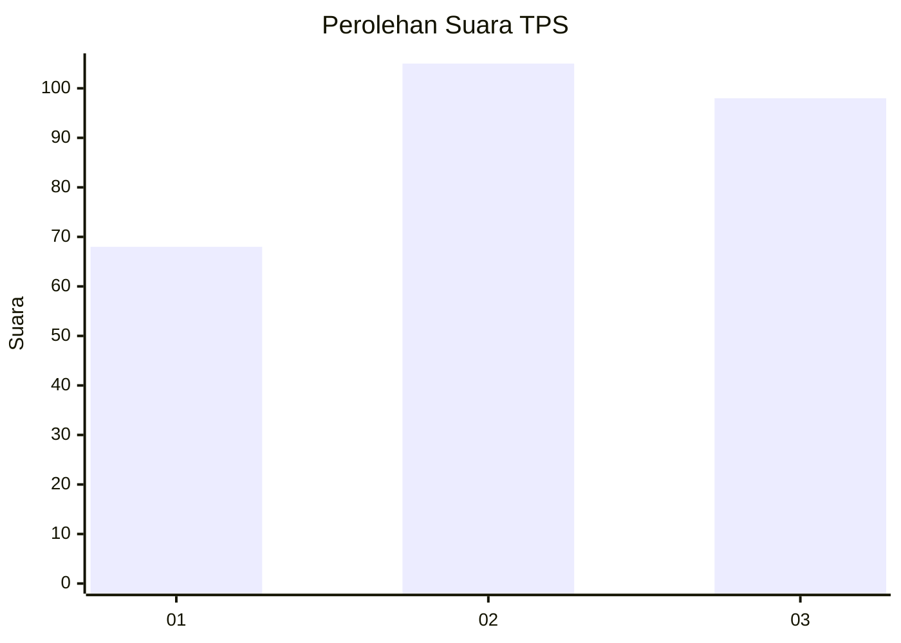
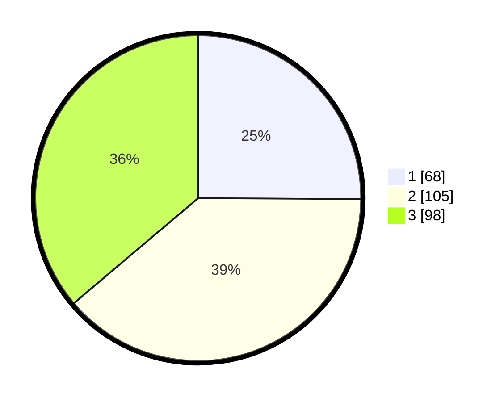

# Hasil

## Grafik

## Tabel

| No. | Nama Paslon    | Suara | Suara (raw) | Persentase |
|:--- |:-------------- | -----:| -----------:| ----------:|
| 1   | ANIES MUHAIMIN | 68    | [68][p-1]   | 25,09      |
| 2   | PRABOWO GIBRAN | 105   | [105][p-2]  | 38,75      |
| 3   | GANJAR MAHFUD  | 98    | [98][p-3]   | 36,16      |

[p-1]: https://github.com/gigit-pemilu/pemilu-2024-36-banten/blob/main/pilpres/hitung-suara/sub/36-banten/sub/03-tangerang/sub/23-cisauk/sub/2006-sampora/sub/014-tps/sub/paslon-1.txt
[p-2]: https://github.com/gigit-pemilu/pemilu-2024-36-banten/blob/main/pilpres/hitung-suara/sub/36-banten/sub/03-tangerang/sub/23-cisauk/sub/2006-sampora/sub/014-tps/sub/paslon-2.txt
[p-3]: https://github.com/gigit-pemilu/pemilu-2024-36-banten/blob/main/pilpres/hitung-suara/sub/36-banten/sub/03-tangerang/sub/23-cisauk/sub/2006-sampora/sub/014-tps/sub/paslon-3.txt

## Foto C Plano

https://sirekap-obj-formc.kpu.go.id/1a49/pemilu/ppwp/36/03/23/20/06/3603232006014-20240224-165150--ad86485b-f7d8-4a1a-a8bc-99a6752e8ceb.jpg

https://sirekap-obj-formc.kpu.go.id/1a49/pemilu/ppwp/36/03/23/20/06/3603232006014-20240224-165258--0779ea2d-6065-4637-8009-51ede71501cf.jpg

https://sirekap-obj-formc.kpu.go.id/1a49/pemilu/ppwp/36/03/23/20/06/3603232006014-20240224-165438--8c5a37a0-62dc-4966-935c-74369de30190.jpg

## Metadata

| Key        | Value               |
| ---------- | ------------------- |
| Time Stamp | 2024-02-25 17:00:00 |

