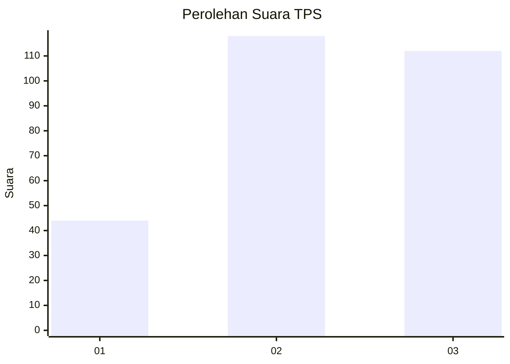
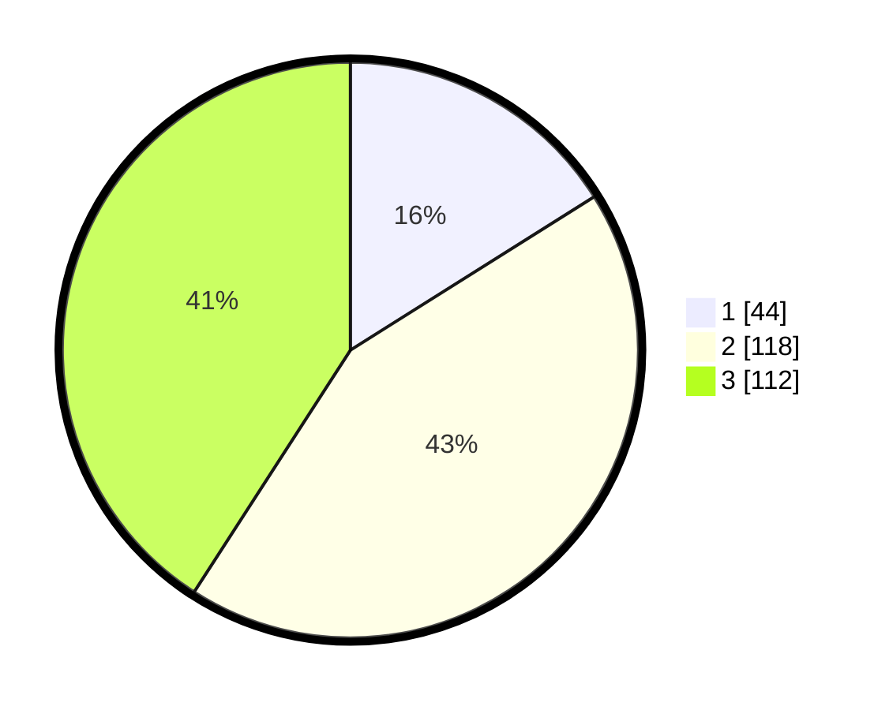

# Hasil

## Grafik

## Tabel

| No. | Nama Paslon    | Suara | Suara (raw) | Persentase |
|:--- |:-------------- | -----:| -----------:| ----------:|
| 1   | ANIES MUHAIMIN | 44    | [44][p-1]   | 16,06      |
| 2   | PRABOWO GIBRAN | 118   | [118][p-2]  | 43,07      |
| 3   | GANJAR MAHFUD  | 112   | [112][p-3]  | 40,88      |

[p-1]: https://github.com/gigit-pemilu/pemilu-2024-36-banten/blob/main/pilpres/hitung-suara/sub/36-banten/sub/03-tangerang/sub/23-cisauk/sub/2006-sampora/sub/015-tps/sub/paslon-1.txt
[p-2]: https://github.com/gigit-pemilu/pemilu-2024-36-banten/blob/main/pilpres/hitung-suara/sub/36-banten/sub/03-tangerang/sub/23-cisauk/sub/2006-sampora/sub/015-tps/sub/paslon-2.txt
[p-3]: https://github.com/gigit-pemilu/pemilu-2024-36-banten/blob/main/pilpres/hitung-suara/sub/36-banten/sub/03-tangerang/sub/23-cisauk/sub/2006-sampora/sub/015-tps/sub/paslon-3.txt

## Foto C Plano

https://sirekap-obj-formc.kpu.go.id/0ec0/pemilu/ppwp/36/03/23/20/06/3603232006015-20240224-121231--9d2b5a7d-767b-435e-a7ff-c981b94c2411.jpg

https://sirekap-obj-formc.kpu.go.id/0ec0/pemilu/ppwp/36/03/23/20/06/3603232006015-20240224-121321--2c918206-43a9-49d2-abe1-f009e3be340a.jpg

https://sirekap-obj-formc.kpu.go.id/0ec0/pemilu/ppwp/36/03/23/20/06/3603232006015-20240224-121405--1da18505-2c77-49c9-b86a-89f0183ca0c7.jpg

## Metadata

| Key        | Value               |
| ---------- | ------------------- |
| Time Stamp | 2024-02-29 19:00:00 |

