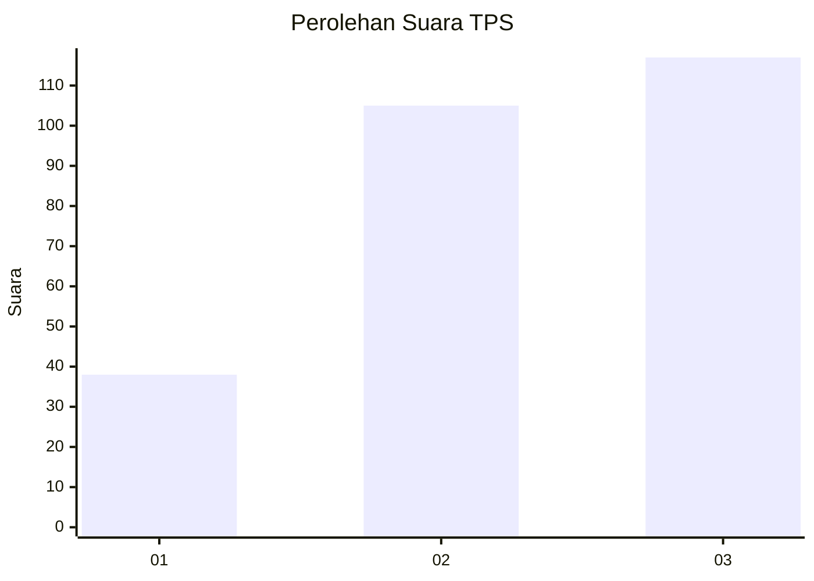
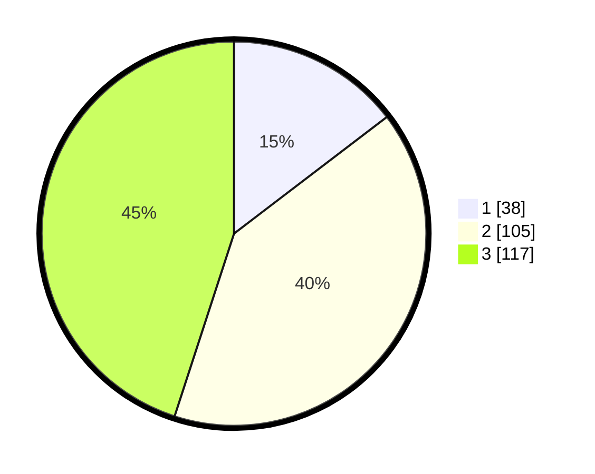

# Hasil

## Grafik

## Tabel

| No. | Nama Paslon    | Suara | Suara (raw) | Persentase |
|:--- |:-------------- | -----:| -----------:| ----------:|
| 1   | ANIES MUHAIMIN | 38    | [38][p-1]   | 14,62      |
| 2   | PRABOWO GIBRAN | 105   | [105][p-2]  | 40,38      |
| 3   | GANJAR MAHFUD  | 117   | [117][p-3]  | 45,00      |

[p-1]: https://github.com/gigit-pemilu/pemilu-2024-36-banten/blob/main/pilpres/hitung-suara/sub/36-banten/sub/03-tangerang/sub/23-cisauk/sub/2006-sampora/sub/020-tps/sub/paslon-1.txt
[p-2]: https://github.com/gigit-pemilu/pemilu-2024-36-banten/blob/main/pilpres/hitung-suara/sub/36-banten/sub/03-tangerang/sub/23-cisauk/sub/2006-sampora/sub/020-tps/sub/paslon-2.txt
[p-3]: https://github.com/gigit-pemilu/pemilu-2024-36-banten/blob/main/pilpres/hitung-suara/sub/36-banten/sub/03-tangerang/sub/23-cisauk/sub/2006-sampora/sub/020-tps/sub/paslon-3.txt

## Foto C Plano

https://sirekap-obj-formc.kpu.go.id/8dff/pemilu/ppwp/36/03/23/20/06/3603232006020-20240224-213638--f3447235-b1fe-4706-9eeb-ff4f4db4208a.jpg

https://sirekap-obj-formc.kpu.go.id/8dff/pemilu/ppwp/36/03/23/20/06/3603232006020-20240224-213727--df245b48-e572-4b30-a79e-d106ea4d4de2.jpg

https://sirekap-obj-formc.kpu.go.id/8dff/pemilu/ppwp/36/03/23/20/06/3603232006020-20240224-213847--3ec2aae2-1592-419b-848e-49835ad25c6f.jpg

## Metadata

| Key        | Value               |
| ---------- | ------------------- |
| Time Stamp | 2024-02-28 19:00:00 |

