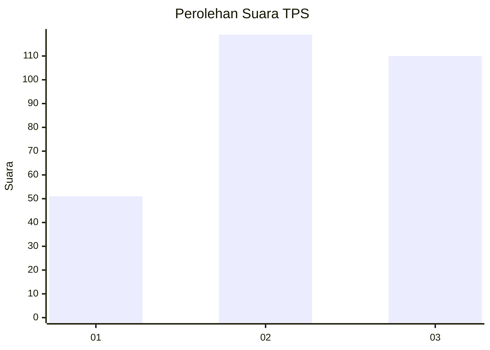
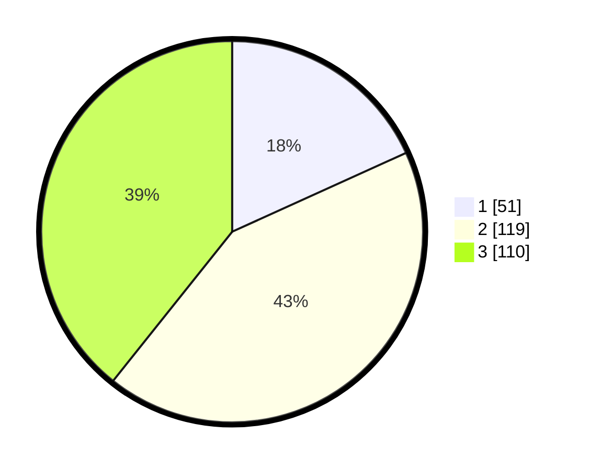

# Hasil

## Grafik

## Tabel

| No. | Nama Paslon    | Suara | Suara (raw) | Persentase |
|:--- |:-------------- | -----:| -----------:| ----------:|
| 1   | ANIES MUHAIMIN | 51    | [51][p-1]   | 18,21      |
| 2   | PRABOWO GIBRAN | 119   | [119][p-2]  | 42,50      |
| 3   | GANJAR MAHFUD  | 110   | [110][p-3]  | 39,29      |

[p-1]: https://github.com/gigit-pemilu/pemilu-2024-36-banten/blob/main/pilpres/hitung-suara/sub/36-banten/sub/03-tangerang/sub/23-cisauk/sub/2006-sampora/sub/022-tps/sub/paslon-1.txt
[p-2]: https://github.com/gigit-pemilu/pemilu-2024-36-banten/blob/main/pilpres/hitung-suara/sub/36-banten/sub/03-tangerang/sub/23-cisauk/sub/2006-sampora/sub/022-tps/sub/paslon-2.txt
[p-3]: https://github.com/gigit-pemilu/pemilu-2024-36-banten/blob/main/pilpres/hitung-suara/sub/36-banten/sub/03-tangerang/sub/23-cisauk/sub/2006-sampora/sub/022-tps/sub/paslon-3.txt

## Foto C Plano

https://sirekap-obj-formc.kpu.go.id/0721/pemilu/ppwp/36/03/23/20/06/3603232006022-20240224-135110--587b7618-5857-4c9d-adb5-b8afa0c4808e.jpg

https://sirekap-obj-formc.kpu.go.id/0721/pemilu/ppwp/36/03/23/20/06/3603232006022-20240224-135246--011459a7-fa21-49ad-87f8-cdffdc052bc0.jpg

https://sirekap-obj-formc.kpu.go.id/0721/pemilu/ppwp/36/03/23/20/06/3603232006022-20240224-135349--bba737a9-48a1-4b38-827d-10c157e182f5.jpg

## Metadata

| Key        | Value               |
| ---------- | ------------------- |
| Time Stamp | 2024-02-28 20:00:00 |

