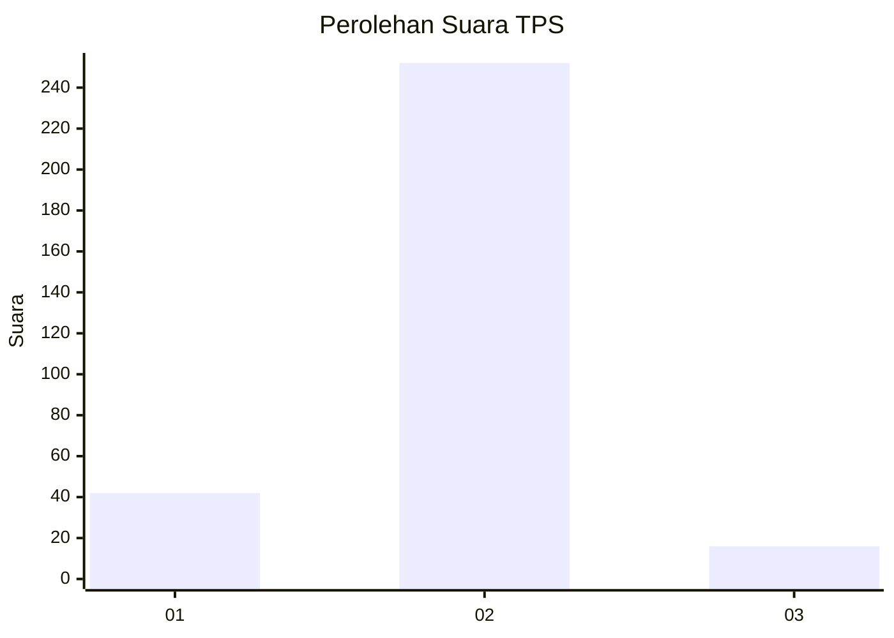
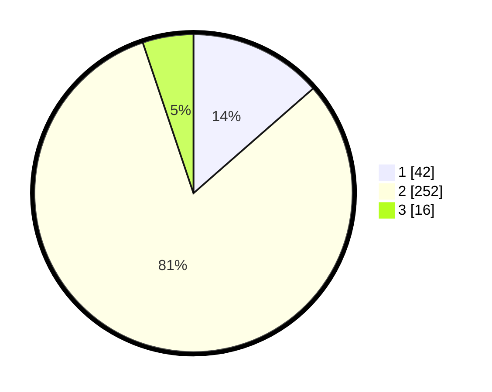

# Hasil

## Grafik

## Tabel

| No. | Nama Paslon    | Suara | Suara (raw) | Persentase |
|:--- |:-------------- | -----:| -----------:| ----------:|
| 1   | ANIES MUHAIMIN | 42    | [42][p-1]   | 13,55      |
| 2   | PRABOWO GIBRAN | 252   | [252][p-2]  | 81,29      |
| 3   | GANJAR MAHFUD  | 16    | [16][p-3]   | 5,16       |

[p-1]: https://github.com/gigit-pemilu/pemilu-2024-36-banten/blob/main/pilpres/hitung-suara/sub/36-banten/sub/03-tangerang/sub/23-cisauk/sub/2009-dangdang/sub/002-tps/sub/paslon-1.txt
[p-2]: https://github.com/gigit-pemilu/pemilu-2024-36-banten/blob/main/pilpres/hitung-suara/sub/36-banten/sub/03-tangerang/sub/23-cisauk/sub/2009-dangdang/sub/002-tps/sub/paslon-2.txt
[p-3]: https://github.com/gigit-pemilu/pemilu-2024-36-banten/blob/main/pilpres/hitung-suara/sub/36-banten/sub/03-tangerang/sub/23-cisauk/sub/2009-dangdang/sub/002-tps/sub/paslon-3.txt

## Foto C Plano

https://sirekap-obj-formc.kpu.go.id/f4e8/pemilu/ppwp/36/03/23/20/09/3603232009002-20240217-153116--503e21ee-b871-4172-813d-b6d6dd55028d.jpg

https://sirekap-obj-formc.kpu.go.id/f4e8/pemilu/ppwp/36/03/23/20/09/3603232009002-20240217-153214--76ad56f5-4f0d-43e1-92af-df1f0fd981e0.jpg

https://sirekap-obj-formc.kpu.go.id/f4e8/pemilu/ppwp/36/03/23/20/09/3603232009002-20240217-153312--9fa3ac10-9f88-4333-9cf0-b8d51185dcb2.jpg

## Metadata

| Key        | Value               |
| ---------- | ------------------- |
| Time Stamp | 2024-02-17 16:00:02 |

## DATA PEMILIH TETAP

Jumlah pemilih dalam DPT: **255**.
 * L: **132**.
 * P: **123**.

## DATA PENGGUNA HAK PILIH

Jumlah pengguna hak pilih dalam DPT: **223**.
 * L: **113**.
 * P: **110**.

Jumlah pengguna hak pilih dalam DPTb: **0**.
 * L: **10**.
 * P: **10**.

Jumlah pengguna hak pilih dalam DPK: **30**.
 * L: **40**.
 * P: **10**.

Jumlah pengguna hak pilih: **132**.
 * L: **281**.
 * P: **151**.

## JUMLAH SUARA SAH DAN TIDAK SAH

JUMLAH SELURUH SUARA SAH: **210**.

JUMLAH SUARA TIDAK SAH: **17**.

JUMLAH SELURUH SUARA SAH DAN SUARA TIDAK SAH: **228**.

