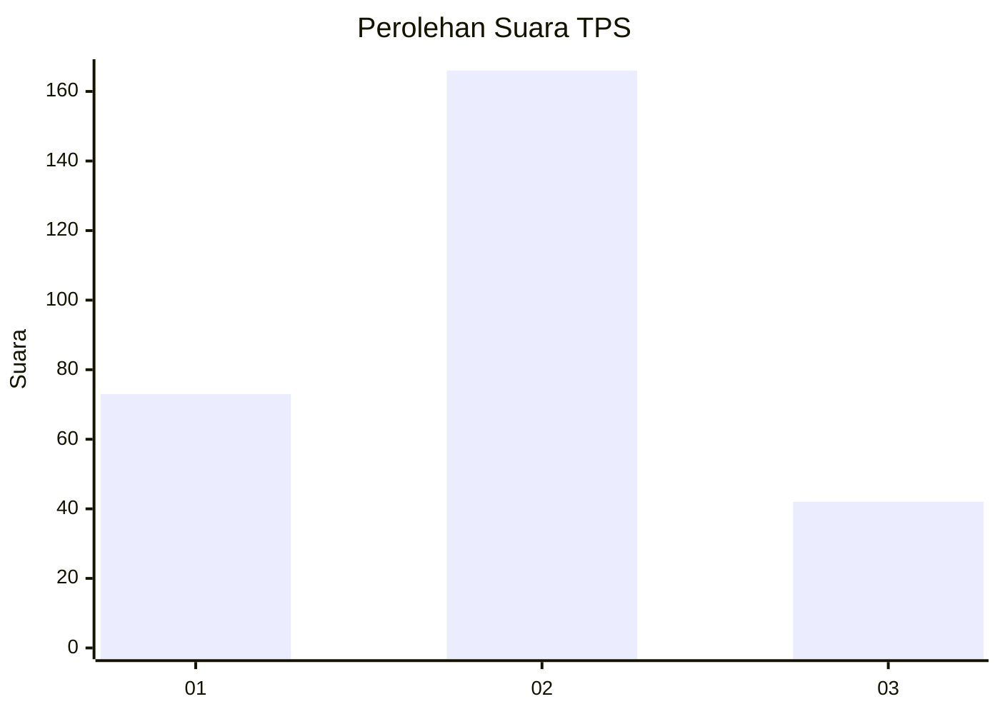
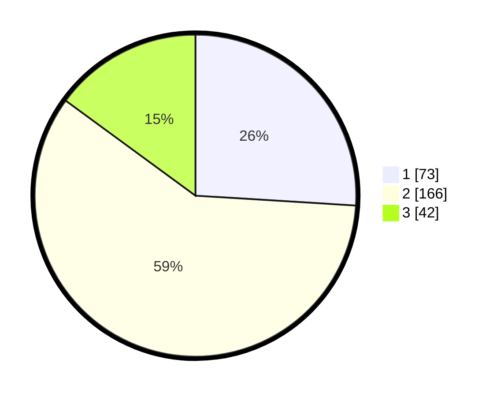

# Hasil

## Grafik

## Tabel

| No. | Nama Paslon    | Suara | Suara (raw) | Persentase |
|:--- |:-------------- | -----:| -----------:| ----------:|
| 1   | ANIES MUHAIMIN | 73    | [73][p-1]   | 25,98      |
| 2   | PRABOWO GIBRAN | 166   | [166][p-2]  | 59,07      |
| 3   | GANJAR MAHFUD  | 42    | [42][p-3]   | 14,95      |

[p-1]: https://github.com/gigit-pemilu/pemilu-2024/blob/main/pilpres/hitung-suara/sub/36-banten/sub/03-tangerang/sub/23-cisauk/sub/2009-dangdang/sub/012-tps/sub/paslon-1.txt
[p-2]: https://github.com/gigit-pemilu/pemilu-2024/blob/main/pilpres/hitung-suara/sub/36-banten/sub/03-tangerang/sub/23-cisauk/sub/2009-dangdang/sub/012-tps/sub/paslon-2.txt
[p-3]: https://github.com/gigit-pemilu/pemilu-2024/blob/main/pilpres/hitung-suara/sub/36-banten/sub/03-tangerang/sub/23-cisauk/sub/2009-dangdang/sub/012-tps/sub/paslon-3.txt

## Foto C Plano

https://sirekap-obj-formc.kpu.go.id/54e0/pemilu/ppwp/36/03/23/20/09/3603232009012-20240220-223820--11ef45ab-6613-41a5-845e-a7c790126faa.jpg

https://sirekap-obj-formc.kpu.go.id/54e0/pemilu/ppwp/36/03/23/20/09/3603232009012-20240220-223837--c86e2ea8-f50f-47c3-9362-2e041d10547a.jpg

https://sirekap-obj-formc.kpu.go.id/54e0/pemilu/ppwp/36/03/23/20/09/3603232009012-20240220-223911--ee6ae040-7b53-4d8b-8f73-5e9a09c1d1a1.jpg

## Metadata

| Key        | Value               |
| ---------- | ------------------- |
| Time Stamp | 2024-02-24 22:31:28 |

