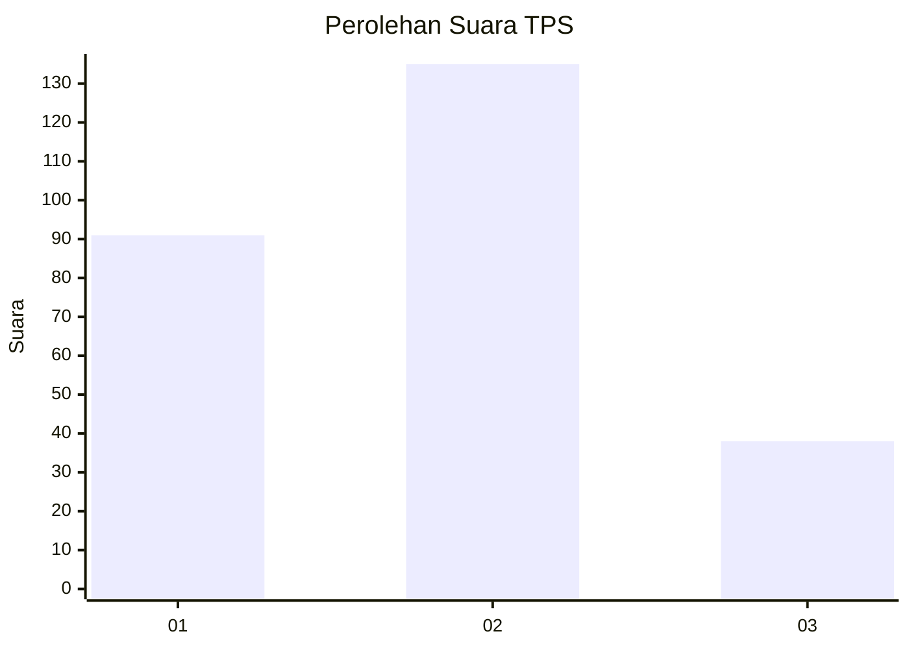
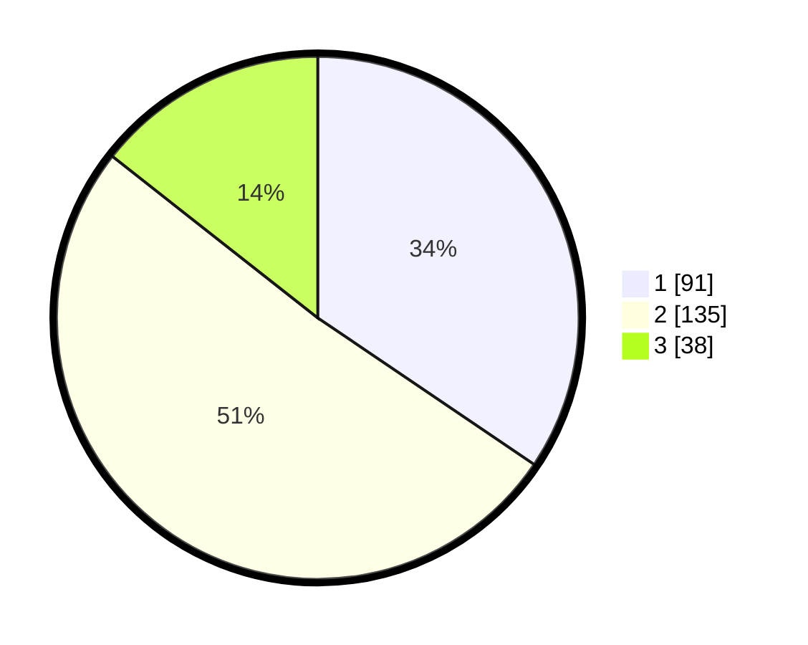

# Hasil

## Grafik

## Tabel

| No. | Nama Paslon    | Suara | Suara (raw) | Persentase |
|:--- |:-------------- | -----:| -----------:| ----------:|
| 1   | ANIES MUHAIMIN | 91    | [91][p-1]   | 34,47      |
| 2   | PRABOWO GIBRAN | 135   | [135][p-2]  | 51,14      |
| 3   | GANJAR MAHFUD  | 38    | [38][p-3]   | 14,39      |

[p-1]: https://github.com/gigit-pemilu/pemilu-2024-36-banten/blob/main/pilpres/hitung-suara/sub/36-banten/sub/03-tangerang/sub/23-cisauk/sub/2011-cibogo/sub/011-tps/sub/paslon-1.txt
[p-2]: https://github.com/gigit-pemilu/pemilu-2024-36-banten/blob/main/pilpres/hitung-suara/sub/36-banten/sub/03-tangerang/sub/23-cisauk/sub/2011-cibogo/sub/011-tps/sub/paslon-2.txt
[p-3]: https://github.com/gigit-pemilu/pemilu-2024-36-banten/blob/main/pilpres/hitung-suara/sub/36-banten/sub/03-tangerang/sub/23-cisauk/sub/2011-cibogo/sub/011-tps/sub/paslon-3.txt

## Foto C Plano

https://sirekap-obj-formc.kpu.go.id/5358/pemilu/ppwp/36/03/23/20/11/3603232011011-20240222-122914--64ebef60-2186-4c54-98dd-c15bbd4889f4.jpg

https://sirekap-obj-formc.kpu.go.id/5358/pemilu/ppwp/36/03/23/20/11/3603232011011-20240222-123015--cacb2f15-2794-4288-b22b-8b77ba338119.jpg

https://sirekap-obj-formc.kpu.go.id/5358/pemilu/ppwp/36/03/23/20/11/3603232011011-20240222-123107--b3259b09-e20b-4e7a-9f39-4d4b1931ffad.jpg

## Metadata

| Key        | Value               |
| ---------- | ------------------- |
| Time Stamp | 2024-02-24 22:31:28 |

