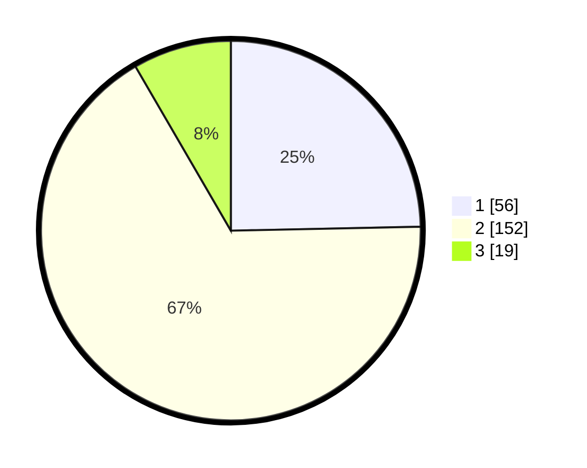

# Hasil

## Grafik

## Tabel

| No. | Nama Paslon    | Suara | Suara (raw) | Persentase |
|:--- |:-------------- | -----:| -----------:| ----------:|
| 1   | ANIES MUHAIMIN | 56    | [56][p-1]   | 24,67      |
| 2   | PRABOWO GIBRAN | 152   | [152][p-2]  | 66,96      |
| 3   | GANJAR MAHFUD  | 19    | [19][p-3]   | 8,37       |

[p-1]: https://github.com/gigit-pemilu/pemilu-2024-36-banten/blob/main/pilpres/hitung-suara/sub/36-banten/sub/03-tangerang/sub/27-sukamulya/sub/2001-benda/sub/004-tps/sub/paslon-1.txt
[p-2]: https://github.com/gigit-pemilu/pemilu-2024-36-banten/blob/main/pilpres/hitung-suara/sub/36-banten/sub/03-tangerang/sub/27-sukamulya/sub/2001-benda/sub/004-tps/sub/paslon-2.txt
[p-3]: https://github.com/gigit-pemilu/pemilu-2024-36-banten/blob/main/pilpres/hitung-suara/sub/36-banten/sub/03-tangerang/sub/27-sukamulya/sub/2001-benda/sub/004-tps/sub/paslon-3.txt

## Foto C Plano

https://sirekap-obj-formc.kpu.go.id/a44b/pemilu/ppwp/36/03/27/20/01/3603272001004-20240217-115217--8083dd8e-ff3e-4e1a-89d9-49aa78fdf6bc.jpg

https://sirekap-obj-formc.kpu.go.id/a44b/pemilu/ppwp/36/03/27/20/01/3603272001004-20240217-115309--557bf485-db0f-489f-9a58-943b800d73e0.jpg

https://sirekap-obj-formc.kpu.go.id/a44b/pemilu/ppwp/36/03/27/20/01/3603272001004-20240217-115048--ae64c544-2499-4766-b7b2-6c257b493a8f.jpg

## Metadata

| Key        | Value               |
| ---------- | ------------------- |
| Time Stamp | 2024-02-19 06:16:00 |

