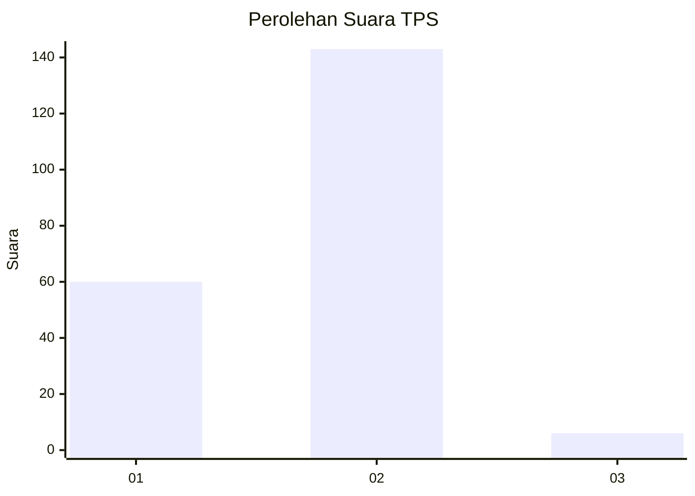
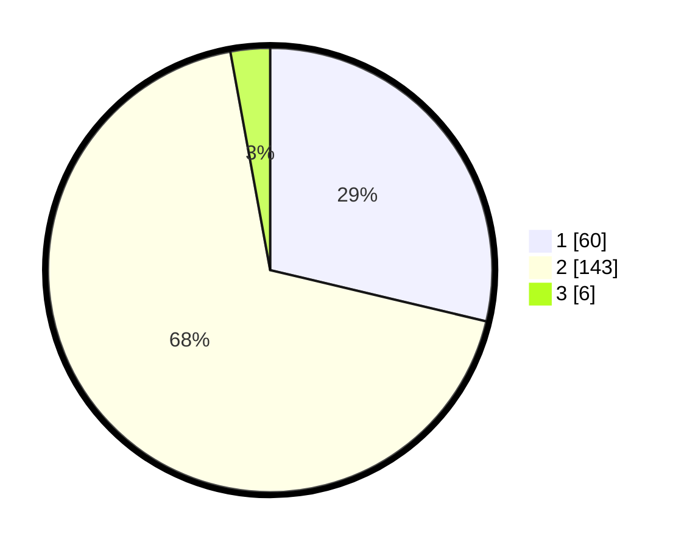

# Hasil

## Grafik

## Tabel

| No. | Nama Paslon    | Suara | Suara (raw) | Persentase |
|:--- |:-------------- | -----:| -----------:| ----------:|
| 1   | ANIES MUHAIMIN | 60    | [60][p-1]   | 28,71      |
| 2   | PRABOWO GIBRAN | 143   | [143][p-2]  | 68,42      |
| 3   | GANJAR MAHFUD  | 6     | [6][p-3]    | 2,87       |

[p-1]: https://github.com/gigit-pemilu/pemilu-2024-36-banten/blob/main/pilpres/hitung-suara/sub/36-banten/sub/03-tangerang/sub/27-sukamulya/sub/2001-benda/sub/005-tps/sub/paslon-1.txt
[p-2]: https://github.com/gigit-pemilu/pemilu-2024-36-banten/blob/main/pilpres/hitung-suara/sub/36-banten/sub/03-tangerang/sub/27-sukamulya/sub/2001-benda/sub/005-tps/sub/paslon-2.txt
[p-3]: https://github.com/gigit-pemilu/pemilu-2024-36-banten/blob/main/pilpres/hitung-suara/sub/36-banten/sub/03-tangerang/sub/27-sukamulya/sub/2001-benda/sub/005-tps/sub/paslon-3.txt

## Foto C Plano

https://sirekap-obj-formc.kpu.go.id/1f14/pemilu/ppwp/36/03/27/20/01/3603272001005-20240217-114418--41041117-232a-40ba-bc02-7fc029c51f19.jpg

https://sirekap-obj-formc.kpu.go.id/1f14/pemilu/ppwp/36/03/27/20/01/3603272001005-20240217-114536--c1cec456-3c93-434b-a1f8-04ce23f3a775.jpg

https://sirekap-obj-formc.kpu.go.id/1f14/pemilu/ppwp/36/03/27/20/01/3603272001005-20240217-114620--c023c583-8885-4e2f-8192-ba71e9969e1d.jpg

## Metadata

| Key        | Value               |
| ---------- | ------------------- |
| Time Stamp | 2024-02-19 06:16:00 |

