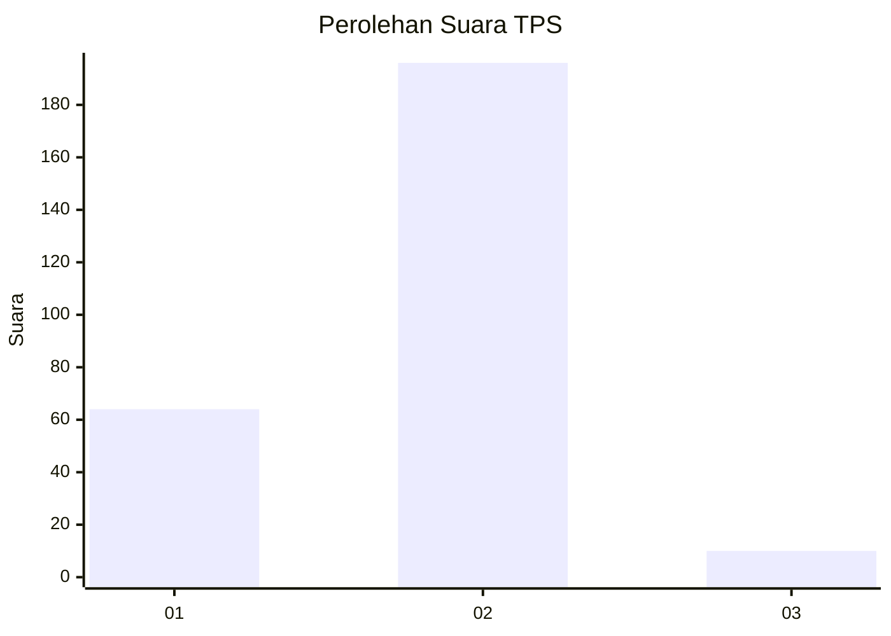

# Hasil

## Grafik

## Tabel

| No. | Nama Paslon    | Suara | Suara (raw) | Persentase |
|:--- |:-------------- | -----:| -----------:| ----------:|
| 1   | ANIES MUHAIMIN | 64    | [64][p-1]   | 23,70      |
| 2   | PRABOWO GIBRAN | 196   | [196][p-2]  | 72,59      |
| 3   | GANJAR MAHFUD  | 10    | [10][p-3]   | 3,70       |

[p-1]: https://github.com/gigit-pemilu/pemilu-2024/blob/main/pilpres/hitung-suara/sub/36-banten/sub/03-tangerang/sub/27-sukamulya/sub/2006-merak/sub/010-tps/sub/paslon-1.txt
[p-2]: https://github.com/gigit-pemilu/pemilu-2024/blob/main/pilpres/hitung-suara/sub/36-banten/sub/03-tangerang/sub/27-sukamulya/sub/2006-merak/sub/010-tps/sub/paslon-2.txt
[p-3]: https://github.com/gigit-pemilu/pemilu-2024/blob/main/pilpres/hitung-suara/sub/36-banten/sub/03-tangerang/sub/27-sukamulya/sub/2006-merak/sub/010-tps/sub/paslon-3.txt

## Foto C Plano

https://sirekap-obj-formc.kpu.go.id/cc87/pemilu/ppwp/36/03/27/20/06/3603272006010-20240214-222431--7174de68-425c-424e-8614-d9cbc75c70fa.jpg

https://sirekap-obj-formc.kpu.go.id/cc87/pemilu/ppwp/36/03/27/20/06/3603272006010-20240214-160127--0f3cfdda-51e0-465b-b022-ad15dc1467cf.jpg

https://sirekap-obj-formc.kpu.go.id/cc87/pemilu/ppwp/36/03/27/20/06/3603272006010-20240214-190729--447d5f7b-3509-475c-a502-f59d3cc7dbed.jpg

## Metadata

| Key        | Value               |
| ---------- | ------------------- |
| Time Stamp | 2024-02-15 00:41:44 |

