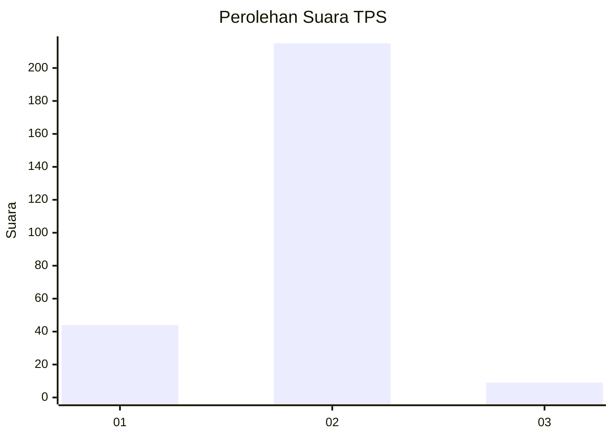
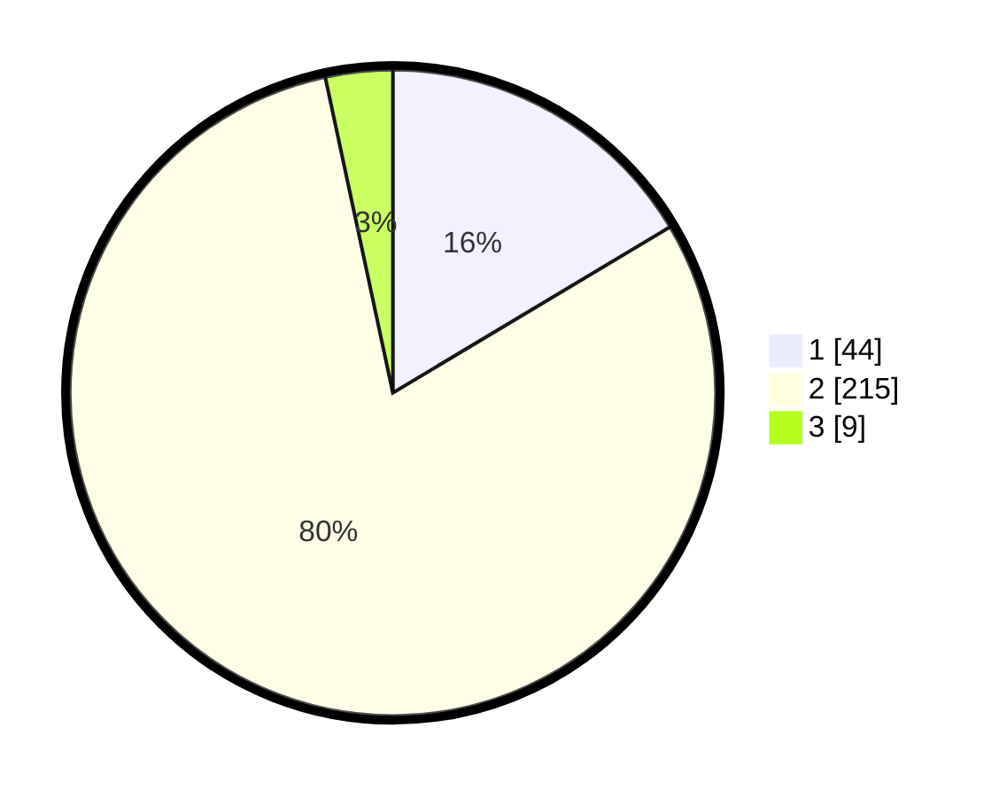

# Hasil

## Grafik

## Tabel

| No. | Nama Paslon    | Suara | Suara (raw) | Persentase |
|:--- |:-------------- | -----:| -----------:| ----------:|
| 1   | ANIES MUHAIMIN | 44    | [44][p-1]   | 16,42      |
| 2   | PRABOWO GIBRAN | 215   | [215][p-2]  | 80,22      |
| 3   | GANJAR MAHFUD  | 9     | [9][p-3]    | 3,36       |

[p-1]: https://github.com/gigit-pemilu/pemilu-2024-36-banten/blob/main/pilpres/hitung-suara/sub/36-banten/sub/03-tangerang/sub/27-sukamulya/sub/2006-merak/sub/018-tps/sub/paslon-1.txt
[p-2]: https://github.com/gigit-pemilu/pemilu-2024-36-banten/blob/main/pilpres/hitung-suara/sub/36-banten/sub/03-tangerang/sub/27-sukamulya/sub/2006-merak/sub/018-tps/sub/paslon-2.txt
[p-3]: https://github.com/gigit-pemilu/pemilu-2024-36-banten/blob/main/pilpres/hitung-suara/sub/36-banten/sub/03-tangerang/sub/27-sukamulya/sub/2006-merak/sub/018-tps/sub/paslon-3.txt

## Foto C Plano

https://sirekap-obj-formc.kpu.go.id/f5c0/pemilu/ppwp/36/03/27/20/06/3603272006018-20240217-151422--b5ae7818-387c-443c-a4da-3657b87d6d5e.jpg

https://sirekap-obj-formc.kpu.go.id/f5c0/pemilu/ppwp/36/03/27/20/06/3603272006018-20240217-151521--b4bbd7f1-fc06-4245-a12e-63ecf54b1430.jpg

https://sirekap-obj-formc.kpu.go.id/f5c0/pemilu/ppwp/36/03/27/20/06/3603272006018-20240217-151621--c1a7f7a7-5d24-4df7-959e-2f3b20064f69.jpg

## Metadata

| Key        | Value               |
| ---------- | ------------------- |
| Time Stamp | 2024-02-20 14:00:00 |

