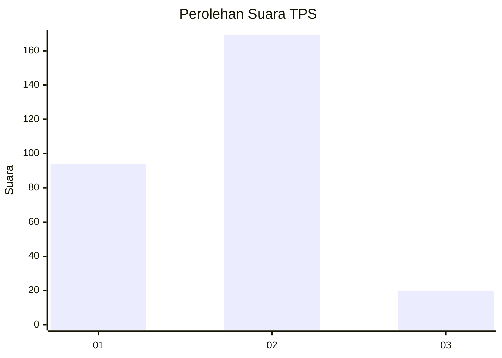
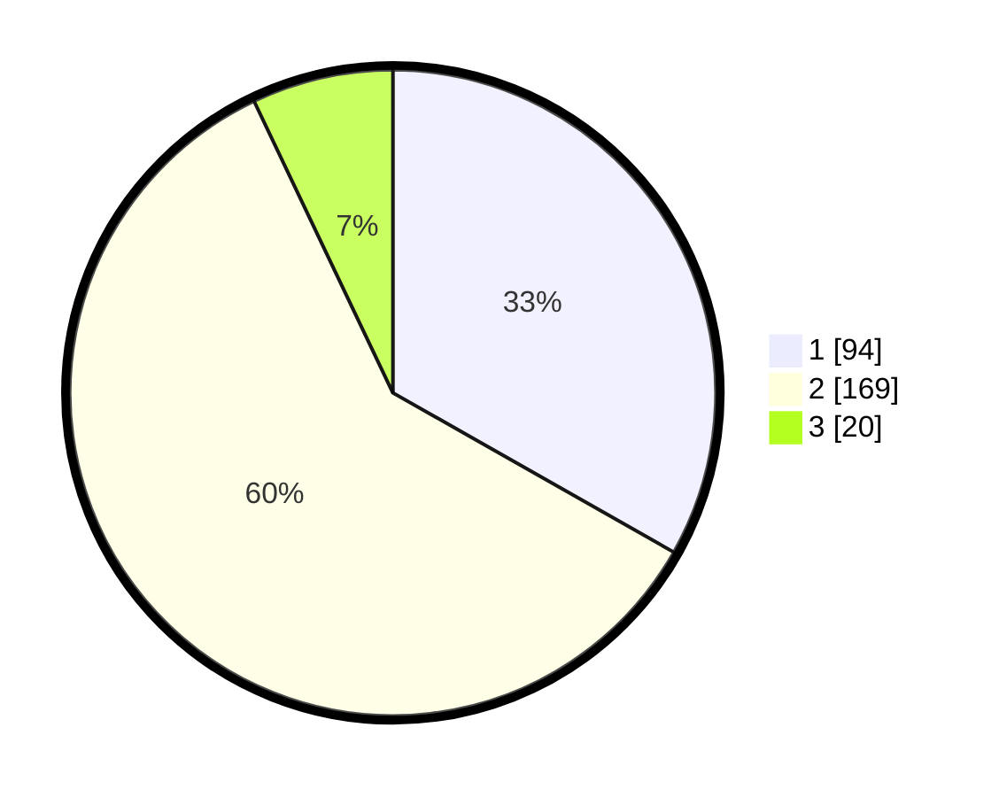

# Hasil

## Grafik

## Tabel

| No. | Nama Paslon    | Suara | Suara (raw) | Persentase |
|:--- |:-------------- | -----:| -----------:| ----------:|
| 1   | ANIES MUHAIMIN | 94    | [94][p-1]   | 33,22      |
| 2   | PRABOWO GIBRAN | 169   | [169][p-2]  | 59,72      |
| 3   | GANJAR MAHFUD  | 20    | [20][p-3]   | 7,07       |

[p-1]: https://github.com/gigit-pemilu/pemilu-2024/blob/main/pilpres/hitung-suara/sub/36-banten/sub/03-tangerang/sub/27-sukamulya/sub/2007-bunar/sub/025-tps/sub/paslon-1.txt
[p-2]: https://github.com/gigit-pemilu/pemilu-2024/blob/main/pilpres/hitung-suara/sub/36-banten/sub/03-tangerang/sub/27-sukamulya/sub/2007-bunar/sub/025-tps/sub/paslon-2.txt
[p-3]: https://github.com/gigit-pemilu/pemilu-2024/blob/main/pilpres/hitung-suara/sub/36-banten/sub/03-tangerang/sub/27-sukamulya/sub/2007-bunar/sub/025-tps/sub/paslon-3.txt

## Foto C Plano

https://sirekap-obj-formc.kpu.go.id/7313/pemilu/ppwp/36/03/27/20/07/3603272007025-20240217-142334--5cb03d7f-3721-4f5d-95a2-2ac0f4ac5e5d.jpg

https://sirekap-obj-formc.kpu.go.id/7313/pemilu/ppwp/36/03/27/20/07/3603272007025-20240217-142547--3c13e9f9-a4bf-464e-bc2a-37222a528303.jpg

https://sirekap-obj-formc.kpu.go.id/7313/pemilu/ppwp/36/03/27/20/07/3603272007025-20240217-142431--3798742b-f9ee-47de-b746-fc4df6967bbe.jpg

## Metadata

| Key        | Value               |
| ---------- | ------------------- |
| Time Stamp | 2024-02-19 06:16:00 |

