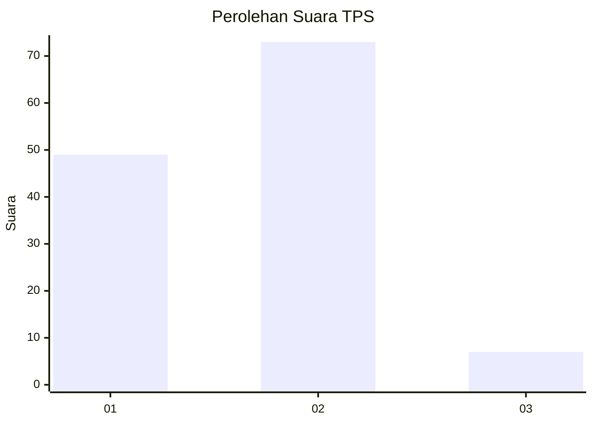
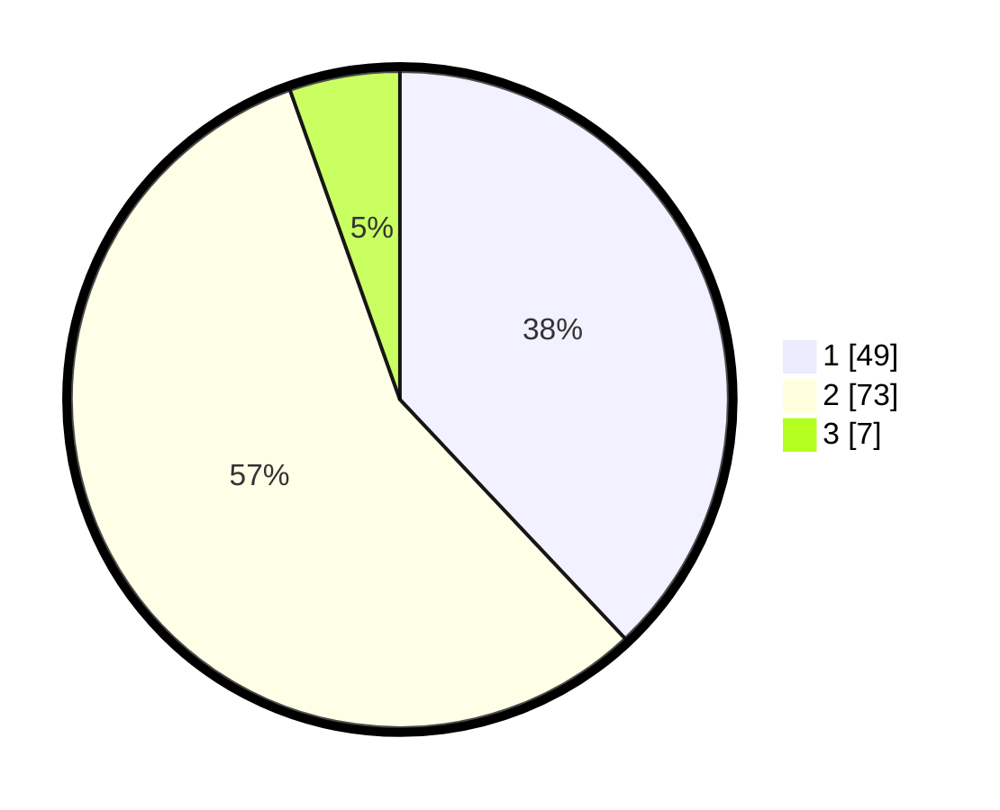

# Hasil

## Grafik

## Tabel

| No. | Nama Paslon    | Suara | Suara (raw) | Persentase |
|:--- |:-------------- | -----:| -----------:| ----------:|
| 1   | ANIES MUHAIMIN | 49    | [49][p-1]   | 37,98      |
| 2   | PRABOWO GIBRAN | 73    | [73][p-2]   | 56,59      |
| 3   | GANJAR MAHFUD  | 7     | [7][p-3]    | 5,43       |

[p-1]: https://github.com/gigit-pemilu/pemilu-2024-36-banten/blob/main/pilpres/hitung-suara/sub/36-banten/sub/03-tangerang/sub/28-kelapa-dua/sub/1001-kelapa-dua/sub/001-tps/sub/paslon-1.txt
[p-2]: https://github.com/gigit-pemilu/pemilu-2024-36-banten/blob/main/pilpres/hitung-suara/sub/36-banten/sub/03-tangerang/sub/28-kelapa-dua/sub/1001-kelapa-dua/sub/001-tps/sub/paslon-2.txt
[p-3]: https://github.com/gigit-pemilu/pemilu-2024-36-banten/blob/main/pilpres/hitung-suara/sub/36-banten/sub/03-tangerang/sub/28-kelapa-dua/sub/1001-kelapa-dua/sub/001-tps/sub/paslon-3.txt

## Foto C Plano

https://sirekap-obj-formc.kpu.go.id/4d78/pemilu/ppwp/36/03/28/10/01/3603281001001-20240223-095604--2418e324-e9ce-4f12-81e2-85f958568e15.jpg

https://sirekap-obj-formc.kpu.go.id/4d78/pemilu/ppwp/36/03/28/10/01/3603281001001-20240223-095700--b4f62309-02cc-4f2c-aa55-2fac4b152e42.jpg

https://sirekap-obj-formc.kpu.go.id/4d78/pemilu/ppwp/36/03/28/10/01/3603281001001-20240223-095747--22807928-7375-4892-a2e9-052564738b66.jpg

## Metadata

| Key        | Value               |
| ---------- | ------------------- |
| Time Stamp | 2024-02-24 22:31:28 |

