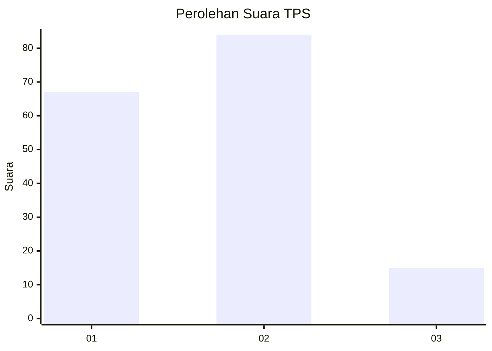
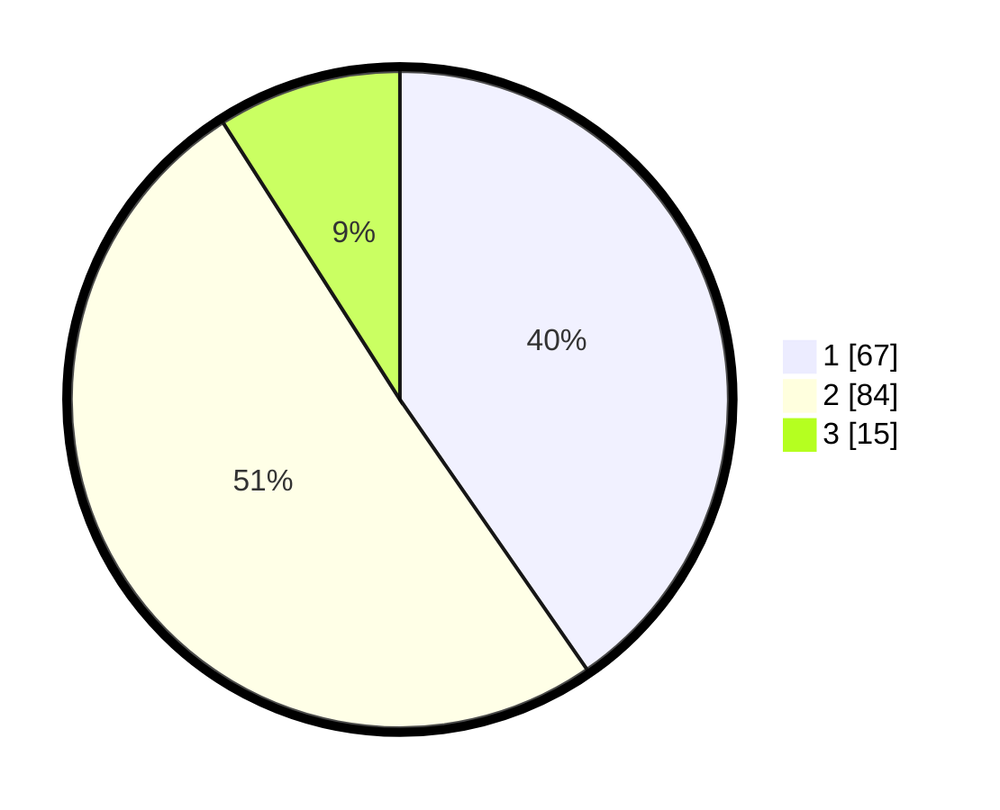

# Hasil

## Grafik

## Tabel

| No. | Nama Paslon    | Suara | Suara (raw) | Persentase |
|:--- |:-------------- | -----:| -----------:| ----------:|
| 1   | ANIES MUHAIMIN | 67    | [67][p-1]   | 40,36      |
| 2   | PRABOWO GIBRAN | 84    | [84][p-2]   | 50,60      |
| 3   | GANJAR MAHFUD  | 15    | [15][p-3]   | 9,04       |

[p-1]: https://github.com/gigit-pemilu/pemilu-2024-36-banten/blob/main/pilpres/hitung-suara/sub/36-banten/sub/03-tangerang/sub/28-kelapa-dua/sub/1001-kelapa-dua/sub/002-tps/sub/paslon-1.txt
[p-2]: https://github.com/gigit-pemilu/pemilu-2024-36-banten/blob/main/pilpres/hitung-suara/sub/36-banten/sub/03-tangerang/sub/28-kelapa-dua/sub/1001-kelapa-dua/sub/002-tps/sub/paslon-2.txt
[p-3]: https://github.com/gigit-pemilu/pemilu-2024-36-banten/blob/main/pilpres/hitung-suara/sub/36-banten/sub/03-tangerang/sub/28-kelapa-dua/sub/1001-kelapa-dua/sub/002-tps/sub/paslon-3.txt

## Foto C Plano

https://sirekap-obj-formc.kpu.go.id/1ea6/pemilu/ppwp/36/03/28/10/01/3603281001002-20240223-105516--30e17f30-4ad6-490e-a2c5-3c2c239f3d29.jpg

https://sirekap-obj-formc.kpu.go.id/1ea6/pemilu/ppwp/36/03/28/10/01/3603281001002-20240223-105602--4b42395e-8bc8-4c2b-8ada-dea03b42daf9.jpg

https://sirekap-obj-formc.kpu.go.id/1ea6/pemilu/ppwp/36/03/28/10/01/3603281001002-20240223-105637--0c1f8a79-1a38-4b09-9046-1024fcd5b013.jpg

## Metadata

| Key        | Value               |
| ---------- | ------------------- |
| Time Stamp | 2024-02-24 22:31:28 |

