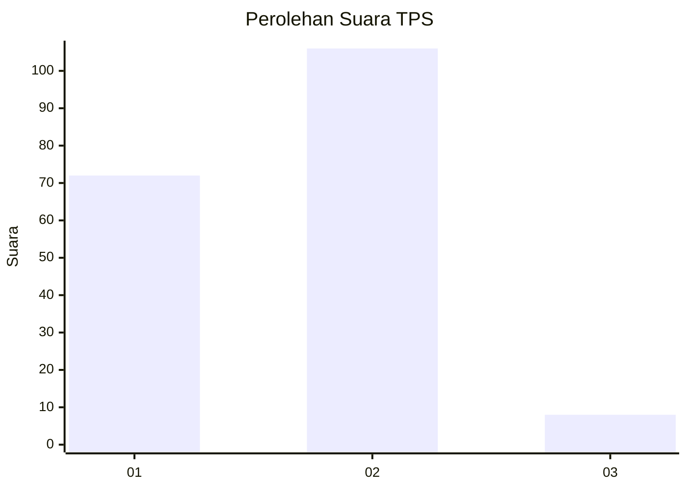
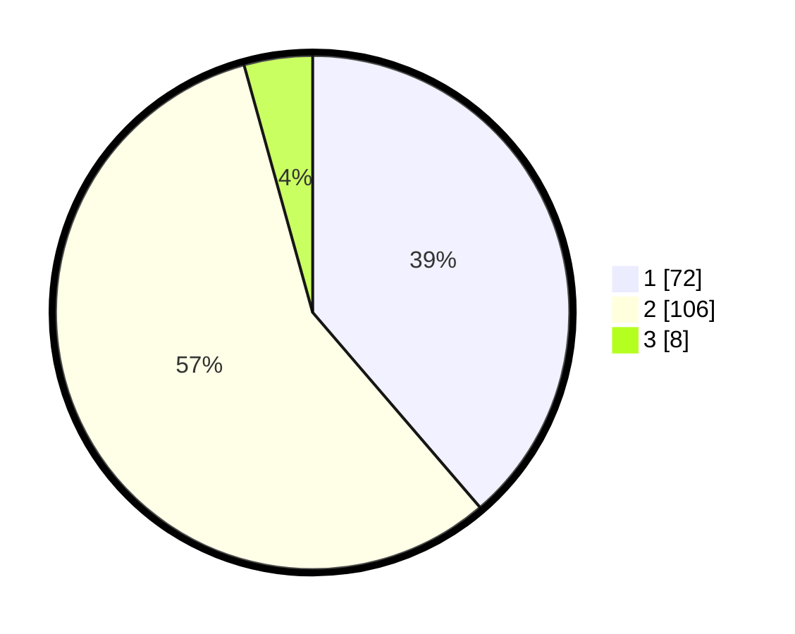

# Hasil

## Grafik

## Tabel

| No. | Nama Paslon    | Suara | Suara (raw) | Persentase |
|:--- |:-------------- | -----:| -----------:| ----------:|
| 1   | ANIES MUHAIMIN | 72    | [72][p-1]   | 38,71      |
| 2   | PRABOWO GIBRAN | 106   | [106][p-2]  | 56,99      |
| 3   | GANJAR MAHFUD  | 8     | [8][p-3]    | 4,30       |

[p-1]: https://github.com/gigit-pemilu/pemilu-2024/blob/main/pilpres/hitung-suara/sub/36-banten/sub/03-tangerang/sub/28-kelapa-dua/sub/1001-kelapa-dua/sub/003-tps/sub/paslon-1.txt
[p-2]: https://github.com/gigit-pemilu/pemilu-2024/blob/main/pilpres/hitung-suara/sub/36-banten/sub/03-tangerang/sub/28-kelapa-dua/sub/1001-kelapa-dua/sub/003-tps/sub/paslon-2.txt
[p-3]: https://github.com/gigit-pemilu/pemilu-2024/blob/main/pilpres/hitung-suara/sub/36-banten/sub/03-tangerang/sub/28-kelapa-dua/sub/1001-kelapa-dua/sub/003-tps/sub/paslon-3.txt

## Foto C Plano

https://sirekap-obj-formc.kpu.go.id/0def/pemilu/ppwp/36/03/28/10/01/3603281001003-20240223-142602--34f6de1b-da17-4608-b28d-7e55af387c44.jpg

https://sirekap-obj-formc.kpu.go.id/0def/pemilu/ppwp/36/03/28/10/01/3603281001003-20240223-142630--45a29702-9195-4a8c-a8e4-1165517b3ba7.jpg

https://sirekap-obj-formc.kpu.go.id/0def/pemilu/ppwp/36/03/28/10/01/3603281001003-20240223-142700--4b9c12af-00fb-4ccb-9797-b018f90d2b4e.jpg

## Metadata

| Key        | Value               |
| ---------- | ------------------- |
| Time Stamp | 2024-02-24 22:31:28 |

