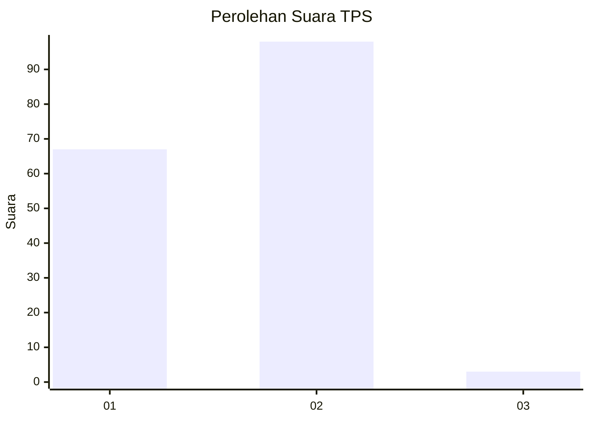
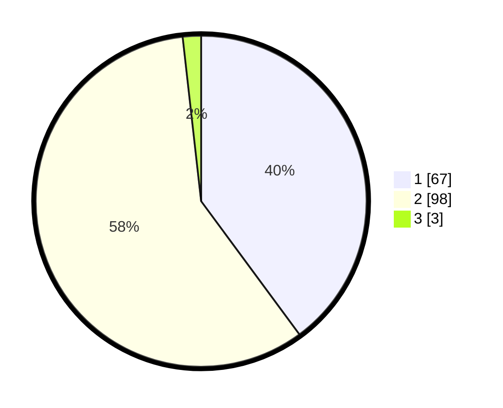

# Hasil

## Grafik

## Tabel

| No. | Nama Paslon    | Suara | Suara (raw) | Persentase |
|:--- |:-------------- | -----:| -----------:| ----------:|
| 1   | ANIES MUHAIMIN | 67    | [67][p-1]   | 39,88      |
| 2   | PRABOWO GIBRAN | 98    | [98][p-2]   | 58,33      |
| 3   | GANJAR MAHFUD  | 3     | [3][p-3]    | 1,79       |

[p-1]: https://github.com/gigit-pemilu/pemilu-2024-36-banten/blob/main/pilpres/hitung-suara/sub/36-banten/sub/03-tangerang/sub/28-kelapa-dua/sub/1001-kelapa-dua/sub/005-tps/sub/paslon-1.txt
[p-2]: https://github.com/gigit-pemilu/pemilu-2024-36-banten/blob/main/pilpres/hitung-suara/sub/36-banten/sub/03-tangerang/sub/28-kelapa-dua/sub/1001-kelapa-dua/sub/005-tps/sub/paslon-2.txt
[p-3]: https://github.com/gigit-pemilu/pemilu-2024-36-banten/blob/main/pilpres/hitung-suara/sub/36-banten/sub/03-tangerang/sub/28-kelapa-dua/sub/1001-kelapa-dua/sub/005-tps/sub/paslon-3.txt

## Foto C Plano

https://sirekap-obj-formc.kpu.go.id/32fa/pemilu/ppwp/36/03/28/10/01/3603281001005-20240223-150556--da72d297-aa3d-456a-bc9b-4151d74d57de.jpg

https://sirekap-obj-formc.kpu.go.id/32fa/pemilu/ppwp/36/03/28/10/01/3603281001005-20240223-150625--c21c7d43-0da0-4615-816d-c8b97ffd9d30.jpg

https://sirekap-obj-formc.kpu.go.id/32fa/pemilu/ppwp/36/03/28/10/01/3603281001005-20240223-150704--741e8a30-bf8f-478e-b1a7-6a4c6f8428e2.jpg

## Metadata

| Key        | Value               |
| ---------- | ------------------- |
| Time Stamp | 2024-02-24 22:31:28 |

