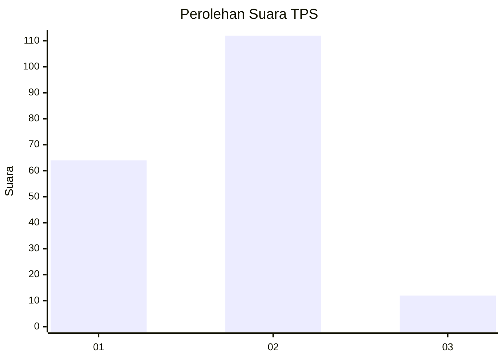
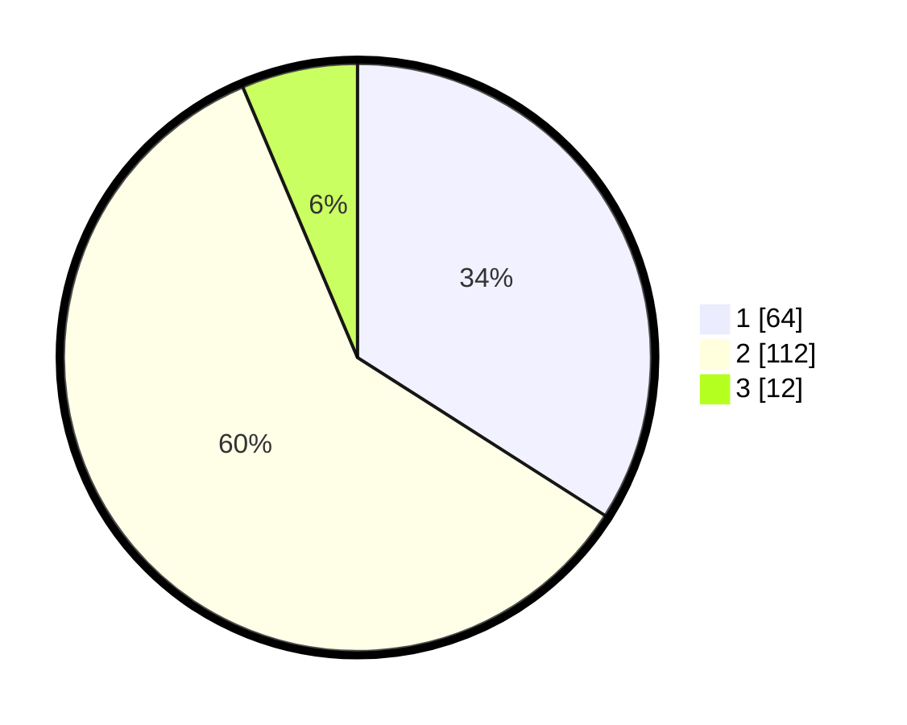

# Hasil

## Grafik

## Tabel

| No. | Nama Paslon    | Suara | Suara (raw) | Persentase |
|:--- |:-------------- | -----:| -----------:| ----------:|
| 1   | ANIES MUHAIMIN | 64    | [64][p-1]   | 34,04      |
| 2   | PRABOWO GIBRAN | 112   | [112][p-2]  | 59,57      |
| 3   | GANJAR MAHFUD  | 12    | [12][p-3]   | 6,38       |

[p-1]: https://github.com/gigit-pemilu/pemilu-2024/blob/main/pilpres/hitung-suara/sub/36-banten/sub/03-tangerang/sub/28-kelapa-dua/sub/1001-kelapa-dua/sub/006-tps/sub/paslon-1.txt
[p-2]: https://github.com/gigit-pemilu/pemilu-2024/blob/main/pilpres/hitung-suara/sub/36-banten/sub/03-tangerang/sub/28-kelapa-dua/sub/1001-kelapa-dua/sub/006-tps/sub/paslon-2.txt
[p-3]: https://github.com/gigit-pemilu/pemilu-2024/blob/main/pilpres/hitung-suara/sub/36-banten/sub/03-tangerang/sub/28-kelapa-dua/sub/1001-kelapa-dua/sub/006-tps/sub/paslon-3.txt

## Foto C Plano

https://sirekap-obj-formc.kpu.go.id/692c/pemilu/ppwp/36/03/28/10/01/3603281001006-20240223-162146--afa8752f-e115-464e-84d5-fe22c98892fb.jpg

https://sirekap-obj-formc.kpu.go.id/692c/pemilu/ppwp/36/03/28/10/01/3603281001006-20240223-162218--e6887375-7fda-4292-b1bc-35c5bff5ea34.jpg

https://sirekap-obj-formc.kpu.go.id/692c/pemilu/ppwp/36/03/28/10/01/3603281001006-20240223-162255--df5706ae-b4d3-4421-9583-40077e81fd96.jpg

## Metadata

| Key        | Value               |
| ---------- | ------------------- |
| Time Stamp | 2024-02-24 22:31:28 |

