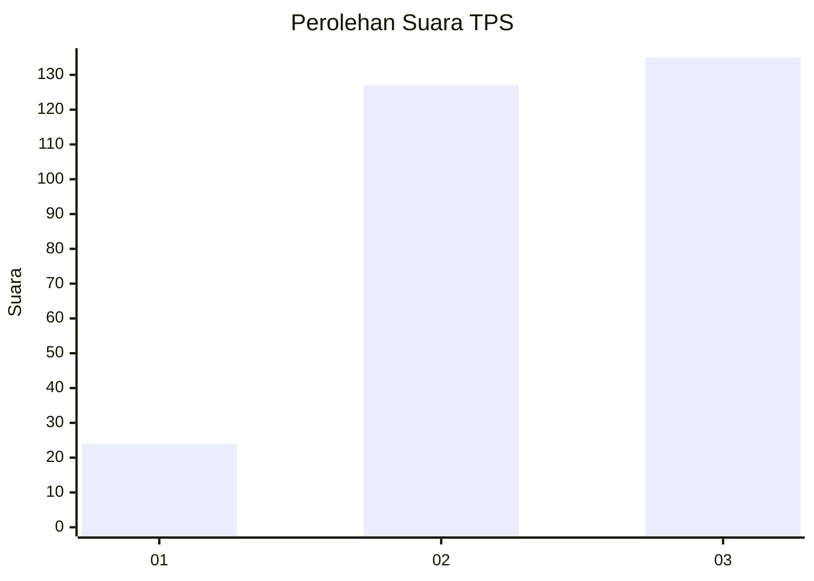
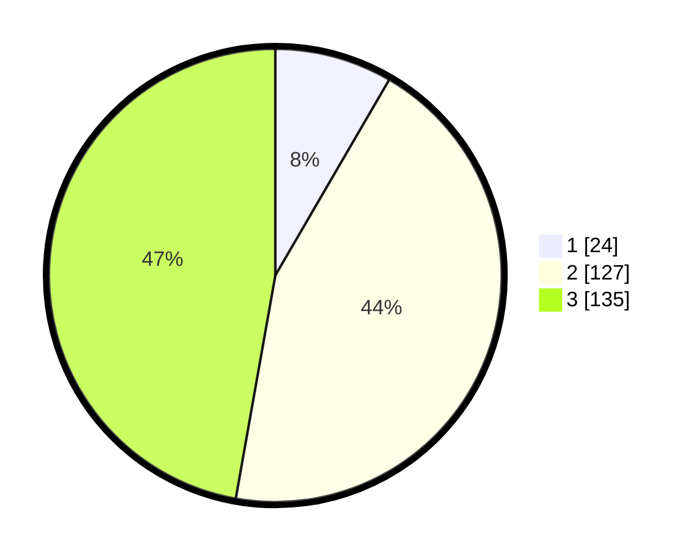

# Hasil

## Grafik

## Tabel

| No. | Nama Paslon    | Suara | Suara (raw) | Persentase |
|:--- |:-------------- | -----:| -----------:| ----------:|
| 1   | ANIES MUHAIMIN | 24    | [24][p-1]   | 8,39       |
| 2   | PRABOWO GIBRAN | 127   | [127][p-2]  | 44,41      |
| 3   | GANJAR MAHFUD  | 135   | [135][p-3]  | 47,20      |

[p-1]: https://github.com/gigit-pemilu/pemilu-2024-36-banten/blob/main/pilpres/hitung-suara/sub/36-banten/sub/03-tangerang/sub/28-kelapa-dua/sub/1001-kelapa-dua/sub/076-tps/sub/paslon-1.txt
[p-2]: https://github.com/gigit-pemilu/pemilu-2024-36-banten/blob/main/pilpres/hitung-suara/sub/36-banten/sub/03-tangerang/sub/28-kelapa-dua/sub/1001-kelapa-dua/sub/076-tps/sub/paslon-2.txt
[p-3]: https://github.com/gigit-pemilu/pemilu-2024-36-banten/blob/main/pilpres/hitung-suara/sub/36-banten/sub/03-tangerang/sub/28-kelapa-dua/sub/1001-kelapa-dua/sub/076-tps/sub/paslon-3.txt

## Foto C Plano

https://sirekap-obj-formc.kpu.go.id/a828/pemilu/ppwp/36/03/28/10/01/3603281001076-20240228-205244--a972a0e5-4812-49b3-a345-f74a6eda3db7.jpg

https://sirekap-obj-formc.kpu.go.id/a828/pemilu/ppwp/36/03/28/10/01/3603281001076-20240215-001831--ceb1e719-e7a4-4dde-b264-e66cc2926d83.jpg

https://sirekap-obj-formc.kpu.go.id/a828/pemilu/ppwp/36/03/28/10/01/3603281001076-20240215-002055--ec0613f6-8fba-4fa2-9983-61119d7c9334.jpg

## Metadata

| Key        | Value               |
| ---------- | ------------------- |
| Time Stamp | 2024-02-28 21:00:00 |

