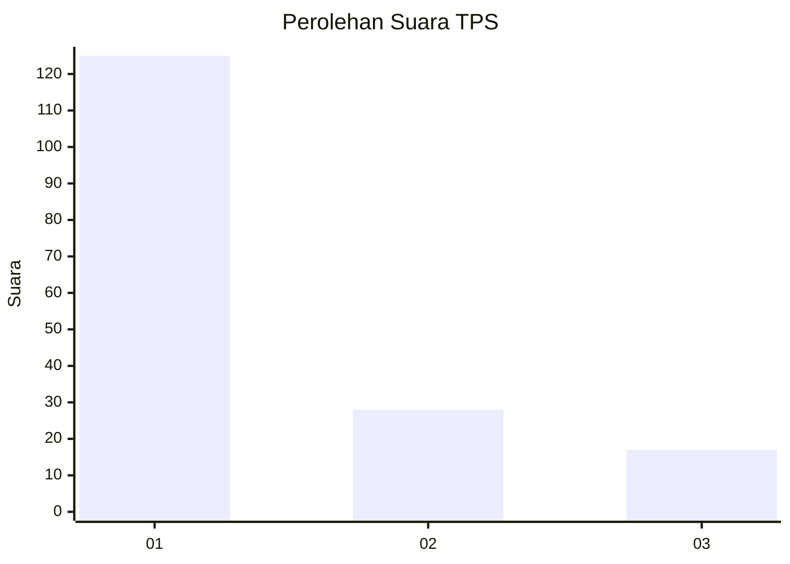
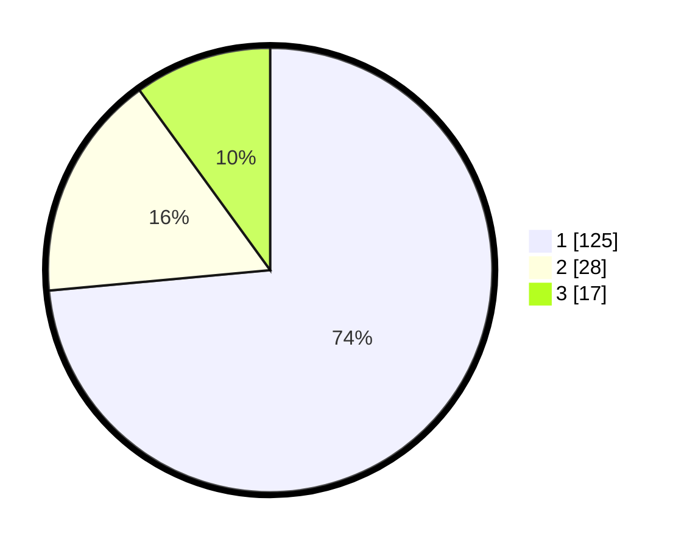

# Hasil

## Grafik

## Tabel

| No. | Nama Paslon    | Suara | Suara (raw) | Persentase |
|:--- |:-------------- | -----:| -----------:| ----------:|
| 1   | ANIES MUHAIMIN | 125   | [125][p-1]  | 73,53      |
| 2   | PRABOWO GIBRAN | 28    | [28][p-2]   | 16,47      |
| 3   | GANJAR MAHFUD  | 17    | [17][p-3]   | 10,00      |

[p-1]: https://github.com/gigit-pemilu/pemilu-2024-36-banten/blob/main/pilpres/hitung-suara/sub/36-banten/sub/03-tangerang/sub/28-kelapa-dua/sub/1001-kelapa-dua/sub/078-tps/sub/paslon-1.txt
[p-2]: https://github.com/gigit-pemilu/pemilu-2024-36-banten/blob/main/pilpres/hitung-suara/sub/36-banten/sub/03-tangerang/sub/28-kelapa-dua/sub/1001-kelapa-dua/sub/078-tps/sub/paslon-2.txt
[p-3]: https://github.com/gigit-pemilu/pemilu-2024-36-banten/blob/main/pilpres/hitung-suara/sub/36-banten/sub/03-tangerang/sub/28-kelapa-dua/sub/1001-kelapa-dua/sub/078-tps/sub/paslon-3.txt

## Foto C Plano

https://sirekap-obj-formc.kpu.go.id/a53b/pemilu/ppwp/36/03/28/10/01/3603281001078-20240214-223527--aa75ef44-d862-4dde-8a7e-34874d6e749c.jpg

https://sirekap-obj-formc.kpu.go.id/a53b/pemilu/ppwp/36/03/28/10/01/3603281001078-20240214-212618--269a965b-a3e6-43aa-95c2-492c1b7ed2cf.jpg

https://sirekap-obj-formc.kpu.go.id/a53b/pemilu/ppwp/36/03/28/10/01/3603281001078-20240214-212723--1bbeae35-2377-44dd-9f36-a812ed110425.jpg

## Metadata

| Key        | Value               |
| ---------- | ------------------- |
| Time Stamp | 2024-02-24 22:31:28 |

