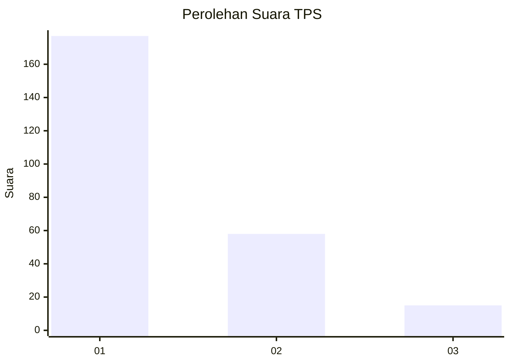
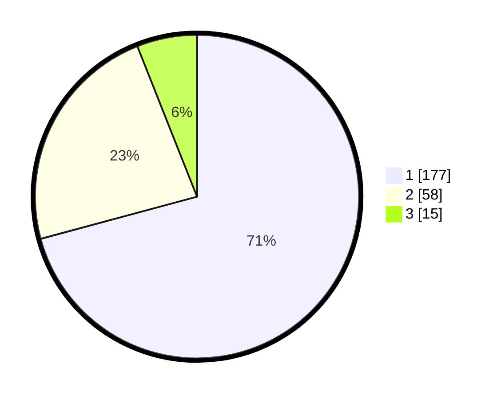

# Hasil

## Grafik

## Tabel

| No. | Nama Paslon    | Suara | Suara (raw) | Persentase |
|:--- |:-------------- | -----:| -----------:| ----------:|
| 1   | ANIES MUHAIMIN | 177   | [177][p-1]  | 70,80      |
| 2   | PRABOWO GIBRAN | 58    | [58][p-2]   | 23,20      |
| 3   | GANJAR MAHFUD  | 15    | [15][p-3]   | 6,00       |

[p-1]: https://github.com/gigit-pemilu/pemilu-2024-36-banten/blob/main/pilpres/hitung-suara/sub/36-banten/sub/03-tangerang/sub/28-kelapa-dua/sub/1001-kelapa-dua/sub/084-tps/sub/paslon-1.txt
[p-2]: https://github.com/gigit-pemilu/pemilu-2024-36-banten/blob/main/pilpres/hitung-suara/sub/36-banten/sub/03-tangerang/sub/28-kelapa-dua/sub/1001-kelapa-dua/sub/084-tps/sub/paslon-2.txt
[p-3]: https://github.com/gigit-pemilu/pemilu-2024-36-banten/blob/main/pilpres/hitung-suara/sub/36-banten/sub/03-tangerang/sub/28-kelapa-dua/sub/1001-kelapa-dua/sub/084-tps/sub/paslon-3.txt

## Foto C Plano

https://sirekap-obj-formc.kpu.go.id/ccaa/pemilu/ppwp/36/03/28/10/01/3603281001084-20240215-003533--f4bc6059-693e-4cec-995b-599c6c8ddef9.jpg

https://sirekap-obj-formc.kpu.go.id/ccaa/pemilu/ppwp/36/03/28/10/01/3603281001084-20240214-220436--767b102a-cbaf-4c3f-ad87-1d3cb93c65c5.jpg

https://sirekap-obj-formc.kpu.go.id/ccaa/pemilu/ppwp/36/03/28/10/01/3603281001084-20240214-220550--ca5400e1-5b5b-4acf-aa6e-7ac49933af4d.jpg

## Metadata

| Key        | Value               |
| ---------- | ------------------- |
| Time Stamp | 2024-02-19 15:00:00 |

