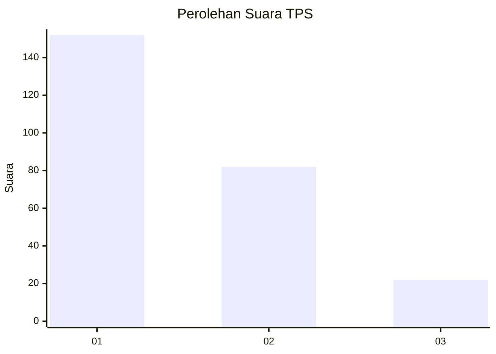
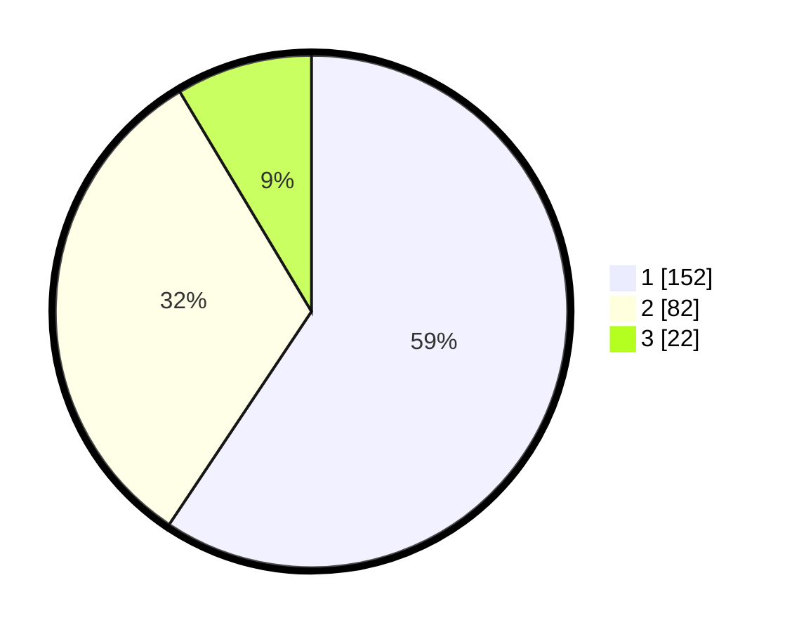

# Hasil

## Grafik

## Tabel

| No. | Nama Paslon    | Suara | Suara (raw) | Persentase |
|:--- |:-------------- | -----:| -----------:| ----------:|
| 1   | ANIES MUHAIMIN | 152   | [152][p-1]  | 59,38      |
| 2   | PRABOWO GIBRAN | 82    | [82][p-2]   | 32,03      |
| 3   | GANJAR MAHFUD  | 22    | [22][p-3]   | 8,59       |

[p-1]: https://github.com/gigit-pemilu/pemilu-2024/blob/main/pilpres/hitung-suara/sub/36-banten/sub/03-tangerang/sub/28-kelapa-dua/sub/1001-kelapa-dua/sub/089-tps/sub/paslon-1.txt
[p-2]: https://github.com/gigit-pemilu/pemilu-2024/blob/main/pilpres/hitung-suara/sub/36-banten/sub/03-tangerang/sub/28-kelapa-dua/sub/1001-kelapa-dua/sub/089-tps/sub/paslon-2.txt
[p-3]: https://github.com/gigit-pemilu/pemilu-2024/blob/main/pilpres/hitung-suara/sub/36-banten/sub/03-tangerang/sub/28-kelapa-dua/sub/1001-kelapa-dua/sub/089-tps/sub/paslon-3.txt

## Foto C Plano

https://sirekap-obj-formc.kpu.go.id/896c/pemilu/ppwp/36/03/28/10/01/3603281001089-20240214-205824--40fa810e-e415-4145-92a3-b04e7e6567ff.jpg

https://sirekap-obj-formc.kpu.go.id/896c/pemilu/ppwp/36/03/28/10/01/3603281001089-20240214-205834--46eed2c8-5d90-4d33-b46c-e842d945d57f.jpg

https://sirekap-obj-formc.kpu.go.id/896c/pemilu/ppwp/36/03/28/10/01/3603281001089-20240214-205844--a52e795f-2fd4-4294-9bdc-9cded7c2e730.jpg

## Metadata

| Key        | Value               |
| ---------- | ------------------- |
| Time Stamp | 2024-02-19 15:00:00 |

