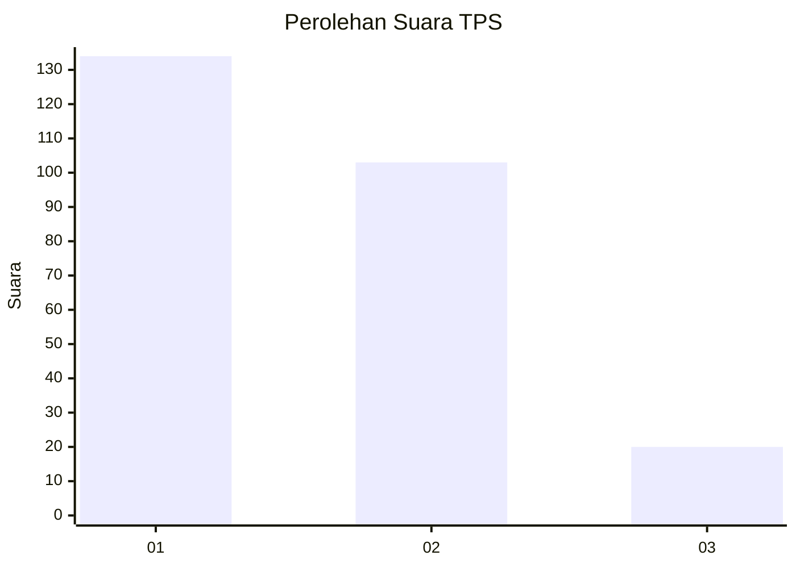
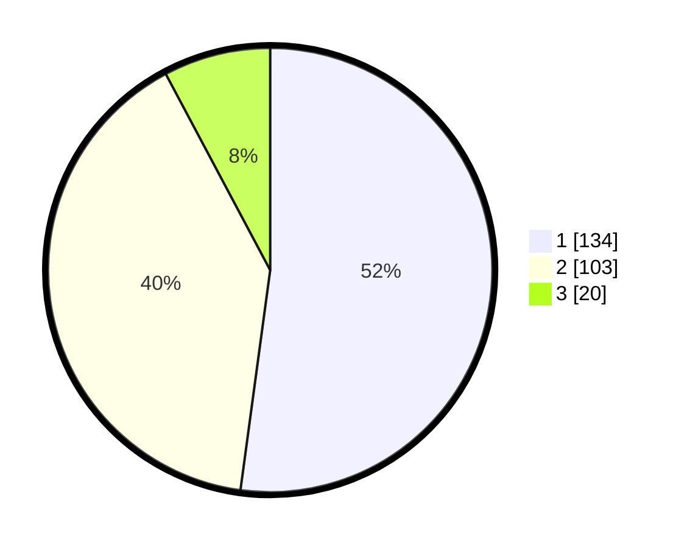

# Hasil

## Grafik

## Tabel

| No. | Nama Paslon    | Suara | Suara (raw) | Persentase |
|:--- |:-------------- | -----:| -----------:| ----------:|
| 1   | ANIES MUHAIMIN | 134   | [134][p-1]  | 52,14      |
| 2   | PRABOWO GIBRAN | 103   | [103][p-2]  | 40,08      |
| 3   | GANJAR MAHFUD  | 20    | [20][p-3]   | 7,78       |

[p-1]: https://github.com/gigit-pemilu/pemilu-2024/blob/main/pilpres/hitung-suara/sub/36-banten/sub/03-tangerang/sub/28-kelapa-dua/sub/1001-kelapa-dua/sub/090-tps/sub/paslon-1.txt
[p-2]: https://github.com/gigit-pemilu/pemilu-2024/blob/main/pilpres/hitung-suara/sub/36-banten/sub/03-tangerang/sub/28-kelapa-dua/sub/1001-kelapa-dua/sub/090-tps/sub/paslon-2.txt
[p-3]: https://github.com/gigit-pemilu/pemilu-2024/blob/main/pilpres/hitung-suara/sub/36-banten/sub/03-tangerang/sub/28-kelapa-dua/sub/1001-kelapa-dua/sub/090-tps/sub/paslon-3.txt

## Foto C Plano

https://sirekap-obj-formc.kpu.go.id/2e88/pemilu/ppwp/36/03/28/10/01/3603281001090-20240214-192719--ab83a7c6-b660-4b7a-beba-cfa25c4ee7aa.jpg

https://sirekap-obj-formc.kpu.go.id/2e88/pemilu/ppwp/36/03/28/10/01/3603281001090-20240214-192745--ff262049-d087-496d-9753-47fa290611ef.jpg

https://sirekap-obj-formc.kpu.go.id/2e88/pemilu/ppwp/36/03/28/10/01/3603281001090-20240214-192840--74563e6b-34f0-42ea-b7ca-b0e36120e6c3.jpg

## Metadata

| Key        | Value               |
| ---------- | ------------------- |
| Time Stamp | 2024-02-24 22:31:28 |

