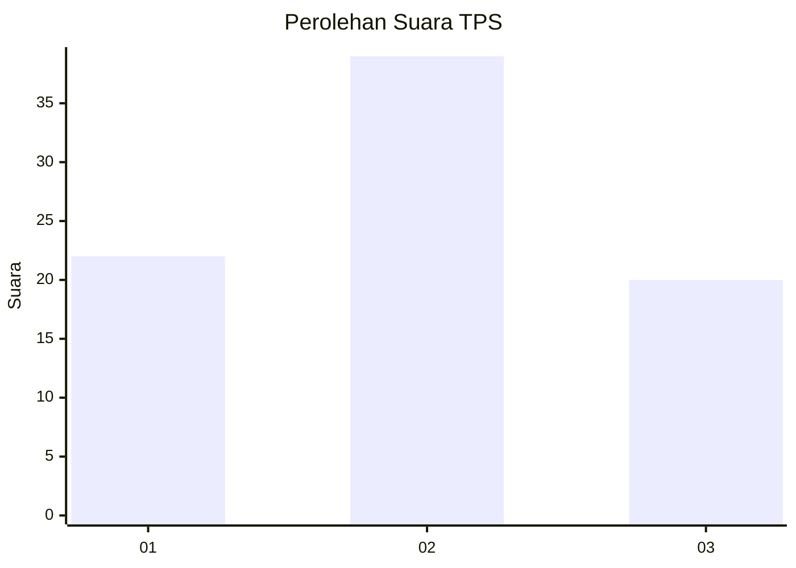
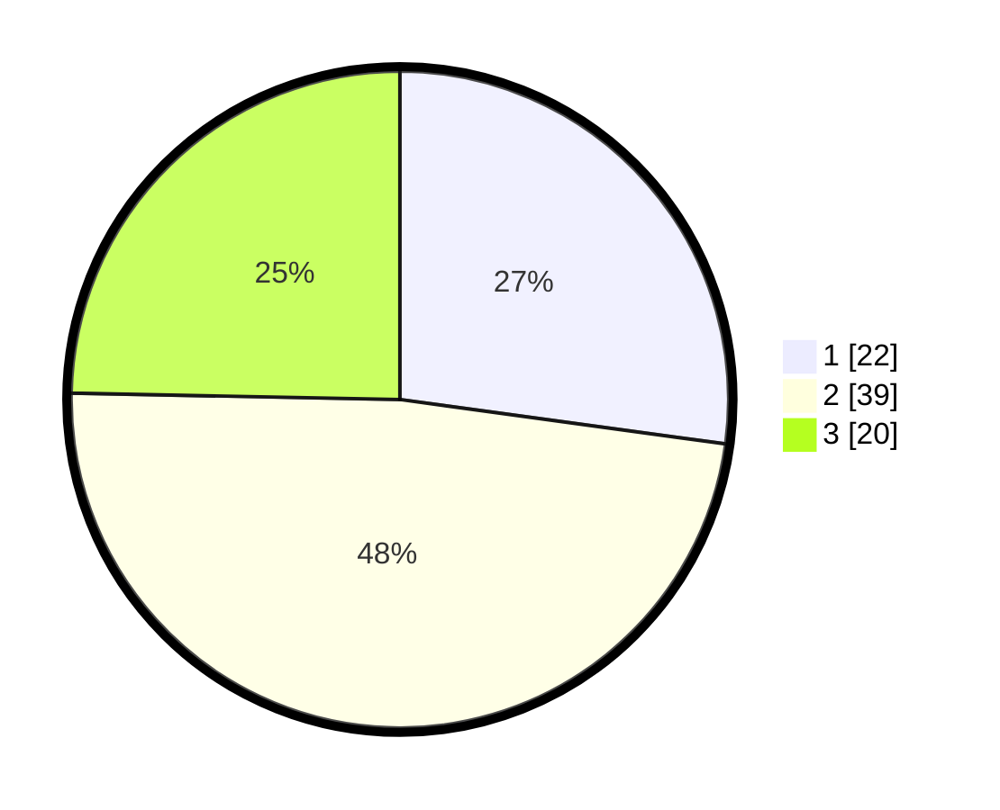

# Hasil

## Grafik

## Tabel

| No. | Nama Paslon    | Suara | Suara (raw) | Persentase |
|:--- |:-------------- | -----:| -----------:| ----------:|
| 1   | ANIES MUHAIMIN | 22    | [22][p-1]   | 27,16      |
| 2   | PRABOWO GIBRAN | 39    | [39][p-2]   | 48,15      |
| 3   | GANJAR MAHFUD  | 20    | [20][p-3]   | 24,69      |

[p-1]: https://github.com/gigit-pemilu/pemilu-2024-36-banten/blob/main/pilpres/hitung-suara/sub/36-banten/sub/03-tangerang/sub/28-kelapa-dua/sub/1005-bojong-nangka/sub/026-tps/sub/paslon-1.txt
[p-2]: https://github.com/gigit-pemilu/pemilu-2024-36-banten/blob/main/pilpres/hitung-suara/sub/36-banten/sub/03-tangerang/sub/28-kelapa-dua/sub/1005-bojong-nangka/sub/026-tps/sub/paslon-2.txt
[p-3]: https://github.com/gigit-pemilu/pemilu-2024-36-banten/blob/main/pilpres/hitung-suara/sub/36-banten/sub/03-tangerang/sub/28-kelapa-dua/sub/1005-bojong-nangka/sub/026-tps/sub/paslon-3.txt

## Foto C Plano

https://sirekap-obj-formc.kpu.go.id/07f5/pemilu/ppwp/36/03/28/10/05/3603281005026-20240222-114837--f42d74e2-ffea-471a-9cc3-365385316fbf.jpg

https://sirekap-obj-formc.kpu.go.id/07f5/pemilu/ppwp/36/03/28/10/05/3603281005026-20240222-102957--07887af8-4ccd-48c4-9235-c8fb579f7c6c.jpg

https://sirekap-obj-formc.kpu.go.id/07f5/pemilu/ppwp/36/03/28/10/05/3603281005026-20240222-114929--dee46fc6-e1ee-4abe-9cfc-17eb33da522e.jpg

## Metadata

| Key        | Value               |
| ---------- | ------------------- |
| Time Stamp | 2024-02-24 22:31:28 |

