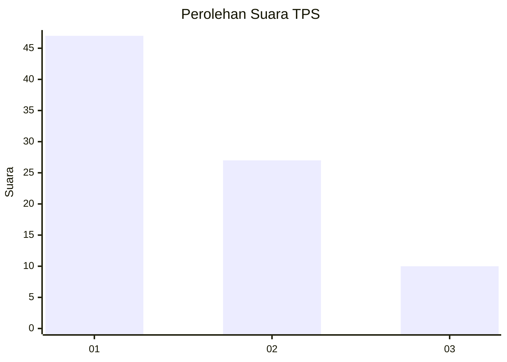
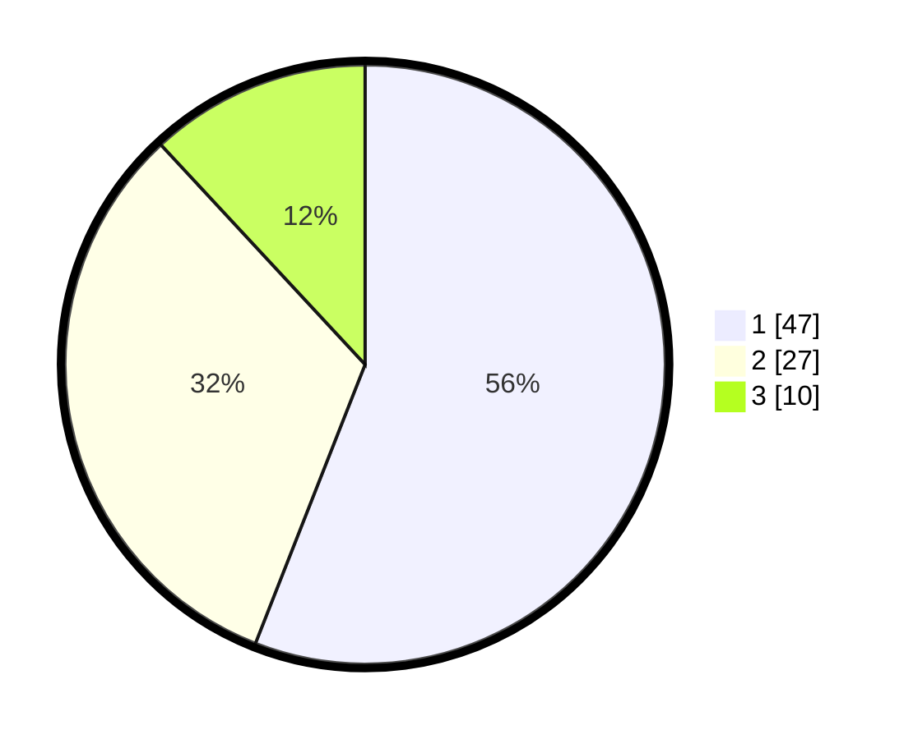

# Hasil

## Grafik

## Tabel

| No. | Nama Paslon    | Suara | Suara (raw) | Persentase |
|:--- |:-------------- | -----:| -----------:| ----------:|
| 1   | ANIES MUHAIMIN | 47    | [47][p-1]   | 55,95      |
| 2   | PRABOWO GIBRAN | 27    | [27][p-2]   | 32,14      |
| 3   | GANJAR MAHFUD  | 10    | [10][p-3]   | 11,90      |

[p-1]: https://github.com/gigit-pemilu/pemilu-2024/blob/main/pilpres/hitung-suara/sub/36-banten/sub/03-tangerang/sub/28-kelapa-dua/sub/1005-bojong-nangka/sub/039-tps/sub/paslon-1.txt
[p-2]: https://github.com/gigit-pemilu/pemilu-2024/blob/main/pilpres/hitung-suara/sub/36-banten/sub/03-tangerang/sub/28-kelapa-dua/sub/1005-bojong-nangka/sub/039-tps/sub/paslon-2.txt
[p-3]: https://github.com/gigit-pemilu/pemilu-2024/blob/main/pilpres/hitung-suara/sub/36-banten/sub/03-tangerang/sub/28-kelapa-dua/sub/1005-bojong-nangka/sub/039-tps/sub/paslon-3.txt

## Foto C Plano

https://sirekap-obj-formc.kpu.go.id/ccf5/pemilu/ppwp/36/03/28/10/05/3603281005039-20240223-150312--b92cf1df-ecdd-46b9-9166-9dd2d6a6a578.jpg

https://sirekap-obj-formc.kpu.go.id/ccf5/pemilu/ppwp/36/03/28/10/05/3603281005039-20240223-150453--698d3b18-13bb-40eb-837c-f7de72e77cd5.jpg

https://sirekap-obj-formc.kpu.go.id/ccf5/pemilu/ppwp/36/03/28/10/05/3603281005039-20240223-150551--26e1a42a-ae27-4d36-a6f1-33cef6ca2779.jpg

## Metadata

| Key        | Value               |
| ---------- | ------------------- |
| Time Stamp | 2024-02-24 22:31:28 |

