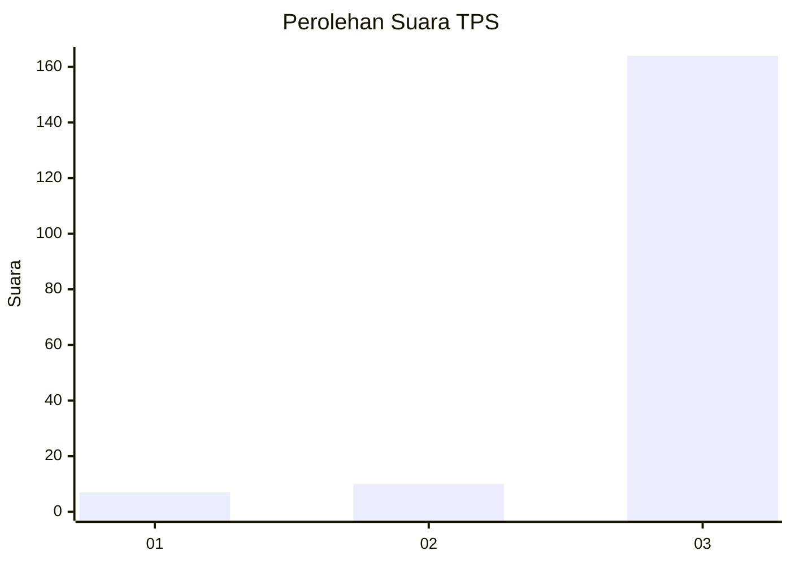
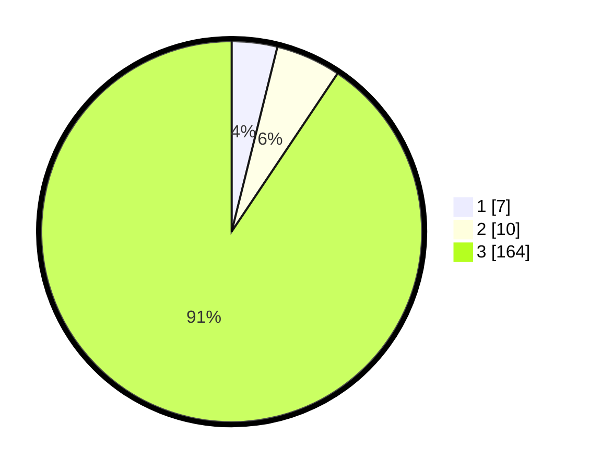

# Hasil

## Grafik

## Tabel

| No. | Nama Paslon    | Suara | Suara (raw) | Persentase |
|:--- |:-------------- | -----:| -----------:| ----------:|
| 1   | ANIES MUHAIMIN | 7     | [7][p-1]    | 3,87       |
| 2   | PRABOWO GIBRAN | 10    | [10][p-2]   | 5,52       |
| 3   | GANJAR MAHFUD  | 164   | [164][p-3]  | 90,61      |

[p-1]: https://github.com/gigit-pemilu/pemilu-2024/blob/main/pilpres/hitung-suara/sub/36-banten/sub/03-tangerang/sub/28-kelapa-dua/sub/2006-curug-sangereng/sub/036-tps/sub/paslon-1.txt
[p-2]: https://github.com/gigit-pemilu/pemilu-2024/blob/main/pilpres/hitung-suara/sub/36-banten/sub/03-tangerang/sub/28-kelapa-dua/sub/2006-curug-sangereng/sub/036-tps/sub/paslon-2.txt
[p-3]: https://github.com/gigit-pemilu/pemilu-2024/blob/main/pilpres/hitung-suara/sub/36-banten/sub/03-tangerang/sub/28-kelapa-dua/sub/2006-curug-sangereng/sub/036-tps/sub/paslon-3.txt

## Foto C Plano

https://sirekap-obj-formc.kpu.go.id/5fc3/pemilu/ppwp/36/03/28/20/06/3603282006036-20240223-094340--53a2ccf8-c639-4257-b478-c9165851945c.jpg

https://sirekap-obj-formc.kpu.go.id/5fc3/pemilu/ppwp/36/03/28/20/06/3603282006036-20240223-094418--d0030a49-e6a3-45b3-98dd-c7c245d04c46.jpg

https://sirekap-obj-formc.kpu.go.id/5fc3/pemilu/ppwp/36/03/28/20/06/3603282006036-20240223-094454--dcae99d5-9e4c-4b6c-a3ff-da476584d817.jpg

## Metadata

| Key        | Value               |
| ---------- | ------------------- |
| Time Stamp | 2024-02-25 11:00:00 |

