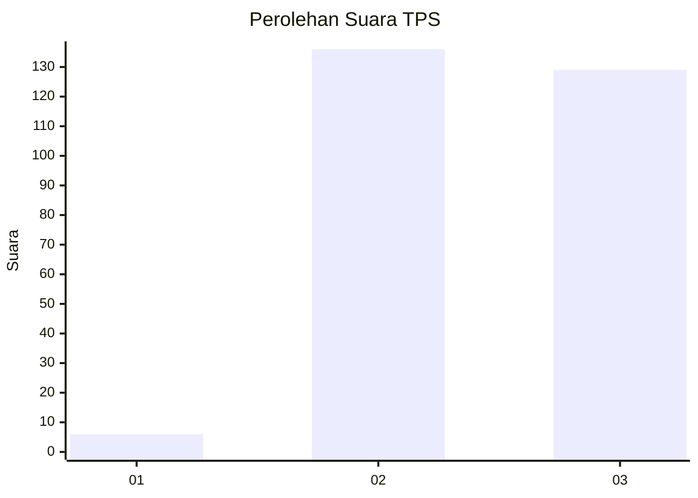
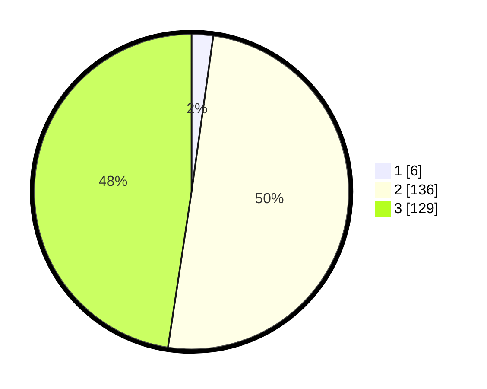

# Hasil

## Grafik

## Tabel

| No. | Nama Paslon    | Suara | Suara (raw) | Persentase |
|:--- |:-------------- | -----:| -----------:| ----------:|
| 1   | ANIES MUHAIMIN | 6     | [6][p-1]    | 2,21       |
| 2   | PRABOWO GIBRAN | 136   | [136][p-2]  | 50,18      |
| 3   | GANJAR MAHFUD  | 129   | [129][p-3]  | 47,60      |

[p-1]: https://github.com/gigit-pemilu/pemilu-2024/blob/main/pilpres/hitung-suara/sub/36-banten/sub/03-tangerang/sub/28-kelapa-dua/sub/2006-curug-sangereng/sub/037-tps/sub/paslon-1.txt
[p-2]: https://github.com/gigit-pemilu/pemilu-2024/blob/main/pilpres/hitung-suara/sub/36-banten/sub/03-tangerang/sub/28-kelapa-dua/sub/2006-curug-sangereng/sub/037-tps/sub/paslon-2.txt
[p-3]: https://github.com/gigit-pemilu/pemilu-2024/blob/main/pilpres/hitung-suara/sub/36-banten/sub/03-tangerang/sub/28-kelapa-dua/sub/2006-curug-sangereng/sub/037-tps/sub/paslon-3.txt

## Foto C Plano

https://sirekap-obj-formc.kpu.go.id/139e/pemilu/ppwp/36/03/28/20/06/3603282006037-20240214-224750--1d8d016c-ebc2-4f0c-bf9f-2b7ab0612973.jpg

https://sirekap-obj-formc.kpu.go.id/139e/pemilu/ppwp/36/03/28/20/06/3603282006037-20240214-224833--20c3f51f-e5ff-4343-a3bc-c6751299e262.jpg

https://sirekap-obj-formc.kpu.go.id/139e/pemilu/ppwp/36/03/28/20/06/3603282006037-20240214-224934--a84135ca-bfc2-403a-95be-78fd82ec609a.jpg

## Metadata

| Key        | Value               |
| ---------- | ------------------- |
| Time Stamp | 2024-02-19 16:00:00 |

