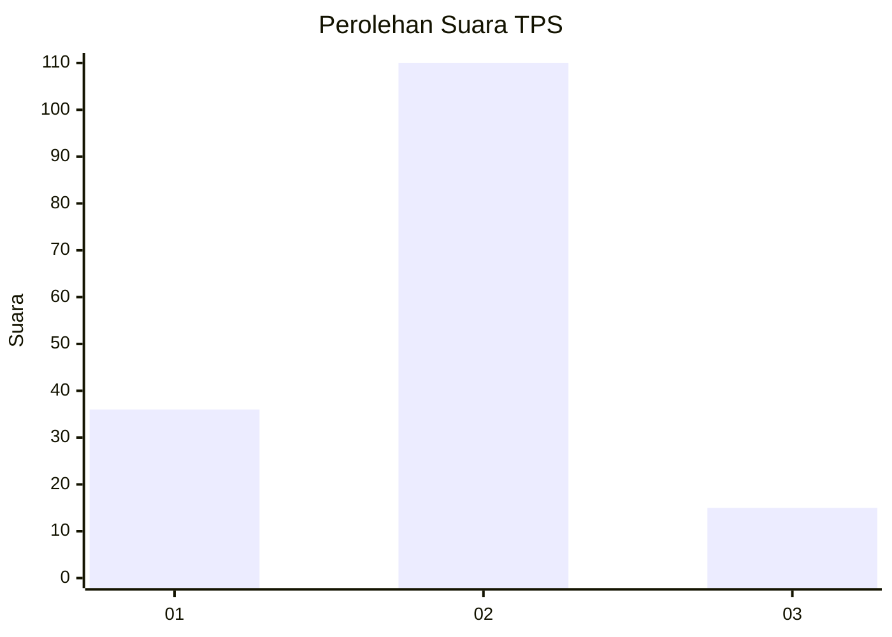

# Hasil

## Grafik

## Tabel

| No. | Nama Paslon    | Suara | Suara (raw) | Persentase |
|:--- |:-------------- | -----:| -----------:| ----------:|
| 1   | ANIES MUHAIMIN | 36    | [36][p-1]   | 22,36      |
| 2   | PRABOWO GIBRAN | 110   | [110][p-2]  | 68,32      |
| 3   | GANJAR MAHFUD  | 15    | [15][p-3]   | 9,32       |

[p-1]: https://github.com/gigit-pemilu/pemilu-2024/blob/main/pilpres/hitung-suara/sub/36-banten/sub/03-tangerang/sub/29-sindang-jaya/sub/2001-sindang-jaya/sub/002-tps/sub/paslon-1.txt
[p-2]: https://github.com/gigit-pemilu/pemilu-2024/blob/main/pilpres/hitung-suara/sub/36-banten/sub/03-tangerang/sub/29-sindang-jaya/sub/2001-sindang-jaya/sub/002-tps/sub/paslon-2.txt
[p-3]: https://github.com/gigit-pemilu/pemilu-2024/blob/main/pilpres/hitung-suara/sub/36-banten/sub/03-tangerang/sub/29-sindang-jaya/sub/2001-sindang-jaya/sub/002-tps/sub/paslon-3.txt

## Foto C Plano

https://sirekap-obj-formc.kpu.go.id/2af8/pemilu/ppwp/36/03/29/20/01/3603292001002-20240216-160614--9ab3080c-5770-4e3c-8f4d-8a573cec7e36.jpg

https://sirekap-obj-formc.kpu.go.id/2af8/pemilu/ppwp/36/03/29/20/01/3603292001002-20240216-160658--a73fdfbc-6208-4e5d-ad73-e7b756eee335.jpg

https://sirekap-obj-formc.kpu.go.id/2af8/pemilu/ppwp/36/03/29/20/01/3603292001002-20240216-160718--dbe6921e-4ccb-46b3-bd9d-2872d60e014c.jpg

## Metadata

| Key        | Value               |
| ---------- | ------------------- |
| Time Stamp | 2024-02-19 12:00:00 |

