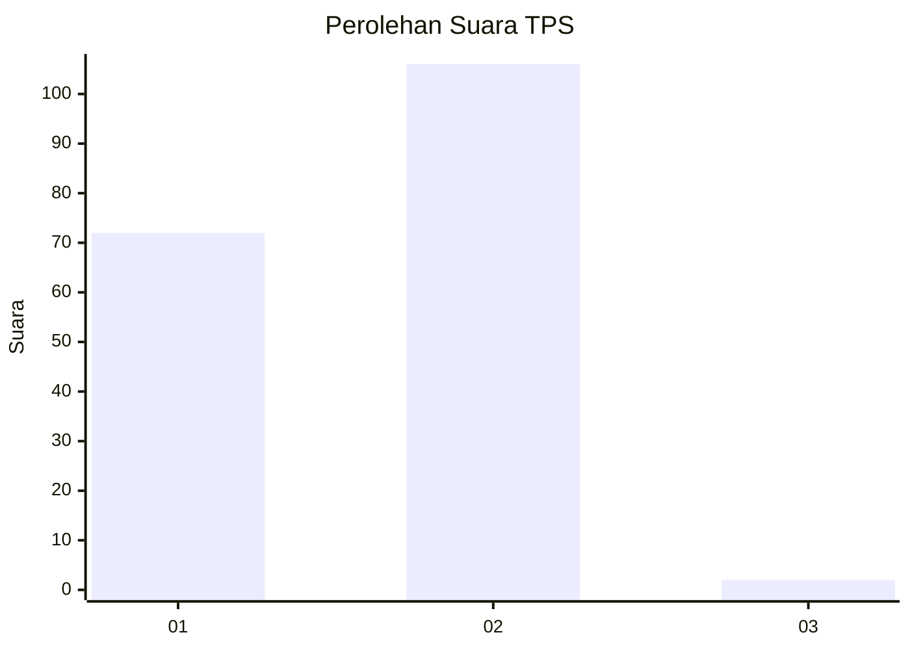
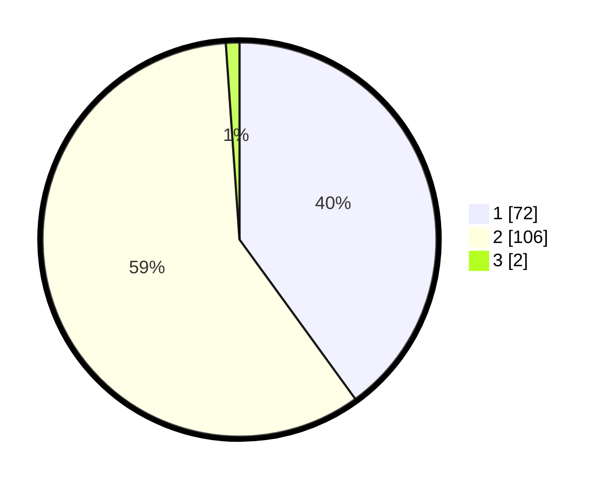

# Hasil

## Grafik

## Tabel

| No. | Nama Paslon    | Suara | Suara (raw) | Persentase |
|:--- |:-------------- | -----:| -----------:| ----------:|
| 1   | ANIES MUHAIMIN | 72    | [72][p-1]   | 40,00      |
| 2   | PRABOWO GIBRAN | 106   | [106][p-2]  | 58,89      |
| 3   | GANJAR MAHFUD  | 2     | [2][p-3]    | 1,11       |

[p-1]: https://github.com/gigit-pemilu/pemilu-2024-36-banten/blob/main/pilpres/hitung-suara/sub/36-banten/sub/03-tangerang/sub/29-sindang-jaya/sub/2001-sindang-jaya/sub/006-tps/sub/paslon-1.txt
[p-2]: https://github.com/gigit-pemilu/pemilu-2024-36-banten/blob/main/pilpres/hitung-suara/sub/36-banten/sub/03-tangerang/sub/29-sindang-jaya/sub/2001-sindang-jaya/sub/006-tps/sub/paslon-2.txt
[p-3]: https://github.com/gigit-pemilu/pemilu-2024-36-banten/blob/main/pilpres/hitung-suara/sub/36-banten/sub/03-tangerang/sub/29-sindang-jaya/sub/2001-sindang-jaya/sub/006-tps/sub/paslon-3.txt

## Foto C Plano

https://sirekap-obj-formc.kpu.go.id/be22/pemilu/ppwp/36/03/29/20/01/3603292001006-20240216-213014--9a147330-e7ff-47cb-bc02-7b371efd1b73.jpg

https://sirekap-obj-formc.kpu.go.id/be22/pemilu/ppwp/36/03/29/20/01/3603292001006-20240216-212952--40271a6c-b4ca-462b-83e1-2807bf02a03c.jpg

https://sirekap-obj-formc.kpu.go.id/be22/pemilu/ppwp/36/03/29/20/01/3603292001006-20240216-212922--31d21f1e-cc74-4fb5-8c41-009616bdfbf1.jpg

## Metadata

| Key        | Value               |
| ---------- | ------------------- |
| Time Stamp | 2024-02-19 13:00:00 |

