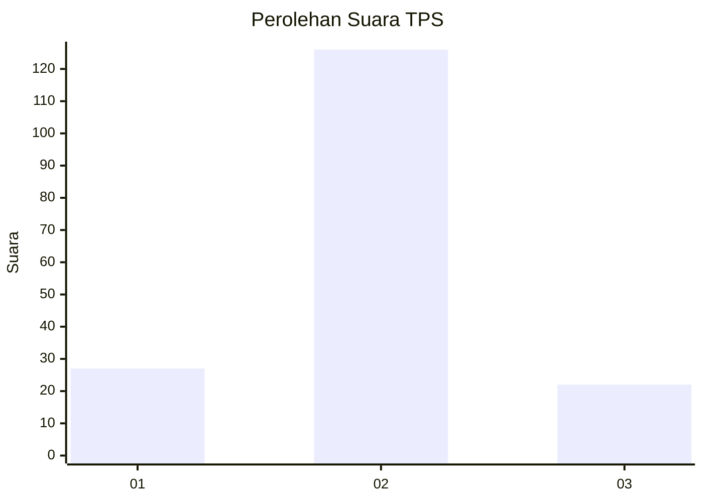
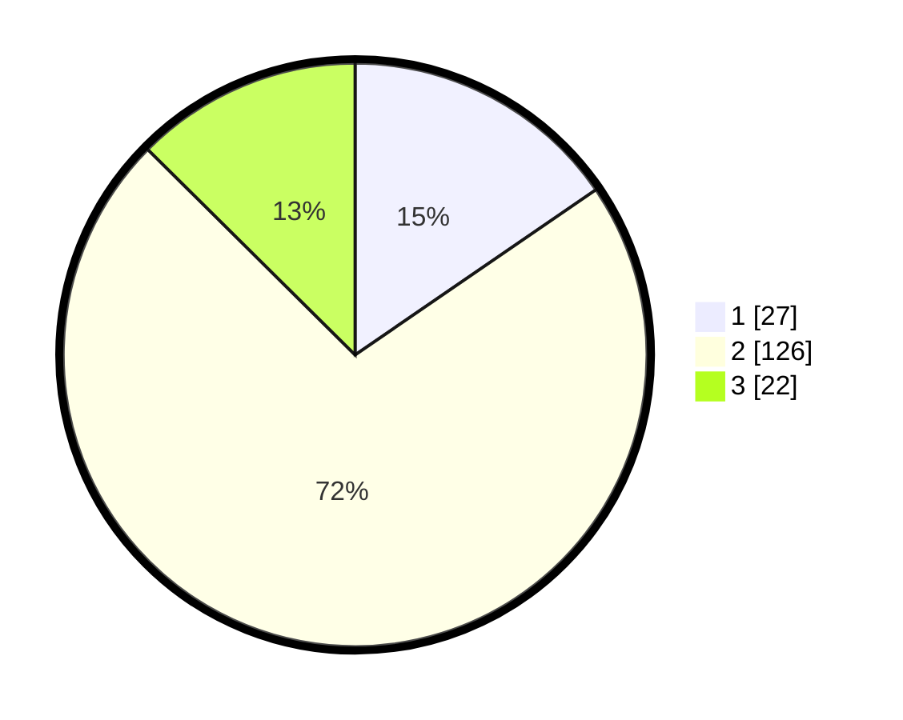

# Hasil

## Grafik

## Tabel

| No. | Nama Paslon    | Suara | Suara (raw) | Persentase |
|:--- |:-------------- | -----:| -----------:| ----------:|
| 1   | ANIES MUHAIMIN | 27    | [27][p-1]   | 15,43      |
| 2   | PRABOWO GIBRAN | 126   | [126][p-2]  | 72,00      |
| 3   | GANJAR MAHFUD  | 22    | [22][p-3]   | 12,57      |

[p-1]: https://github.com/gigit-pemilu/pemilu-2024/blob/main/pilpres/hitung-suara/sub/36-banten/sub/03-tangerang/sub/30-sepatan-timur/sub/2001-kedaung-barat/sub/001-tps/sub/paslon-1.txt
[p-2]: https://github.com/gigit-pemilu/pemilu-2024/blob/main/pilpres/hitung-suara/sub/36-banten/sub/03-tangerang/sub/30-sepatan-timur/sub/2001-kedaung-barat/sub/001-tps/sub/paslon-2.txt
[p-3]: https://github.com/gigit-pemilu/pemilu-2024/blob/main/pilpres/hitung-suara/sub/36-banten/sub/03-tangerang/sub/30-sepatan-timur/sub/2001-kedaung-barat/sub/001-tps/sub/paslon-3.txt

## Foto C Plano

https://sirekap-obj-formc.kpu.go.id/68e3/pemilu/ppwp/36/03/30/20/01/3603302001001-20240222-115308--8efa7816-6e7a-4ba3-89b5-eccff1d13c9d.jpg

https://sirekap-obj-formc.kpu.go.id/68e3/pemilu/ppwp/36/03/30/20/01/3603302001001-20240222-115501--6fa90459-9f98-4f4b-b235-246177a27610.jpg

https://sirekap-obj-formc.kpu.go.id/68e3/pemilu/ppwp/36/03/30/20/01/3603302001001-20240222-115354--a6c53d6d-1252-4d58-94ec-083220a6d782.jpg

## Metadata

| Key        | Value               |
| ---------- | ------------------- |
| Time Stamp | 2024-02-24 22:31:28 |

