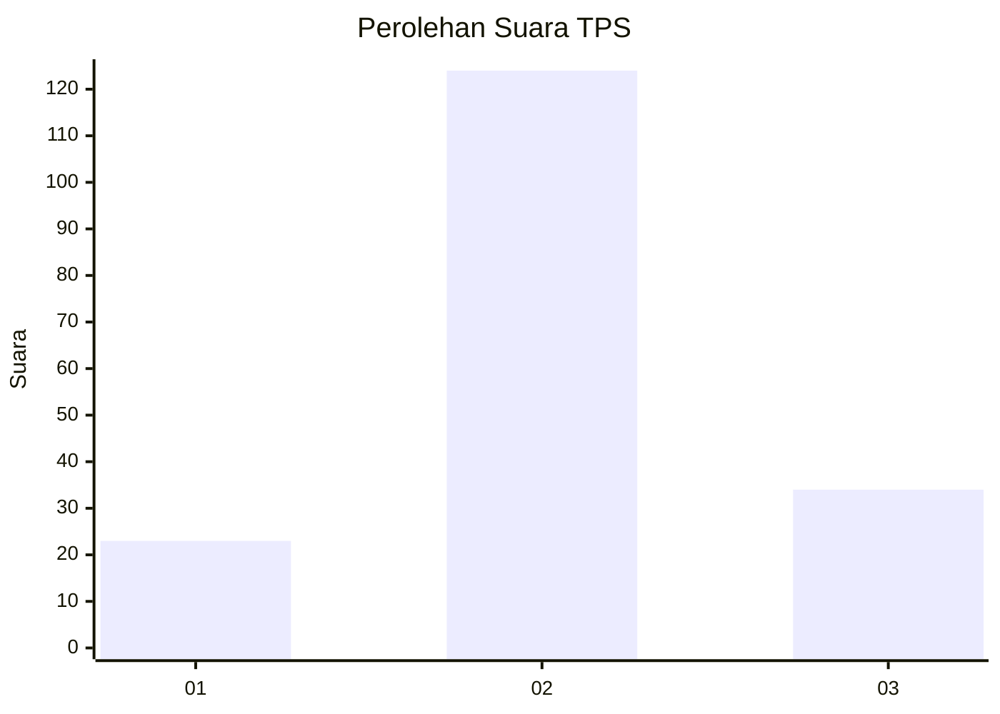
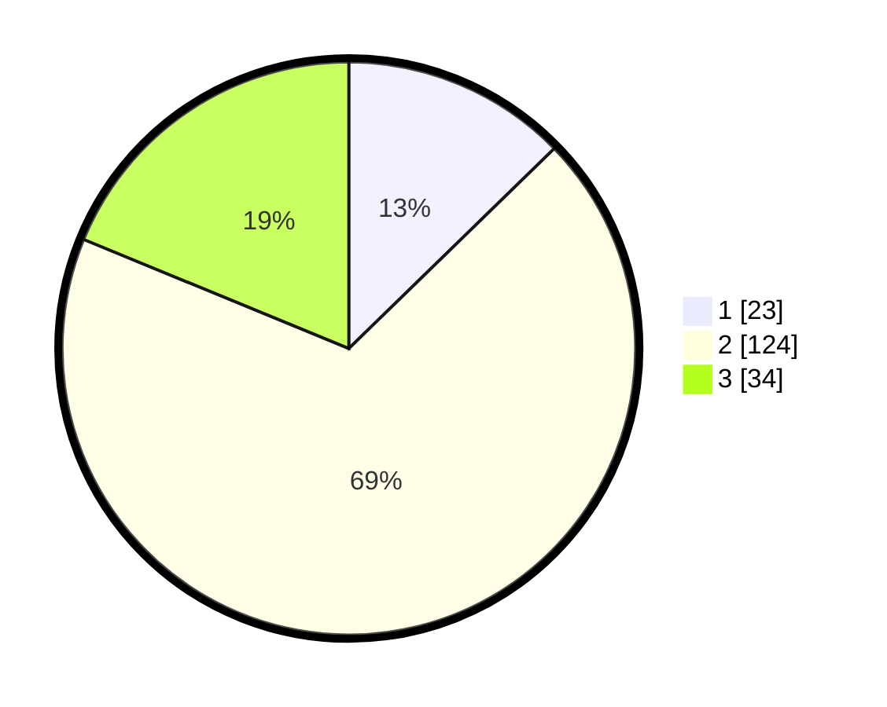

# Hasil

## Grafik

## Tabel

| No. | Nama Paslon    | Suara | Suara (raw) | Persentase |
|:--- |:-------------- | -----:| -----------:| ----------:|
| 1   | ANIES MUHAIMIN | 23    | [23][p-1]   | 12,71      |
| 2   | PRABOWO GIBRAN | 124   | [124][p-2]  | 68,51      |
| 3   | GANJAR MAHFUD  | 34    | [34][p-3]   | 18,78      |

[p-1]: https://github.com/gigit-pemilu/pemilu-2024/blob/main/pilpres/hitung-suara/sub/36-banten/sub/03-tangerang/sub/30-sepatan-timur/sub/2001-kedaung-barat/sub/002-tps/sub/paslon-1.txt
[p-2]: https://github.com/gigit-pemilu/pemilu-2024/blob/main/pilpres/hitung-suara/sub/36-banten/sub/03-tangerang/sub/30-sepatan-timur/sub/2001-kedaung-barat/sub/002-tps/sub/paslon-2.txt
[p-3]: https://github.com/gigit-pemilu/pemilu-2024/blob/main/pilpres/hitung-suara/sub/36-banten/sub/03-tangerang/sub/30-sepatan-timur/sub/2001-kedaung-barat/sub/002-tps/sub/paslon-3.txt

## Foto C Plano

https://sirekap-obj-formc.kpu.go.id/1815/pemilu/ppwp/36/03/30/20/01/3603302001002-20240214-224753--0b6c6c16-a390-4b65-9d35-76ca4f991615.jpg

https://sirekap-obj-formc.kpu.go.id/1815/pemilu/ppwp/36/03/30/20/01/3603302001002-20240214-225121--87d885dc-b6d6-4fd2-b9ba-fee8e92975b6.jpg

https://sirekap-obj-formc.kpu.go.id/1815/pemilu/ppwp/36/03/30/20/01/3603302001002-20240214-225402--89e28f9c-2756-4680-aa6c-0cb2486ecbbc.jpg

## Metadata

| Key        | Value               |
| ---------- | ------------------- |
| Time Stamp | 2024-02-19 13:00:00 |

