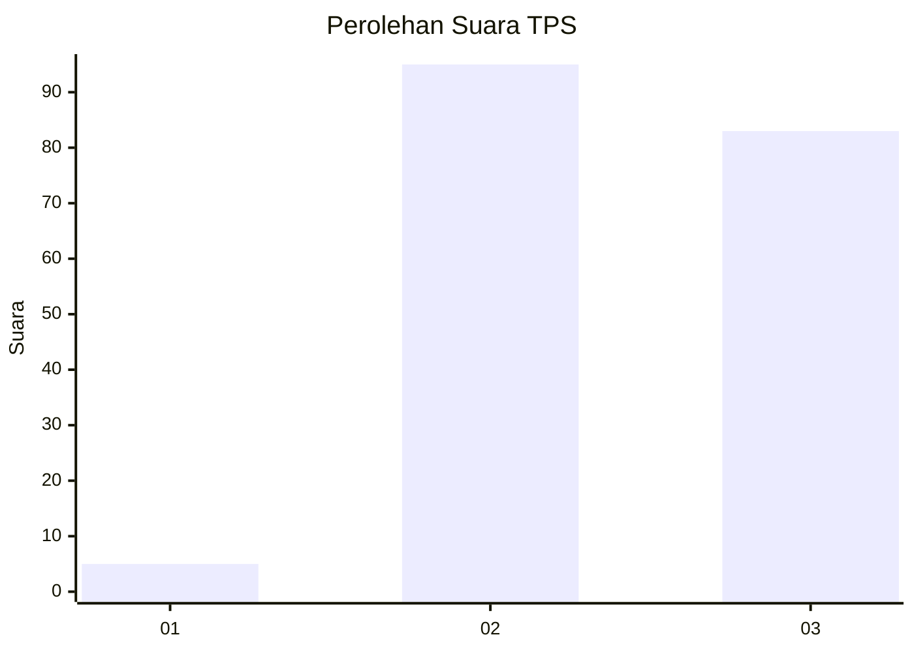
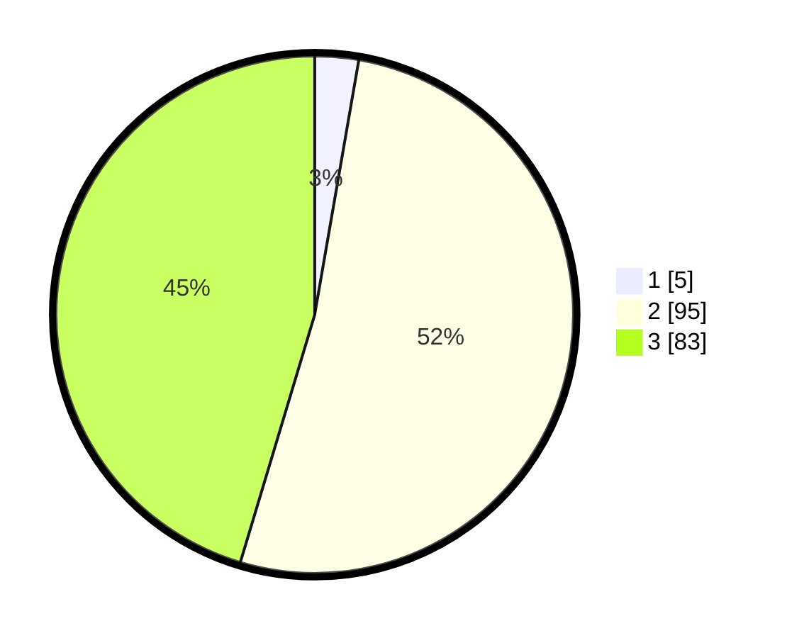

# Hasil

## Grafik

## Tabel

| No. | Nama Paslon    | Suara | Suara (raw) | Persentase |
|:--- |:-------------- | -----:| -----------:| ----------:|
| 1   | ANIES MUHAIMIN | 5     | [5][p-1]    | 2,73       |
| 2   | PRABOWO GIBRAN | 95    | [95][p-2]   | 51,91      |
| 3   | GANJAR MAHFUD  | 83    | [83][p-3]   | 45,36      |

[p-1]: https://github.com/gigit-pemilu/pemilu-2024/blob/main/pilpres/hitung-suara/sub/36-banten/sub/03-tangerang/sub/30-sepatan-timur/sub/2001-kedaung-barat/sub/003-tps/sub/paslon-1.txt
[p-2]: https://github.com/gigit-pemilu/pemilu-2024/blob/main/pilpres/hitung-suara/sub/36-banten/sub/03-tangerang/sub/30-sepatan-timur/sub/2001-kedaung-barat/sub/003-tps/sub/paslon-2.txt
[p-3]: https://github.com/gigit-pemilu/pemilu-2024/blob/main/pilpres/hitung-suara/sub/36-banten/sub/03-tangerang/sub/30-sepatan-timur/sub/2001-kedaung-barat/sub/003-tps/sub/paslon-3.txt

## Foto C Plano

https://sirekap-obj-formc.kpu.go.id/cfc2/pemilu/ppwp/36/03/30/20/01/3603302001003-20240222-151450--ff6fbee9-389e-480e-9d56-db533411e125.jpg

https://sirekap-obj-formc.kpu.go.id/cfc2/pemilu/ppwp/36/03/30/20/01/3603302001003-20240214-211223--0ba647e9-dbc4-466c-b52b-d612db8dee82.jpg

https://sirekap-obj-formc.kpu.go.id/cfc2/pemilu/ppwp/36/03/30/20/01/3603302001003-20240214-211322--e85cb075-b9b2-4f64-b6da-49c4a3bda7c7.jpg

## Metadata

| Key        | Value               |
| ---------- | ------------------- |
| Time Stamp | 2024-02-22 16:00:00 |

