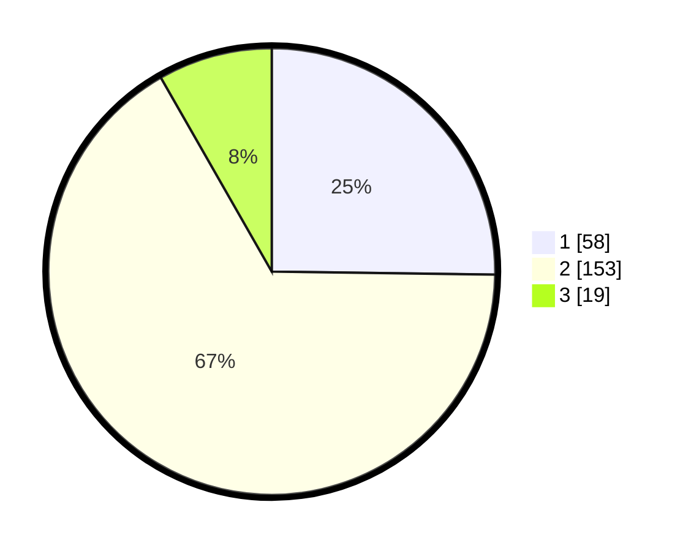

# Hasil

## Grafik

## Tabel

| No. | Nama Paslon    | Suara | Suara (raw) | Persentase |
|:--- |:-------------- | -----:| -----------:| ----------:|
| 1   | ANIES MUHAIMIN | 58    | [58][p-1]   | 25,22      |
| 2   | PRABOWO GIBRAN | 153   | [153][p-2]  | 66,52      |
| 3   | GANJAR MAHFUD  | 19    | [19][p-3]   | 8,26       |

[p-1]: https://github.com/gigit-pemilu/pemilu-2024/blob/main/pilpres/hitung-suara/sub/36-banten/sub/03-tangerang/sub/30-sepatan-timur/sub/2001-kedaung-barat/sub/005-tps/sub/paslon-1.txt
[p-2]: https://github.com/gigit-pemilu/pemilu-2024/blob/main/pilpres/hitung-suara/sub/36-banten/sub/03-tangerang/sub/30-sepatan-timur/sub/2001-kedaung-barat/sub/005-tps/sub/paslon-2.txt
[p-3]: https://github.com/gigit-pemilu/pemilu-2024/blob/main/pilpres/hitung-suara/sub/36-banten/sub/03-tangerang/sub/30-sepatan-timur/sub/2001-kedaung-barat/sub/005-tps/sub/paslon-3.txt

## Foto C Plano

https://sirekap-obj-formc.kpu.go.id/7324/pemilu/ppwp/36/03/30/20/01/3603302001005-20240214-204105--aaff32e5-785d-4679-9529-8adcc94054e5.jpg

https://sirekap-obj-formc.kpu.go.id/7324/pemilu/ppwp/36/03/30/20/01/3603302001005-20240214-204121--a4279112-c513-42cc-b941-fd4fcaa819da.jpg

https://sirekap-obj-formc.kpu.go.id/7324/pemilu/ppwp/36/03/30/20/01/3603302001005-20240214-204130--350ba40c-b059-4eb3-8b7b-2bf6180e20af.jpg

## Metadata

| Key        | Value               |
| ---------- | ------------------- |
| Time Stamp | 2024-02-19 13:00:00 |

