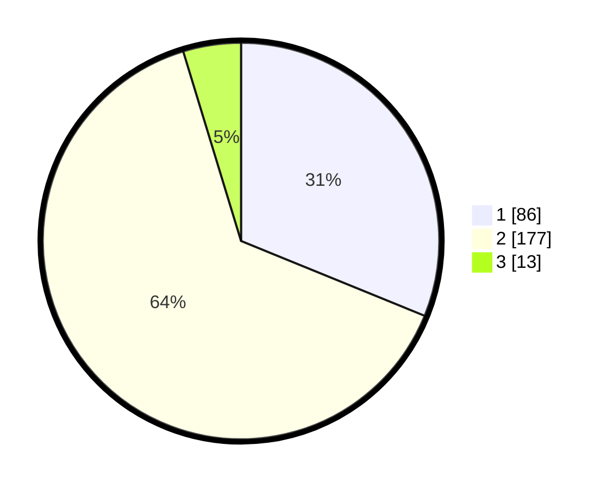

# Hasil

## Grafik

## Tabel

| No. | Nama Paslon    | Suara | Suara (raw) | Persentase |
|:--- |:-------------- | -----:| -----------:| ----------:|
| 1   | ANIES MUHAIMIN | 86    | [86][p-1]   | 31,16      |
| 2   | PRABOWO GIBRAN | 177   | [177][p-2]  | 64,13      |
| 3   | GANJAR MAHFUD  | 13    | [13][p-3]   | 4,71       |

[p-1]: https://github.com/gigit-pemilu/pemilu-2024-36-banten/blob/main/pilpres/hitung-suara/sub/36-banten/sub/03-tangerang/sub/30-sepatan-timur/sub/2008-tanah-merah/sub/011-tps/sub/paslon-1.txt
[p-2]: https://github.com/gigit-pemilu/pemilu-2024-36-banten/blob/main/pilpres/hitung-suara/sub/36-banten/sub/03-tangerang/sub/30-sepatan-timur/sub/2008-tanah-merah/sub/011-tps/sub/paslon-2.txt
[p-3]: https://github.com/gigit-pemilu/pemilu-2024-36-banten/blob/main/pilpres/hitung-suara/sub/36-banten/sub/03-tangerang/sub/30-sepatan-timur/sub/2008-tanah-merah/sub/011-tps/sub/paslon-3.txt

## Foto C Plano

https://sirekap-obj-formc.kpu.go.id/5474/pemilu/ppwp/36/03/30/20/08/3603302008011-20240214-233210--2ee9b99a-ba65-4a6e-9c95-2de119a3fdeb.jpg

https://sirekap-obj-formc.kpu.go.id/5474/pemilu/ppwp/36/03/30/20/08/3603302008011-20240214-233216--1dea4f61-37e6-447e-8c88-ff1c7d3e93a7.jpg

https://sirekap-obj-formc.kpu.go.id/5474/pemilu/ppwp/36/03/30/20/08/3603302008011-20240214-233220--1f2e5e18-d2e3-40e0-8327-7edb44fa4b86.jpg

## Metadata

| Key        | Value               |
| ---------- | ------------------- |
| Time Stamp | 2024-02-19 17:00:00 |

