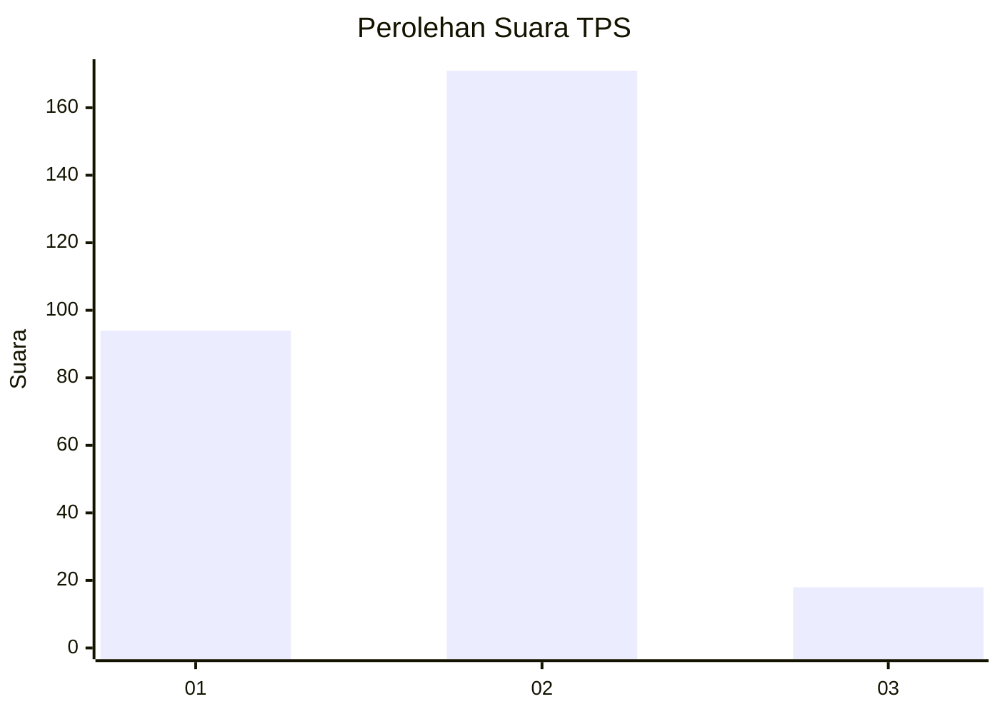
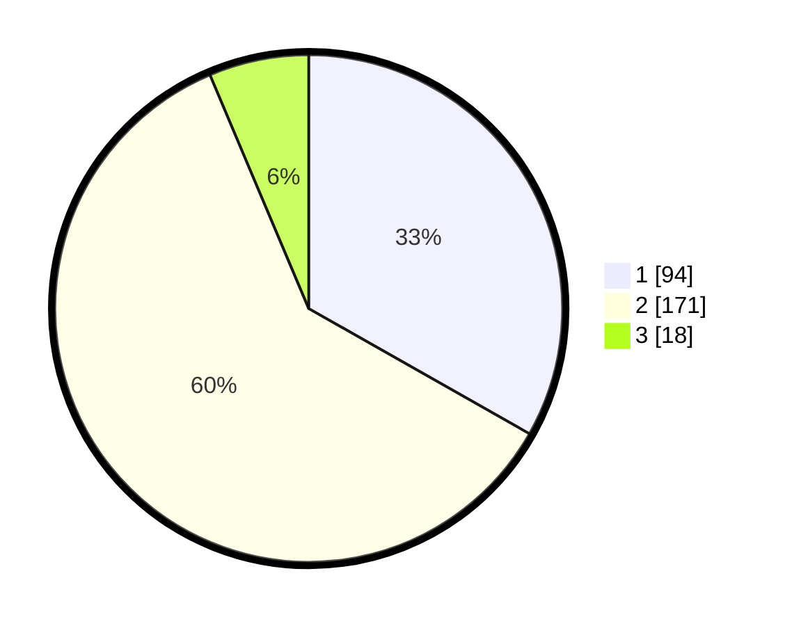

# Hasil

## Grafik

## Tabel

| No. | Nama Paslon    | Suara | Suara (raw) | Persentase |
|:--- |:-------------- | -----:| -----------:| ----------:|
| 1   | ANIES MUHAIMIN | 94    | [94][p-1]   | 33,22      |
| 2   | PRABOWO GIBRAN | 171   | [171][p-2]  | 60,42      |
| 3   | GANJAR MAHFUD  | 18    | [18][p-3]   | 6,36       |

[p-1]: https://github.com/gigit-pemilu/pemilu-2024/blob/main/pilpres/hitung-suara/sub/36-banten/sub/03-tangerang/sub/31-solear/sub/2001-solear/sub/028-tps/sub/paslon-1.txt
[p-2]: https://github.com/gigit-pemilu/pemilu-2024/blob/main/pilpres/hitung-suara/sub/36-banten/sub/03-tangerang/sub/31-solear/sub/2001-solear/sub/028-tps/sub/paslon-2.txt
[p-3]: https://github.com/gigit-pemilu/pemilu-2024/blob/main/pilpres/hitung-suara/sub/36-banten/sub/03-tangerang/sub/31-solear/sub/2001-solear/sub/028-tps/sub/paslon-3.txt

## Foto C Plano

https://sirekap-obj-formc.kpu.go.id/9533/pemilu/ppwp/36/03/31/20/01/3603312001028-20240215-030749--e80d23bf-4cf9-4e98-87f9-0f24a909b689.jpg

https://sirekap-obj-formc.kpu.go.id/9533/pemilu/ppwp/36/03/31/20/01/3603312001028-20240215-031017--33d8f58e-3f18-4d6b-8136-97deeaa8a47e.jpg

https://sirekap-obj-formc.kpu.go.id/9533/pemilu/ppwp/36/03/31/20/01/3603312001028-20240215-031145--27520f81-6445-49e5-bc7e-0bbe8683bb44.jpg

## Metadata

| Key        | Value               |
| ---------- | ------------------- |
| Time Stamp | 2024-02-19 12:00:00 |

