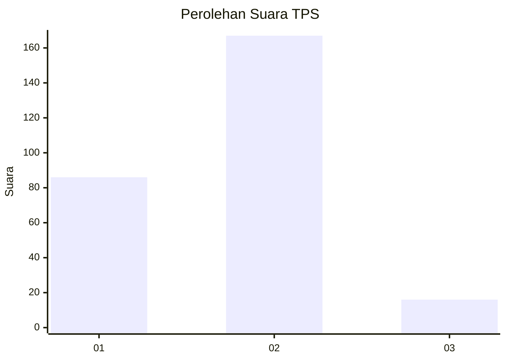
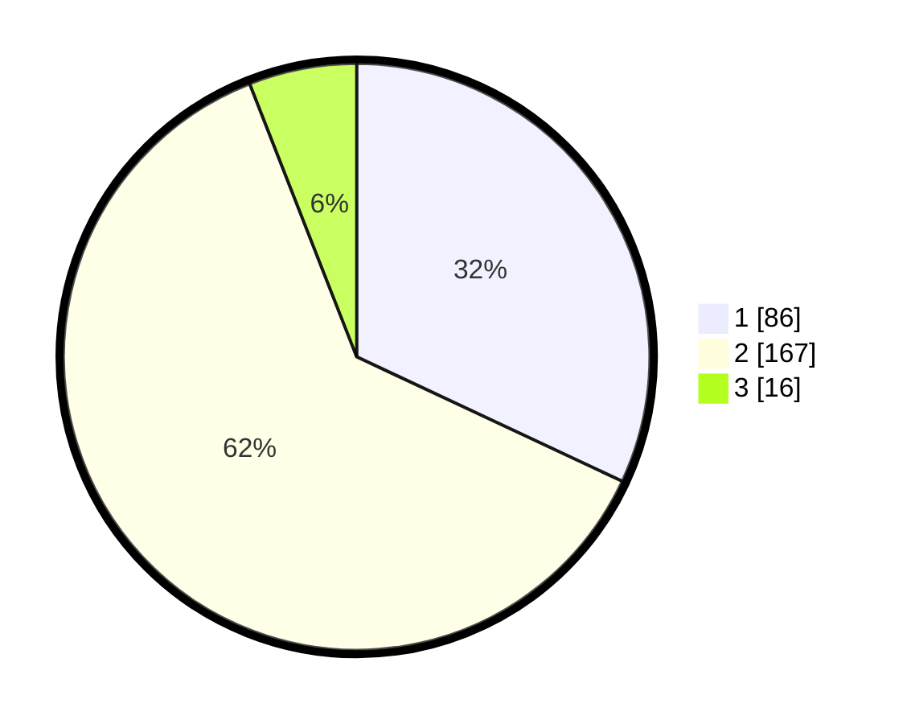

# Hasil

## Grafik

## Tabel

| No. | Nama Paslon    | Suara | Suara (raw) | Persentase |
|:--- |:-------------- | -----:| -----------:| ----------:|
| 1   | ANIES MUHAIMIN | 86    | [86][p-1]   | 31,97      |
| 2   | PRABOWO GIBRAN | 167   | [167][p-2]  | 62,08      |
| 3   | GANJAR MAHFUD  | 16    | [16][p-3]   | 5,95       |

[p-1]: https://github.com/gigit-pemilu/pemilu-2024-36-banten/blob/main/pilpres/hitung-suara/sub/36-banten/sub/03-tangerang/sub/31-solear/sub/2006-pasanggrahan/sub/023-tps/sub/paslon-1.txt
[p-2]: https://github.com/gigit-pemilu/pemilu-2024-36-banten/blob/main/pilpres/hitung-suara/sub/36-banten/sub/03-tangerang/sub/31-solear/sub/2006-pasanggrahan/sub/023-tps/sub/paslon-2.txt
[p-3]: https://github.com/gigit-pemilu/pemilu-2024-36-banten/blob/main/pilpres/hitung-suara/sub/36-banten/sub/03-tangerang/sub/31-solear/sub/2006-pasanggrahan/sub/023-tps/sub/paslon-3.txt

## Foto C Plano

https://sirekap-obj-formc.kpu.go.id/3c09/pemilu/ppwp/36/03/31/20/06/3603312006023-20240225-103948--89078ab2-6af1-4099-87df-a603ab9c4247.jpg

https://sirekap-obj-formc.kpu.go.id/3c09/pemilu/ppwp/36/03/31/20/06/3603312006023-20240223-171916--86ef0a9f-163b-40cf-9976-638b8814dcd5.jpg

https://sirekap-obj-formc.kpu.go.id/3c09/pemilu/ppwp/36/03/31/20/06/3603312006023-20240221-142928--07e3c5f0-3d79-4734-92e8-4d13187b0aca.jpg

## Metadata

| Key        | Value               |
| ---------- | ------------------- |
| Time Stamp | 2024-02-25 11:00:00 |

