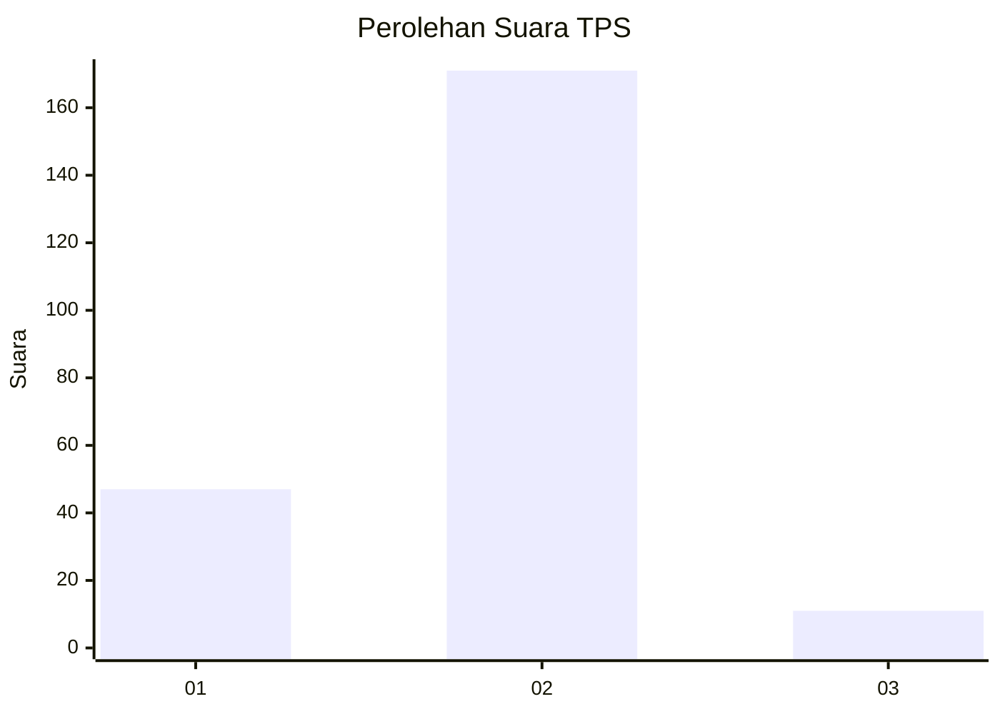
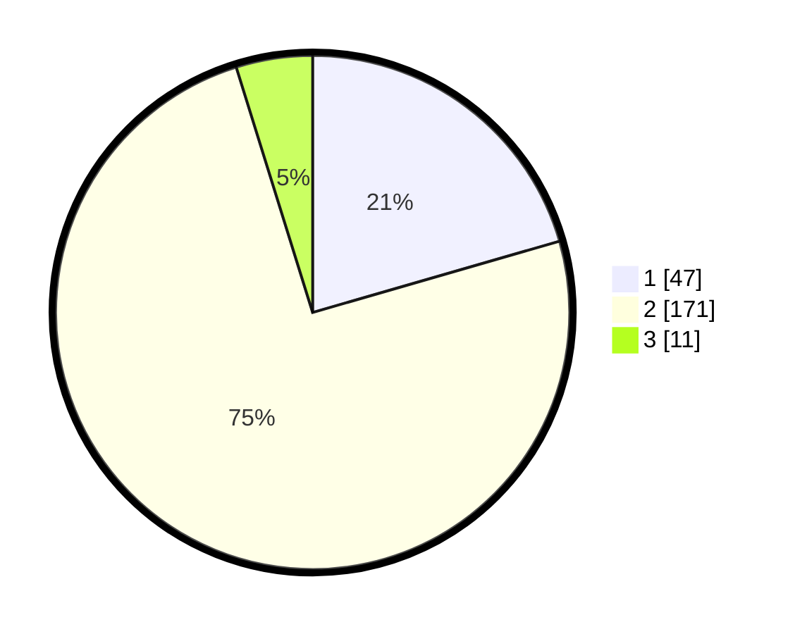

# Hasil

## Grafik

## Tabel

| No. | Nama Paslon    | Suara | Suara (raw) | Persentase |
|:--- |:-------------- | -----:| -----------:| ----------:|
| 1   | ANIES MUHAIMIN | 47    | [47][p-1]   | 20,52      |
| 2   | PRABOWO GIBRAN | 171   | [171][p-2]  | 74,67      |
| 3   | GANJAR MAHFUD  | 11    | [11][p-3]   | 4,80       |

[p-1]: https://github.com/gigit-pemilu/pemilu-2024/blob/main/pilpres/hitung-suara/sub/36-banten/sub/03-tangerang/sub/32-gunung-kaler/sub/2001-gunung-kaler/sub/001-tps/sub/paslon-1.txt
[p-2]: https://github.com/gigit-pemilu/pemilu-2024/blob/main/pilpres/hitung-suara/sub/36-banten/sub/03-tangerang/sub/32-gunung-kaler/sub/2001-gunung-kaler/sub/001-tps/sub/paslon-2.txt
[p-3]: https://github.com/gigit-pemilu/pemilu-2024/blob/main/pilpres/hitung-suara/sub/36-banten/sub/03-tangerang/sub/32-gunung-kaler/sub/2001-gunung-kaler/sub/001-tps/sub/paslon-3.txt

## Foto C Plano

https://sirekap-obj-formc.kpu.go.id/8374/pemilu/ppwp/36/03/32/20/01/3603322001001-20240224-215851--ec9cd42c-ca66-4591-8e6a-fca4719c7efc.jpg

https://sirekap-obj-formc.kpu.go.id/8374/pemilu/ppwp/36/03/32/20/01/3603322001001-20240224-220032--79693c5d-c0fa-4637-b8bb-b89b750ce6c7.jpg

https://sirekap-obj-formc.kpu.go.id/8374/pemilu/ppwp/36/03/32/20/01/3603322001001-20240224-220210--71ff3c61-70b5-4899-833e-4a404216fda9.jpg

## Metadata

| Key        | Value               |
| ---------- | ------------------- |
| Time Stamp | 2024-02-24 22:31:28 |

## DATA PEMILIH TETAP

Jumlah pemilih dalam DPT: **292**.
 * L: **7**.
 * P: **577**.

## DATA PENGGUNA HAK PILIH

Jumlah pengguna hak pilih dalam DPT: **233**.
 * L: **7**.
 * P: **777**.

Jumlah pengguna hak pilih dalam DPTb: **740**.
 * L: **25**.
 * P: **777**.

Jumlah pengguna hak pilih dalam DPK: **104**.
 * L: **257**.
 * P: **777**.

Jumlah pengguna hak pilih: **477**.
 * L: **557**.
 * P: **774**.

## JUMLAH SUARA SAH DAN TIDAK SAH

JUMLAH SELURUH SUARA SAH: **225**.

JUMLAH SUARA TIDAK SAH: **17**.

JUMLAH SELURUH SUARA SAH DAN SUARA TIDAK SAH: **237**.

