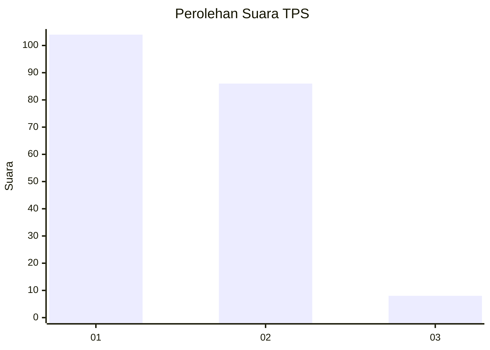
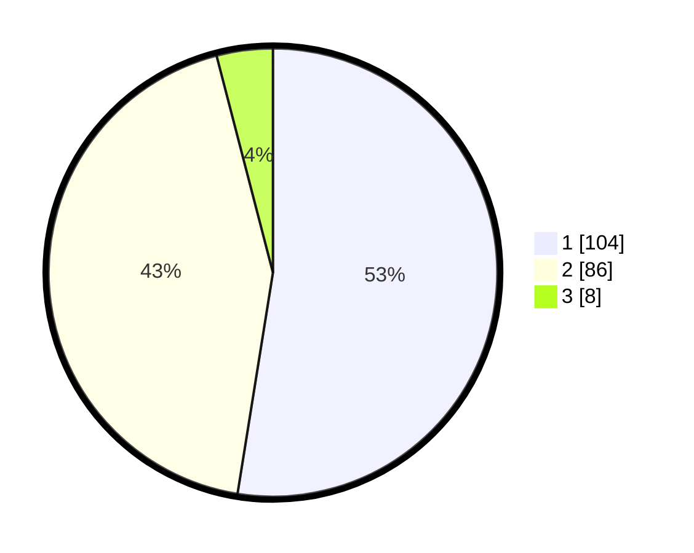

# Hasil

## Grafik

## Tabel

| No. | Nama Paslon    | Suara | Suara (raw) | Persentase |
|:--- |:-------------- | -----:| -----------:| ----------:|
| 1   | ANIES MUHAIMIN | 104   | [104][p-1]  | 52,53      |
| 2   | PRABOWO GIBRAN | 86    | [86][p-2]   | 43,43      |
| 3   | GANJAR MAHFUD  | 8     | [8][p-3]    | 4,04       |

[p-1]: https://github.com/gigit-pemilu/pemilu-2024/blob/main/pilpres/hitung-suara/sub/36-banten/sub/03-tangerang/sub/32-gunung-kaler/sub/2001-gunung-kaler/sub/004-tps/sub/paslon-1.txt
[p-2]: https://github.com/gigit-pemilu/pemilu-2024/blob/main/pilpres/hitung-suara/sub/36-banten/sub/03-tangerang/sub/32-gunung-kaler/sub/2001-gunung-kaler/sub/004-tps/sub/paslon-2.txt
[p-3]: https://github.com/gigit-pemilu/pemilu-2024/blob/main/pilpres/hitung-suara/sub/36-banten/sub/03-tangerang/sub/32-gunung-kaler/sub/2001-gunung-kaler/sub/004-tps/sub/paslon-3.txt

## Foto C Plano

https://sirekap-obj-formc.kpu.go.id/b471/pemilu/ppwp/36/03/32/20/01/3603322001004-20240223-213237--00a3940e-18d3-4435-88a7-21f0c973a1e6.jpg

https://sirekap-obj-formc.kpu.go.id/b471/pemilu/ppwp/36/03/32/20/01/3603322001004-20240223-220443--8e7092dd-9555-4ee3-948d-6e0bb50b3e67.jpg

https://sirekap-obj-formc.kpu.go.id/b471/pemilu/ppwp/36/03/32/20/01/3603322001004-20240223-220633--a98dfb25-8350-4cb7-9bfd-3edf5bb36227.jpg

## Metadata

| Key        | Value               |
| ---------- | ------------------- |
| Time Stamp | 2024-02-24 22:31:28 |

