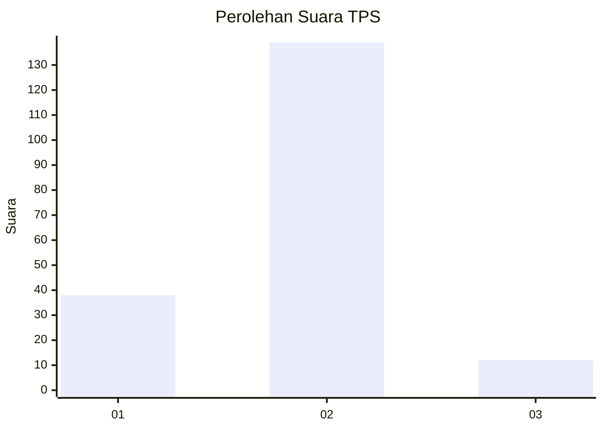

# Hasil

## Grafik

## Tabel

| No. | Nama Paslon    | Suara | Suara (raw) | Persentase |
|:--- |:-------------- | -----:| -----------:| ----------:|
| 1   | ANIES MUHAIMIN | 38    | [38][p-1]   | 20,11      |
| 2   | PRABOWO GIBRAN | 139   | [139][p-2]  | 73,54      |
| 3   | GANJAR MAHFUD  | 12    | [12][p-3]   | 6,35       |

[p-1]: https://github.com/gigit-pemilu/pemilu-2024/blob/main/pilpres/hitung-suara/sub/36-banten/sub/03-tangerang/sub/32-gunung-kaler/sub/2006-onyam/sub/010-tps/sub/paslon-1.txt
[p-2]: https://github.com/gigit-pemilu/pemilu-2024/blob/main/pilpres/hitung-suara/sub/36-banten/sub/03-tangerang/sub/32-gunung-kaler/sub/2006-onyam/sub/010-tps/sub/paslon-2.txt
[p-3]: https://github.com/gigit-pemilu/pemilu-2024/blob/main/pilpres/hitung-suara/sub/36-banten/sub/03-tangerang/sub/32-gunung-kaler/sub/2006-onyam/sub/010-tps/sub/paslon-3.txt

## Foto C Plano

https://sirekap-obj-formc.kpu.go.id/ec3d/pemilu/ppwp/36/03/32/20/06/3603322006010-20240225-110134--f0c2d58f-afac-4add-8b52-74789a804f4d.jpg

https://sirekap-obj-formc.kpu.go.id/ec3d/pemilu/ppwp/36/03/32/20/06/3603322006010-20240225-110230--22358917-0df3-45cf-99f2-fde59c9ea5ef.jpg

https://sirekap-obj-formc.kpu.go.id/ec3d/pemilu/ppwp/36/03/32/20/06/3603322006010-20240225-110316--9d4c4807-a596-49a1-a222-642affb0989e.jpg

## Metadata

| Key        | Value               |
| ---------- | ------------------- |
| Time Stamp | 2024-02-25 20:00:00 |

## DATA PEMILIH TETAP

Jumlah pemilih dalam DPT: **222**.
 * L: **442**.
 * P: **640**.

## DATA PENGGUNA HAK PILIH

Jumlah pengguna hak pilih dalam DPT: **695**.
 * L: **895**.
 * P: **200**.

Jumlah pengguna hak pilih dalam DPTb: **8**.
 * L: **888**.
 * P: **50**.

Jumlah pengguna hak pilih dalam DPK: **8**.
 * L: **80**.
 * P: **88**.

Jumlah pengguna hak pilih: **595**.
 * L: **895**.
 * P: **600**.

## JUMLAH SUARA SAH DAN TIDAK SAH

JUMLAH SELURUH SUARA SAH: **189**.

JUMLAH SUARA TIDAK SAH: **6**.

JUMLAH SELURUH SUARA SAH DAN SUARA TIDAK SAH: **195**.

