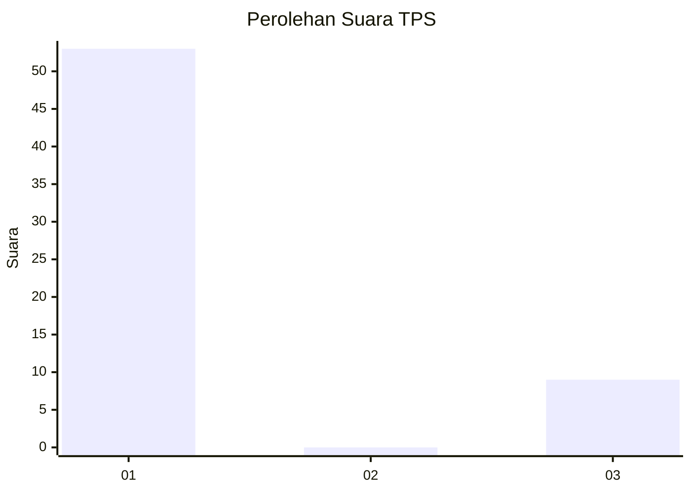
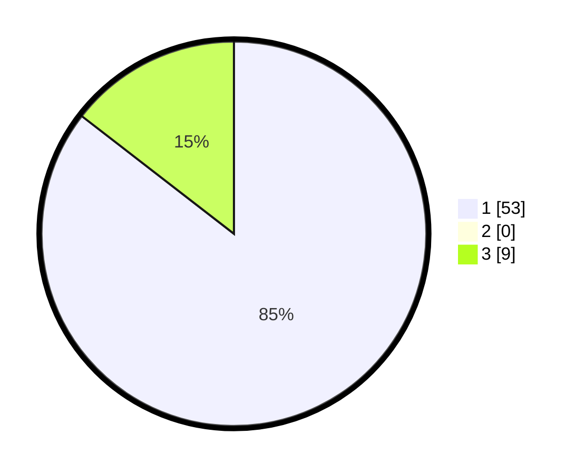

# Hasil

## Grafik

## Tabel

| No. | Nama Paslon    | Suara | Suara (raw) | Persentase |
|:--- |:-------------- | -----:| -----------:| ----------:|
| 1   | ANIES MUHAIMIN | 53    | [53][p-1]   | 85,48      |
| 2   | PRABOWO GIBRAN | 0     | [0][p-2]    | 0,00       |
| 3   | GANJAR MAHFUD  | 9     | [9][p-3]    | 14,52      |

[p-1]: https://github.com/gigit-pemilu/pemilu-2024-36-banten/blob/main/pilpres/hitung-suara/sub/36-banten/sub/03-tangerang/sub/32-gunung-kaler/sub/2007-tamiang/sub/007-tps/sub/paslon-1.txt
[p-2]: https://github.com/gigit-pemilu/pemilu-2024-36-banten/blob/main/pilpres/hitung-suara/sub/36-banten/sub/03-tangerang/sub/32-gunung-kaler/sub/2007-tamiang/sub/007-tps/sub/paslon-2.txt
[p-3]: https://github.com/gigit-pemilu/pemilu-2024-36-banten/blob/main/pilpres/hitung-suara/sub/36-banten/sub/03-tangerang/sub/32-gunung-kaler/sub/2007-tamiang/sub/007-tps/sub/paslon-3.txt

## Foto C Plano

https://sirekap-obj-formc.kpu.go.id/83c7/pemilu/ppwp/36/03/32/20/07/3603322007007-20240224-131626--733f627a-b2cb-4764-8489-d790df178d78.jpg

https://sirekap-obj-formc.kpu.go.id/83c7/pemilu/ppwp/36/03/32/20/07/3603322007007-20240224-131739--29b7c143-55be-44fb-9bf9-a044810e9e8d.jpg

https://sirekap-obj-formc.kpu.go.id/83c7/pemilu/ppwp/36/03/32/20/07/3603322007007-20240224-131844--29cfc760-c966-4f85-bb6c-6c4448c06e7c.jpg

## Metadata

| Key        | Value               |
| ---------- | ------------------- |
| Time Stamp | 2024-02-24 22:31:28 |

## DATA PEMILIH TETAP

Jumlah pemilih dalam DPT: **125**.
 * L: **97**.
 * P: **8**.

## DATA PENGGUNA HAK PILIH

Jumlah pengguna hak pilih dalam DPT: **454**.
 * L: **71**.
 * P: **93**.

Jumlah pengguna hak pilih dalam DPTb: **80**.
 * L: **88**.
 * P: **88**.

Jumlah pengguna hak pilih dalam DPK: **0**.
 * L: **880**.
 * P: **80**.

Jumlah pengguna hak pilih: **554**.
 * L: **4**.
 * P: **97**.

## JUMLAH SUARA SAH DAN TIDAK SAH

JUMLAH SELURUH SUARA SAH: **383**.

JUMLAH SUARA TIDAK SAH: **2**.

JUMLAH SELURUH SUARA SAH DAN SUARA TIDAK SAH: **364**.

