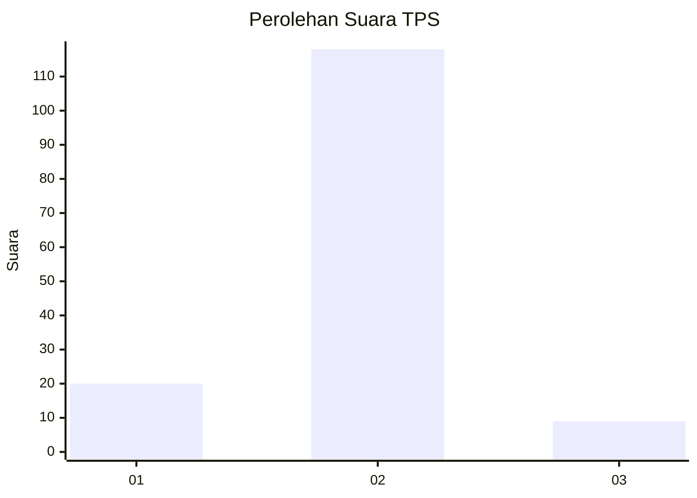
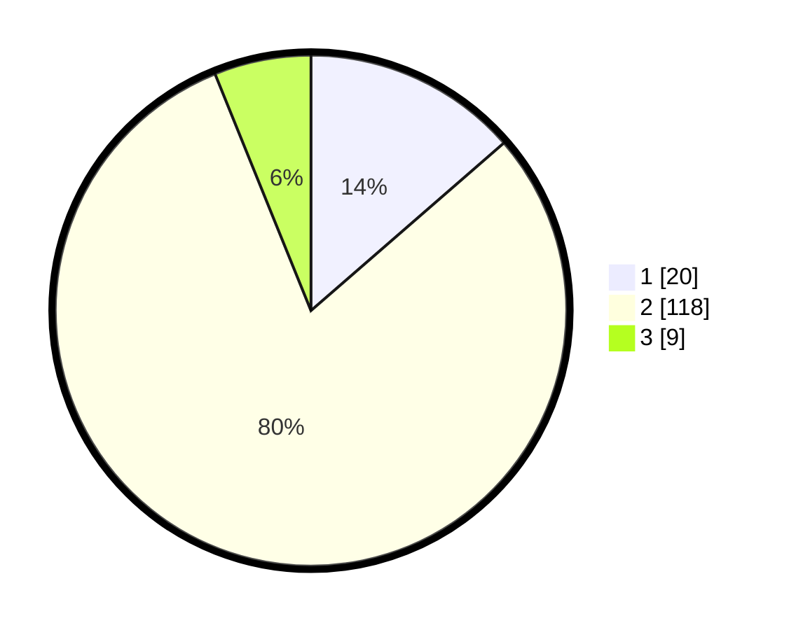

# Hasil

## Grafik

## Tabel

| No. | Nama Paslon    | Suara | Suara (raw) | Persentase |
|:--- |:-------------- | -----:| -----------:| ----------:|
| 1   | ANIES MUHAIMIN | 20    | [20][p-1]   | 13,61      |
| 2   | PRABOWO GIBRAN | 118   | [118][p-2]  | 80,27      |
| 3   | GANJAR MAHFUD  | 9     | [9][p-3]    | 6,12       |

[p-1]: https://github.com/gigit-pemilu/pemilu-2024-36-banten/blob/main/pilpres/hitung-suara/sub/36-banten/sub/03-tangerang/sub/32-gunung-kaler/sub/2007-tamiang/sub/011-tps/sub/paslon-1.txt
[p-2]: https://github.com/gigit-pemilu/pemilu-2024-36-banten/blob/main/pilpres/hitung-suara/sub/36-banten/sub/03-tangerang/sub/32-gunung-kaler/sub/2007-tamiang/sub/011-tps/sub/paslon-2.txt
[p-3]: https://github.com/gigit-pemilu/pemilu-2024-36-banten/blob/main/pilpres/hitung-suara/sub/36-banten/sub/03-tangerang/sub/32-gunung-kaler/sub/2007-tamiang/sub/011-tps/sub/paslon-3.txt

## Foto C Plano

https://sirekap-obj-formc.kpu.go.id/f56c/pemilu/ppwp/36/03/32/20/07/3603322007011-20240225-104310--5a24cc06-560c-4484-97ae-d5d2c193f78e.jpg

https://sirekap-obj-formc.kpu.go.id/f56c/pemilu/ppwp/36/03/32/20/07/3603322007011-20240225-104616--c351d169-4599-49e4-bf92-4c5dcdbc2e23.jpg

https://sirekap-obj-formc.kpu.go.id/f56c/pemilu/ppwp/36/03/32/20/07/3603322007011-20240225-104740--b7d04b12-b6a3-4a5b-aa48-e3ca1ef4bdd6.jpg

## Metadata

| Key        | Value               |
| ---------- | ------------------- |
| Time Stamp | 2024-02-25 19:00:00 |

## DATA PEMILIH TETAP

Jumlah pemilih dalam DPT: **145**.
 * L: **100**.
 * P: **894**.

## DATA PENGGUNA HAK PILIH

Jumlah pengguna hak pilih dalam DPT: **615**.
 * L: **587**.
 * P: **723**.

Jumlah pengguna hak pilih dalam DPTb: **0**.
 * L: **280**.
 * P: **0**.

Jumlah pengguna hak pilih dalam DPK: **888**.
 * L: **5**.
 * P: **2**.

Jumlah pengguna hak pilih: **168**.
 * L: **82**.
 * P: **289**.

## JUMLAH SUARA SAH DAN TIDAK SAH

JUMLAH SELURUH SUARA SAH: **147**.

JUMLAH SUARA TIDAK SAH: **14**.

JUMLAH SELURUH SUARA SAH DAN SUARA TIDAK SAH: **161**.

