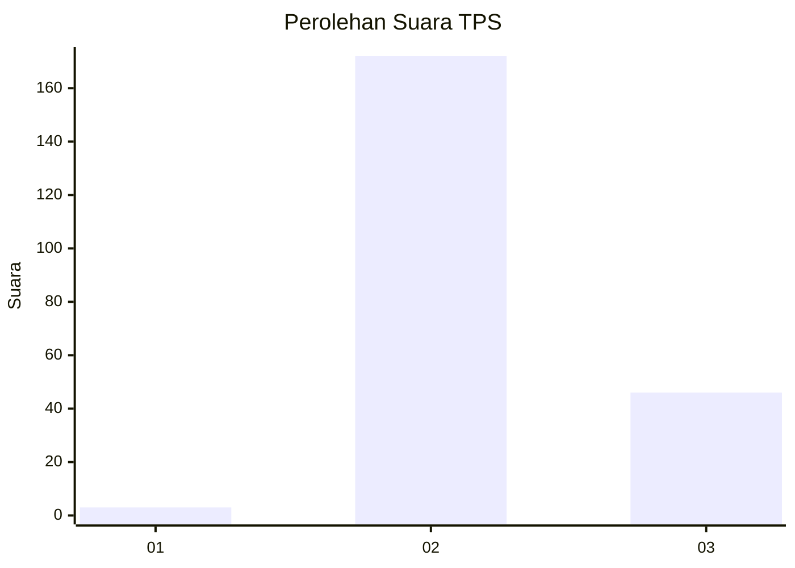

# Hasil

## Grafik

## Tabel

| No. | Nama Paslon    | Suara | Suara (raw) | Persentase |
|:--- |:-------------- | -----:| -----------:| ----------:|
| 1   | ANIES MUHAIMIN | 3     | [3][p-1]    | 1,36       |
| 2   | PRABOWO GIBRAN | 172   | [172][p-2]  | 77,83      |
| 3   | GANJAR MAHFUD  | 46    | [46][p-3]   | 20,81      |

[p-1]: https://github.com/gigit-pemilu/pemilu-2024/blob/main/pilpres/hitung-suara/sub/36-banten/sub/03-tangerang/sub/32-gunung-kaler/sub/2007-tamiang/sub/026-tps/sub/paslon-1.txt
[p-2]: https://github.com/gigit-pemilu/pemilu-2024/blob/main/pilpres/hitung-suara/sub/36-banten/sub/03-tangerang/sub/32-gunung-kaler/sub/2007-tamiang/sub/026-tps/sub/paslon-2.txt
[p-3]: https://github.com/gigit-pemilu/pemilu-2024/blob/main/pilpres/hitung-suara/sub/36-banten/sub/03-tangerang/sub/32-gunung-kaler/sub/2007-tamiang/sub/026-tps/sub/paslon-3.txt

## Foto C Plano

https://sirekap-obj-formc.kpu.go.id/e2fb/pemilu/ppwp/36/03/32/20/07/3603322007026-20240224-135225--2a931697-080d-44a3-a2c3-cde0bee3485c.jpg

https://sirekap-obj-formc.kpu.go.id/e2fb/pemilu/ppwp/36/03/32/20/07/3603322007026-20240224-135331--7445ca19-50a7-4d2c-91ca-adadce734be3.jpg

https://sirekap-obj-formc.kpu.go.id/e2fb/pemilu/ppwp/36/03/32/20/07/3603322007026-20240224-135435--47d35bc0-9efc-4eab-b918-3164a59938a4.jpg

## Metadata

| Key        | Value               |
| ---------- | ------------------- |
| Time Stamp | 2024-02-24 22:31:28 |

## DATA PEMILIH TETAP

Jumlah pemilih dalam DPT: **143**.
 * L: **193**.
 * P: **875**.

## DATA PENGGUNA HAK PILIH

Jumlah pengguna hak pilih dalam DPT: **145**.
 * L: **888**.
 * P: **865**.

Jumlah pengguna hak pilih dalam DPTb: **828**.
 * L: **262**.
 * P: **488**.

Jumlah pengguna hak pilih dalam DPK: **2**.
 * L: **446**.
 * P: **807**.

Jumlah pengguna hak pilih: **147**.
 * L: **481**.
 * P: **866**.

## JUMLAH SUARA SAH DAN TIDAK SAH

JUMLAH SELURUH SUARA SAH: **135**.

JUMLAH SUARA TIDAK SAH: **835**.

JUMLAH SELURUH SUARA SAH DAN SUARA TIDAK SAH: **547**.

