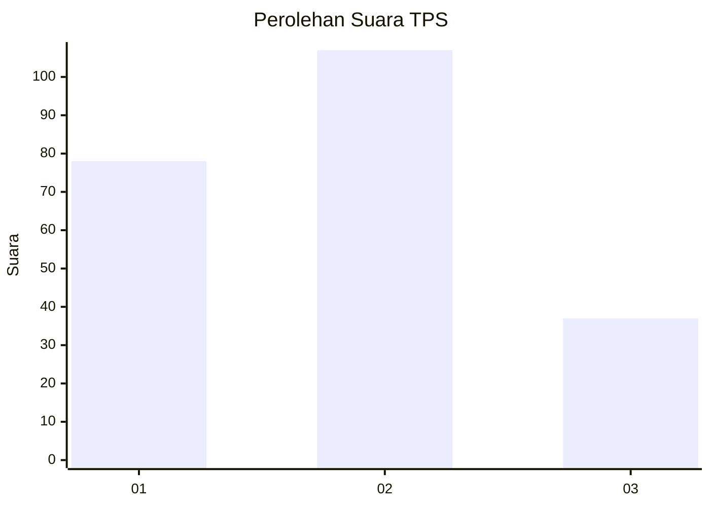
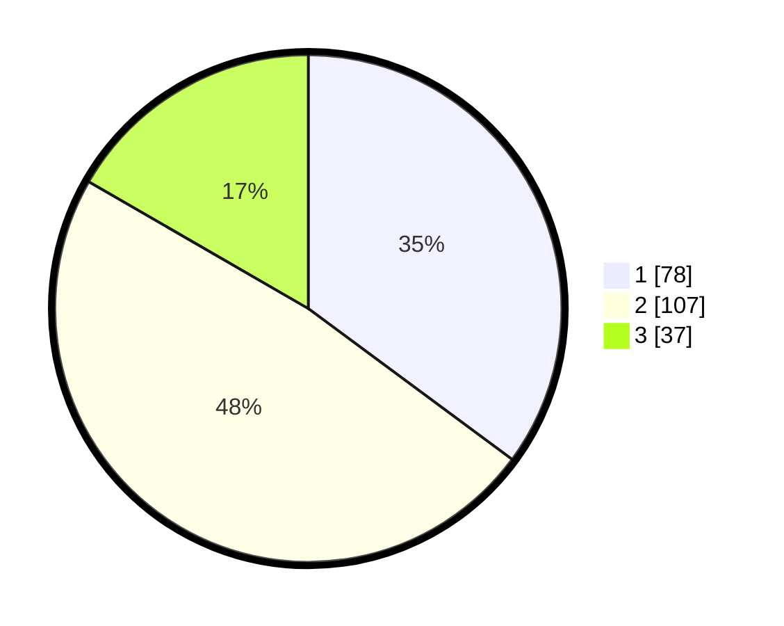

# Hasil

## Grafik

## Tabel

| No. | Nama Paslon    | Suara | Suara (raw) | Persentase |
|:--- |:-------------- | -----:| -----------:| ----------:|
| 1   | ANIES MUHAIMIN | 78    | [78][p-1]   | 35,14      |
| 2   | PRABOWO GIBRAN | 107   | [107][p-2]  | 48,20      |
| 3   | GANJAR MAHFUD  | 37    | [37][p-3]   | 16,67      |

[p-1]: https://github.com/gigit-pemilu/pemilu-2024-36-banten/blob/main/pilpres/hitung-suara/sub/36-banten/sub/03-tangerang/sub/33-mekar-baru/sub/2001-mekar-baru/sub/001-tps/sub/paslon-1.txt
[p-2]: https://github.com/gigit-pemilu/pemilu-2024-36-banten/blob/main/pilpres/hitung-suara/sub/36-banten/sub/03-tangerang/sub/33-mekar-baru/sub/2001-mekar-baru/sub/001-tps/sub/paslon-2.txt
[p-3]: https://github.com/gigit-pemilu/pemilu-2024-36-banten/blob/main/pilpres/hitung-suara/sub/36-banten/sub/03-tangerang/sub/33-mekar-baru/sub/2001-mekar-baru/sub/001-tps/sub/paslon-3.txt

## Foto C Plano

https://sirekap-obj-formc.kpu.go.id/bd4e/pemilu/ppwp/36/03/33/20/01/3603332001001-20240220-164020--b77835ad-76ba-454e-8334-26c51b9a6eed.jpg

https://sirekap-obj-formc.kpu.go.id/bd4e/pemilu/ppwp/36/03/33/20/01/3603332001001-20240220-164053--8929a83c-54c3-434b-8b9d-77abe74b8d79.jpg

https://sirekap-obj-formc.kpu.go.id/bd4e/pemilu/ppwp/36/03/33/20/01/3603332001001-20240220-164136--be43b992-e0f8-4d27-b91a-189213655239.jpg

## Metadata

| Key        | Value               |
| ---------- | ------------------- |
| Time Stamp | 2024-02-22 13:00:00 |

