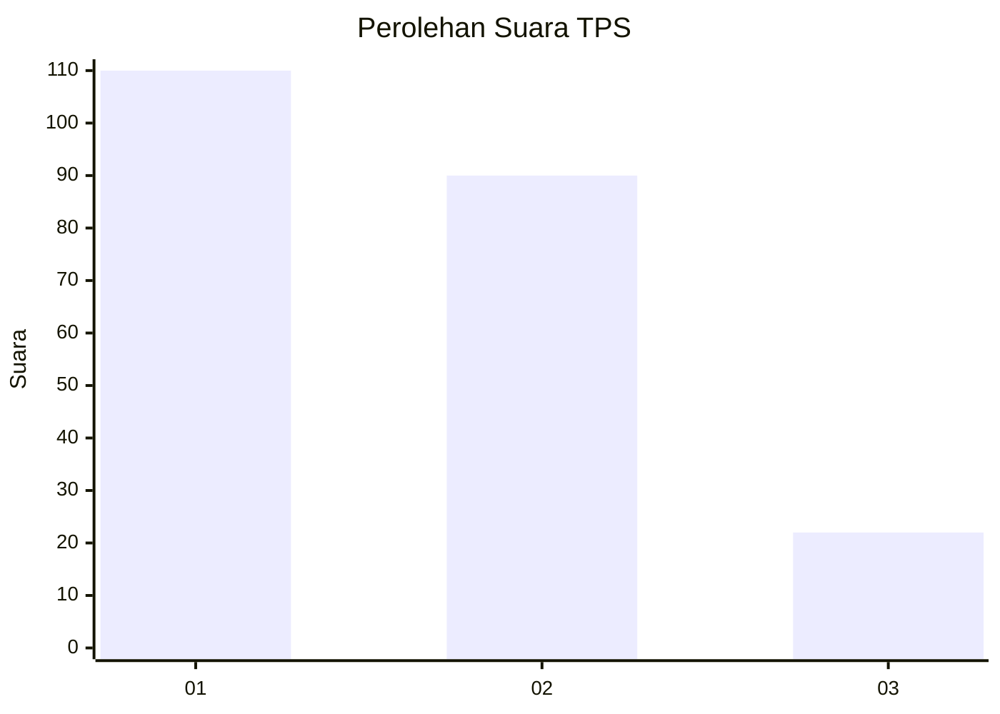
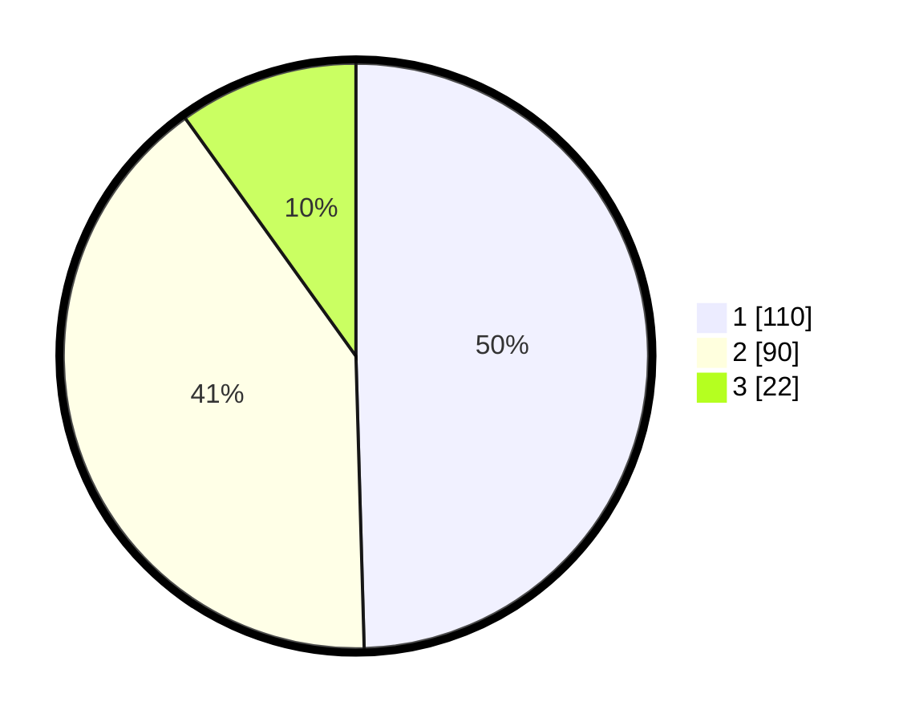

# Hasil

## Grafik

## Tabel

| No. | Nama Paslon    | Suara | Suara (raw) | Persentase |
|:--- |:-------------- | -----:| -----------:| ----------:|
| 1   | ANIES MUHAIMIN | 110   | [110][p-1]  | 49,55      |
| 2   | PRABOWO GIBRAN | 90    | [90][p-2]   | 40,54      |
| 3   | GANJAR MAHFUD  | 22    | [22][p-3]   | 9,91       |

[p-1]: https://github.com/gigit-pemilu/pemilu-2024-36-banten/blob/main/pilpres/hitung-suara/sub/36-banten/sub/03-tangerang/sub/33-mekar-baru/sub/2001-mekar-baru/sub/003-tps/sub/paslon-1.txt
[p-2]: https://github.com/gigit-pemilu/pemilu-2024-36-banten/blob/main/pilpres/hitung-suara/sub/36-banten/sub/03-tangerang/sub/33-mekar-baru/sub/2001-mekar-baru/sub/003-tps/sub/paslon-2.txt
[p-3]: https://github.com/gigit-pemilu/pemilu-2024-36-banten/blob/main/pilpres/hitung-suara/sub/36-banten/sub/03-tangerang/sub/33-mekar-baru/sub/2001-mekar-baru/sub/003-tps/sub/paslon-3.txt

## Foto C Plano

https://sirekap-obj-formc.kpu.go.id/9375/pemilu/ppwp/36/03/33/20/01/3603332001003-20240214-233916--3b98cac7-64dc-4ac2-870f-ac7a1117221a.jpg

https://sirekap-obj-formc.kpu.go.id/9375/pemilu/ppwp/36/03/33/20/01/3603332001003-20240214-155741--2cb2e8dd-e152-4f39-a59a-81174e4170d8.jpg

https://sirekap-obj-formc.kpu.go.id/9375/pemilu/ppwp/36/03/33/20/01/3603332001003-20240214-155819--339b1023-81f4-426c-9763-ed94d41fb7ce.jpg

## Metadata

| Key        | Value               |
| ---------- | ------------------- |
| Time Stamp | 2024-02-15 16:00:26 |

