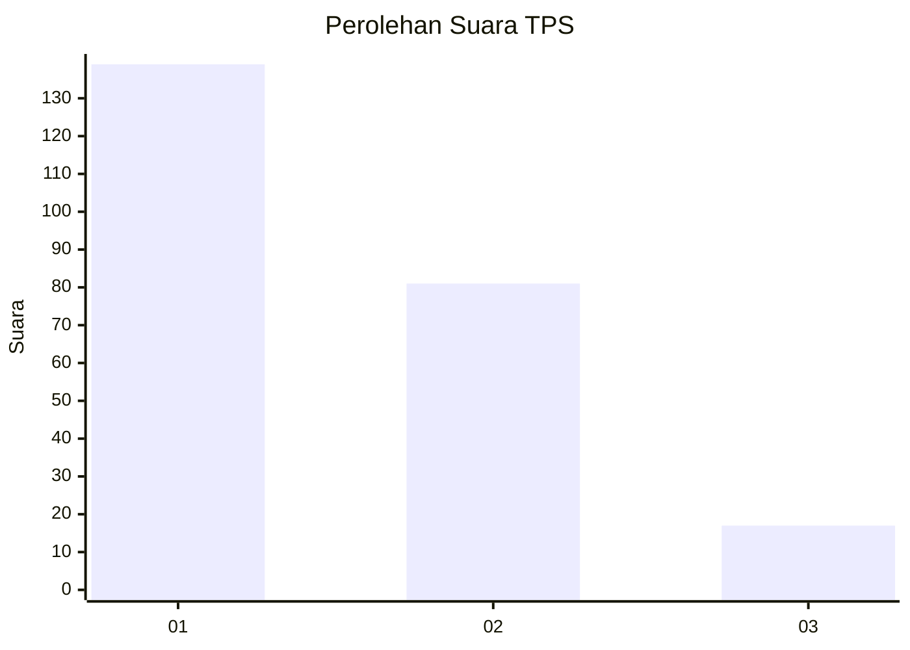
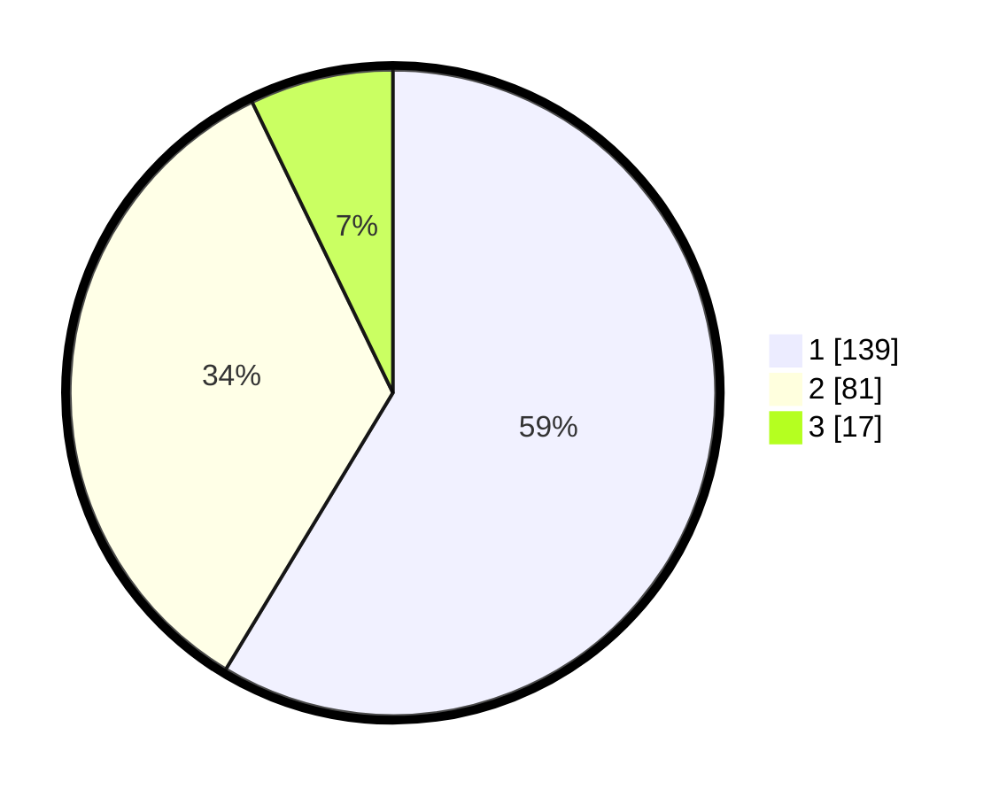

# Hasil

## Grafik

## Tabel

| No. | Nama Paslon    | Suara | Suara (raw) | Persentase |
|:--- |:-------------- | -----:| -----------:| ----------:|
| 1   | ANIES MUHAIMIN | 139   | [139][p-1]  | 58,65      |
| 2   | PRABOWO GIBRAN | 81    | [81][p-2]   | 34,18      |
| 3   | GANJAR MAHFUD  | 17    | [17][p-3]   | 7,17       |

[p-1]: https://github.com/gigit-pemilu/pemilu-2024/blob/main/pilpres/hitung-suara/sub/36-banten/sub/03-tangerang/sub/33-mekar-baru/sub/2001-mekar-baru/sub/004-tps/sub/paslon-1.txt
[p-2]: https://github.com/gigit-pemilu/pemilu-2024/blob/main/pilpres/hitung-suara/sub/36-banten/sub/03-tangerang/sub/33-mekar-baru/sub/2001-mekar-baru/sub/004-tps/sub/paslon-2.txt
[p-3]: https://github.com/gigit-pemilu/pemilu-2024/blob/main/pilpres/hitung-suara/sub/36-banten/sub/03-tangerang/sub/33-mekar-baru/sub/2001-mekar-baru/sub/004-tps/sub/paslon-3.txt

## Foto C Plano

https://sirekap-obj-formc.kpu.go.id/bbe5/pemilu/ppwp/36/03/33/20/01/3603332001004-20240220-164543--a9529d1a-7e34-48df-8dfe-24c42bb0e4bf.jpg

https://sirekap-obj-formc.kpu.go.id/bbe5/pemilu/ppwp/36/03/33/20/01/3603332001004-20240220-164702--4cca1fa1-13ea-4cb1-a162-cd3e6865b686.jpg

https://sirekap-obj-formc.kpu.go.id/bbe5/pemilu/ppwp/36/03/33/20/01/3603332001004-20240220-164818--0a3a9a1a-ec2f-4f6f-85fa-f0ba51e992e6.jpg

## Metadata

| Key        | Value               |
| ---------- | ------------------- |
| Time Stamp | 2024-02-25 02:00:00 |

