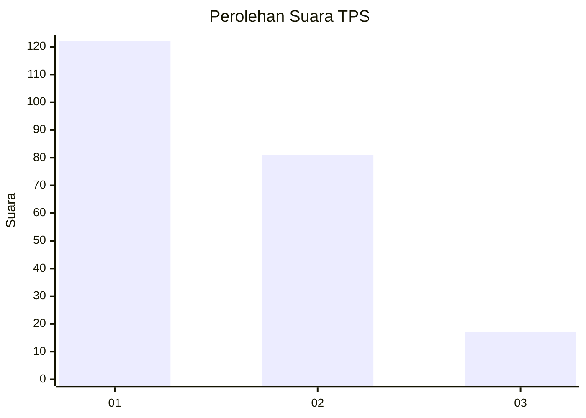
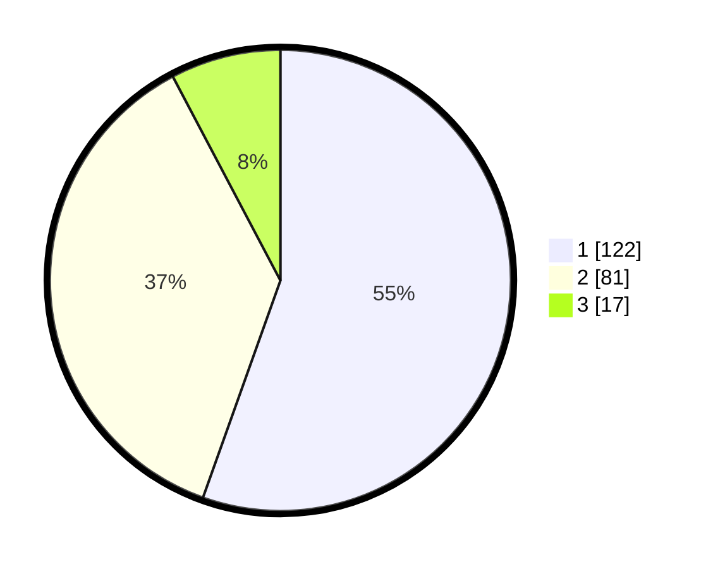

# Hasil

## Grafik

## Tabel

| No. | Nama Paslon    | Suara | Suara (raw) | Persentase |
|:--- |:-------------- | -----:| -----------:| ----------:|
| 1   | ANIES MUHAIMIN | 122   | [122][p-1]  | 55,45      |
| 2   | PRABOWO GIBRAN | 81    | [81][p-2]   | 36,82      |
| 3   | GANJAR MAHFUD  | 17    | [17][p-3]   | 7,73       |

[p-1]: https://github.com/gigit-pemilu/pemilu-2024-36-banten/blob/main/pilpres/hitung-suara/sub/36-banten/sub/03-tangerang/sub/33-mekar-baru/sub/2001-mekar-baru/sub/005-tps/sub/paslon-1.txt
[p-2]: https://github.com/gigit-pemilu/pemilu-2024-36-banten/blob/main/pilpres/hitung-suara/sub/36-banten/sub/03-tangerang/sub/33-mekar-baru/sub/2001-mekar-baru/sub/005-tps/sub/paslon-2.txt
[p-3]: https://github.com/gigit-pemilu/pemilu-2024-36-banten/blob/main/pilpres/hitung-suara/sub/36-banten/sub/03-tangerang/sub/33-mekar-baru/sub/2001-mekar-baru/sub/005-tps/sub/paslon-3.txt

## Foto C Plano

https://sirekap-obj-formc.kpu.go.id/34f9/pemilu/ppwp/36/03/33/20/01/3603332001005-20240220-165409--b0fccc2b-f3bf-4967-9864-ea08df7f67d2.jpg

https://sirekap-obj-formc.kpu.go.id/34f9/pemilu/ppwp/36/03/33/20/01/3603332001005-20240220-165520--f65ee2ea-1a7e-423b-b066-a9a761e78ebc.jpg

https://sirekap-obj-formc.kpu.go.id/34f9/pemilu/ppwp/36/03/33/20/01/3603332001005-20240220-165623--5300f094-463f-48d9-afef-46015c5673c3.jpg

## Metadata

| Key        | Value               |
| ---------- | ------------------- |
| Time Stamp | 2024-02-24 22:31:28 |

