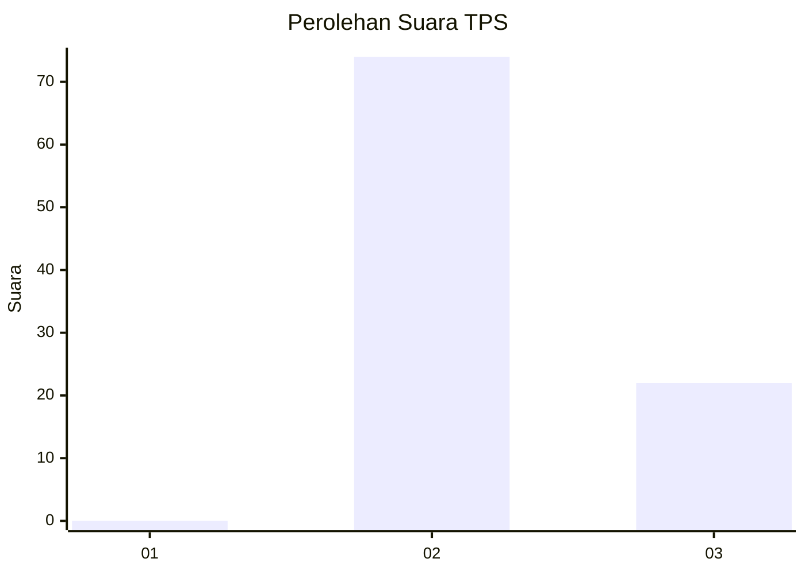
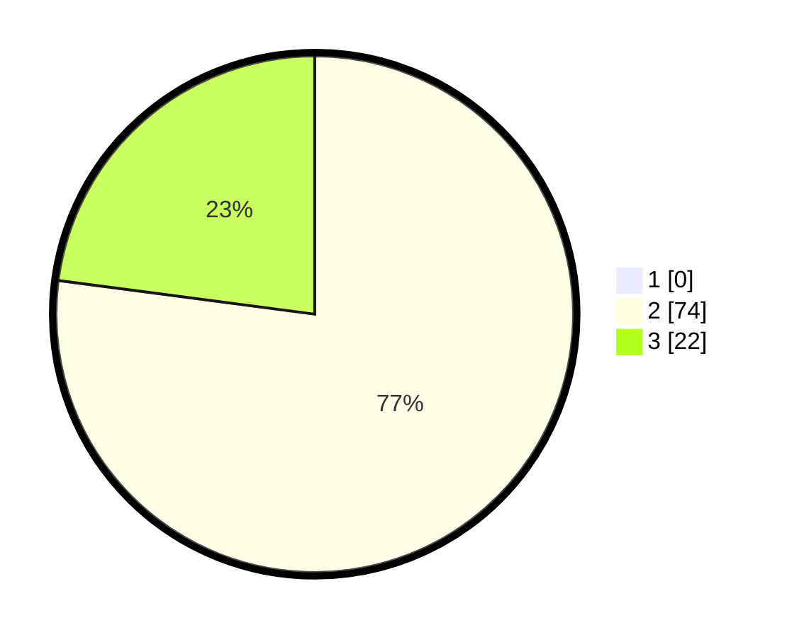

# Hasil

## Grafik

## Tabel

| No. | Nama Paslon    | Suara | Suara (raw) | Persentase |
|:--- |:-------------- | -----:| -----------:| ----------:|
| 1   | ANIES MUHAIMIN | 0     | [0][p-1]    | 0,00       |
| 2   | PRABOWO GIBRAN | 74    | [74][p-2]   | 77,08      |
| 3   | GANJAR MAHFUD  | 22    | [22][p-3]   | 22,92      |

[p-1]: https://github.com/gigit-pemilu/pemilu-2024-36-banten/blob/main/pilpres/hitung-suara/sub/36-banten/sub/03-tangerang/sub/33-mekar-baru/sub/2007-kosambi-dalam/sub/009-tps/sub/paslon-1.txt
[p-2]: https://github.com/gigit-pemilu/pemilu-2024-36-banten/blob/main/pilpres/hitung-suara/sub/36-banten/sub/03-tangerang/sub/33-mekar-baru/sub/2007-kosambi-dalam/sub/009-tps/sub/paslon-2.txt
[p-3]: https://github.com/gigit-pemilu/pemilu-2024-36-banten/blob/main/pilpres/hitung-suara/sub/36-banten/sub/03-tangerang/sub/33-mekar-baru/sub/2007-kosambi-dalam/sub/009-tps/sub/paslon-3.txt

## Foto C Plano

https://sirekap-obj-formc.kpu.go.id/7b01/pemilu/ppwp/36/03/33/20/07/3603332007009-20240220-182454--99891e4f-a819-4b4c-9403-5a6bd413000e.jpg

https://sirekap-obj-formc.kpu.go.id/7b01/pemilu/ppwp/36/03/33/20/07/3603332007009-20240220-182555--4709727e-110d-4b85-b79d-3c339dabed38.jpg

https://sirekap-obj-formc.kpu.go.id/7b01/pemilu/ppwp/36/03/33/20/07/3603332007009-20240220-182820--7176a530-37b8-4132-8bf1-b41fb1a39428.jpg

## Metadata

| Key        | Value               |
| ---------- | ------------------- |
| Time Stamp | 2024-02-20 19:00:00 |

## DATA PEMILIH TETAP

Jumlah pemilih dalam DPT: **280**.
 * L: **834**.
 * P: **447**.

## DATA PENGGUNA HAK PILIH

Jumlah pengguna hak pilih dalam DPT: **230**.
 * L: **85**.
 * P: **4**.

Jumlah pengguna hak pilih dalam DPTb: **880**.
 * L: **804**.
 * P: **0**.

Jumlah pengguna hak pilih dalam DPK: **5**.
 * L: **2**.
 * P: **3**.

Jumlah pengguna hak pilih: **228**.
 * L: **649**.
 * P: **447**.

## JUMLAH SUARA SAH DAN TIDAK SAH

JUMLAH SELURUH SUARA SAH: **208**.

JUMLAH SUARA TIDAK SAH: **865**.

JUMLAH SELURUH SUARA SAH DAN SUARA TIDAK SAH: **232**.

