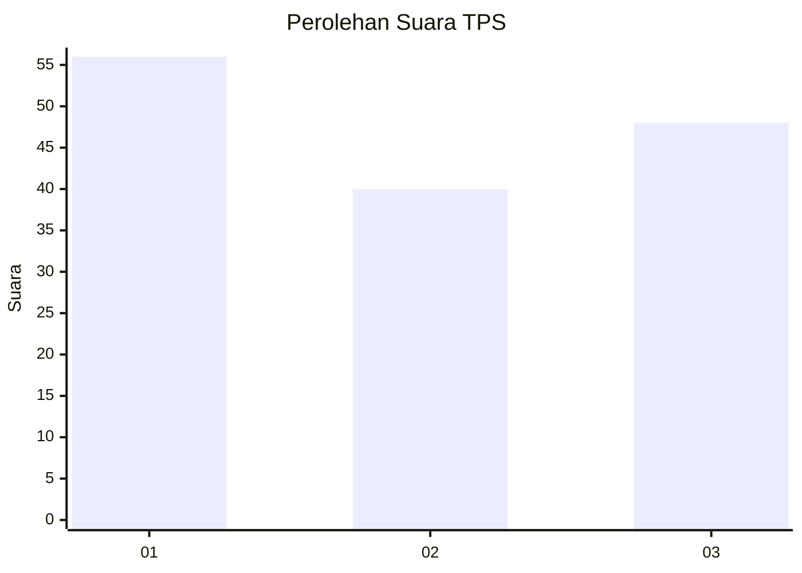
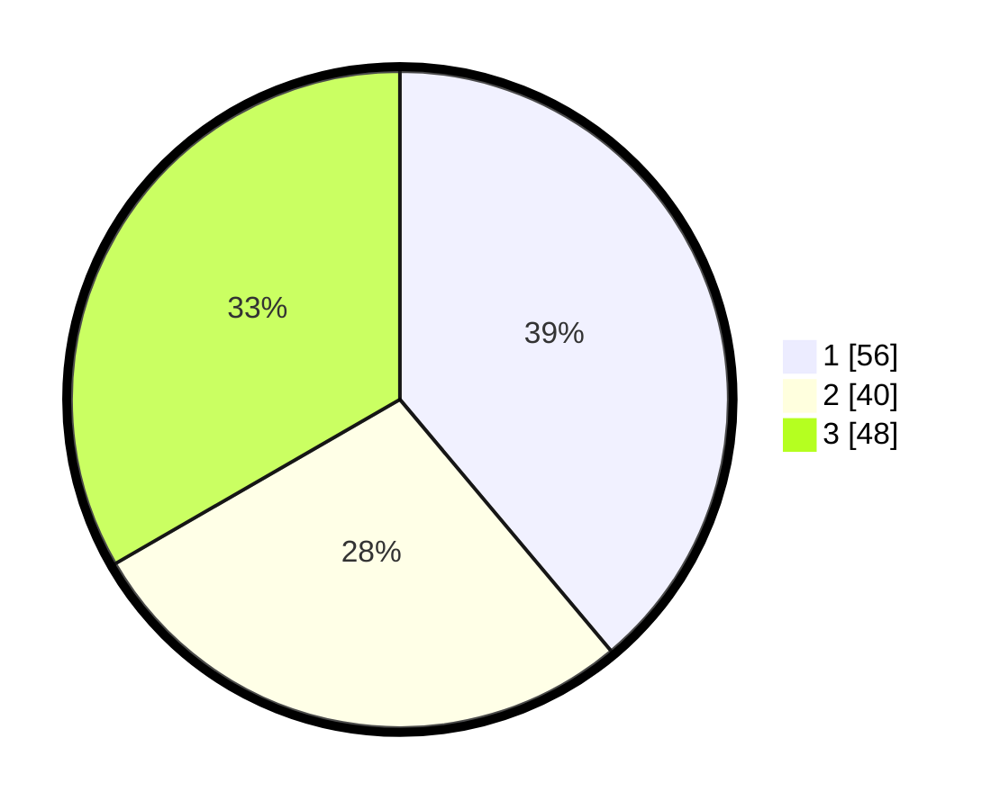

# Hasil

## Grafik

## Tabel

| No. | Nama Paslon    | Suara | Suara (raw) | Persentase |
|:--- |:-------------- | -----:| -----------:| ----------:|
| 1   | ANIES MUHAIMIN | 56    | [56][p-1]   | 38,89      |
| 2   | PRABOWO GIBRAN | 40    | [40][p-2]   | 27,78      |
| 3   | GANJAR MAHFUD  | 48    | [48][p-3]   | 33,33      |

[p-1]: https://github.com/gigit-pemilu/pemilu-2024-36-banten/blob/main/pilpres/hitung-suara/sub/36-banten/sub/03-tangerang/sub/33-mekar-baru/sub/2007-kosambi-dalam/sub/010-tps/sub/paslon-1.txt
[p-2]: https://github.com/gigit-pemilu/pemilu-2024-36-banten/blob/main/pilpres/hitung-suara/sub/36-banten/sub/03-tangerang/sub/33-mekar-baru/sub/2007-kosambi-dalam/sub/010-tps/sub/paslon-2.txt
[p-3]: https://github.com/gigit-pemilu/pemilu-2024-36-banten/blob/main/pilpres/hitung-suara/sub/36-banten/sub/03-tangerang/sub/33-mekar-baru/sub/2007-kosambi-dalam/sub/010-tps/sub/paslon-3.txt

## Foto C Plano

https://sirekap-obj-formc.kpu.go.id/8739/pemilu/ppwp/36/03/33/20/07/3603332007010-20240220-183449--ca86cd23-f107-4d0c-a3d5-8cfbeeb46463.jpg

https://sirekap-obj-formc.kpu.go.id/8739/pemilu/ppwp/36/03/33/20/07/3603332007010-20240220-183710--710c11f8-2444-4ffc-adb6-4be82918fdf4.jpg

https://sirekap-obj-formc.kpu.go.id/8739/pemilu/ppwp/36/03/33/20/07/3603332007010-20240220-184037--a3cb270d-1178-48df-bbe6-2afada221e11.jpg

## Metadata

| Key        | Value               |
| ---------- | ------------------- |
| Time Stamp | 2024-02-20 19:00:00 |

## DATA PEMILIH TETAP

Jumlah pemilih dalam DPT: **272**.
 * L: **427**.
 * P: **425**.

## DATA PENGGUNA HAK PILIH

Jumlah pengguna hak pilih dalam DPT: **220**.
 * L: **644**.
 * P: **406**.

Jumlah pengguna hak pilih dalam DPTb: **888**.
 * L: **88**.
 * P: **888**.

Jumlah pengguna hak pilih dalam DPK: **884**.
 * L: **888**.
 * P: **888**.

Jumlah pengguna hak pilih: **220**.
 * L: **64**.
 * P: **906**.

## JUMLAH SUARA SAH DAN TIDAK SAH

JUMLAH SELURUH SUARA SAH: **549**.

JUMLAH SUARA TIDAK SAH: **800**.

JUMLAH SELURUH SUARA SAH DAN SUARA TIDAK SAH: **220**.

