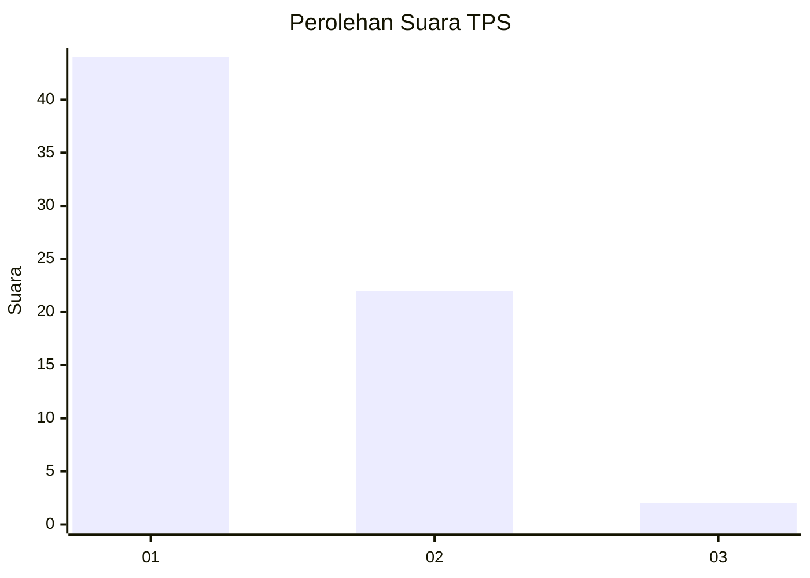
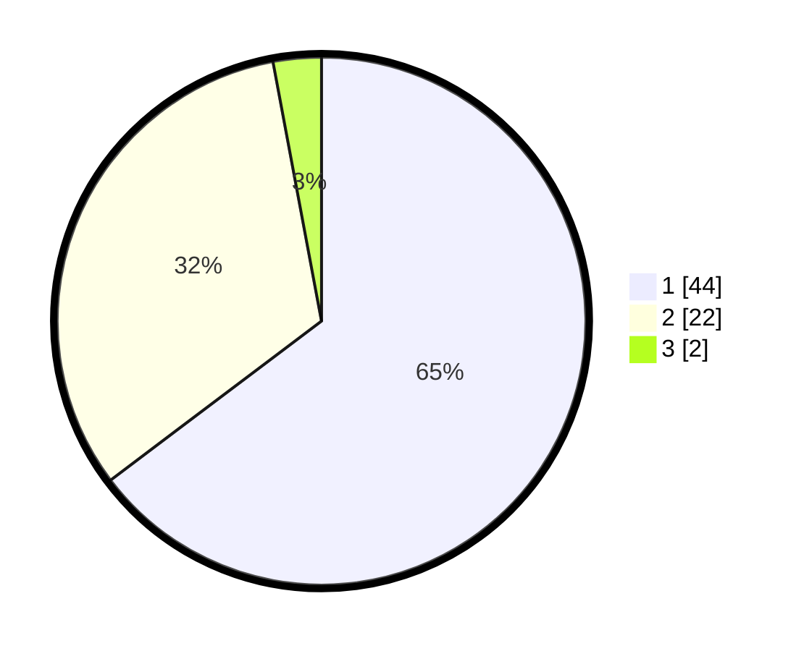

# Hasil

## Grafik

## Tabel

| No. | Nama Paslon    | Suara | Suara (raw) | Persentase |
|:--- |:-------------- | -----:| -----------:| ----------:|
| 1   | ANIES MUHAIMIN | 44    | [44][p-1]   | 64,71      |
| 2   | PRABOWO GIBRAN | 22    | [22][p-2]   | 32,35      |
| 3   | GANJAR MAHFUD  | 2     | [2][p-3]    | 2,94       |

[p-1]: https://github.com/gigit-pemilu/pemilu-2024-36-banten/blob/main/pilpres/hitung-suara/sub/36-banten/sub/03-tangerang/sub/33-mekar-baru/sub/2007-kosambi-dalam/sub/021-tps/sub/paslon-1.txt
[p-2]: https://github.com/gigit-pemilu/pemilu-2024-36-banten/blob/main/pilpres/hitung-suara/sub/36-banten/sub/03-tangerang/sub/33-mekar-baru/sub/2007-kosambi-dalam/sub/021-tps/sub/paslon-2.txt
[p-3]: https://github.com/gigit-pemilu/pemilu-2024-36-banten/blob/main/pilpres/hitung-suara/sub/36-banten/sub/03-tangerang/sub/33-mekar-baru/sub/2007-kosambi-dalam/sub/021-tps/sub/paslon-3.txt

## Foto C Plano

https://sirekap-obj-formc.kpu.go.id/c299/pemilu/ppwp/36/03/33/20/07/3603332007021-20240220-184902--03b3676f-11b1-49cf-a570-b644991da428.jpg

https://sirekap-obj-formc.kpu.go.id/c299/pemilu/ppwp/36/03/33/20/07/3603332007021-20240220-185009--9bf80f46-f8e3-45c5-897c-408e6df0a7ca.jpg

https://sirekap-obj-formc.kpu.go.id/c299/pemilu/ppwp/36/03/33/20/07/3603332007021-20240220-185447--ad26ee52-5f3d-4874-9d91-b48d4f108905.jpg

## Metadata

| Key        | Value               |
| ---------- | ------------------- |
| Time Stamp | 2024-02-20 19:00:00 |

## DATA PEMILIH TETAP

Jumlah pemilih dalam DPT: **225**.
 * L: **442**.
 * P: **623**.

## DATA PENGGUNA HAK PILIH

Jumlah pengguna hak pilih dalam DPT: **242**.
 * L: **822**.
 * P: **20**.

Jumlah pengguna hak pilih dalam DPTb: **888**.
 * L: **880**.
 * P: **888**.

Jumlah pengguna hak pilih dalam DPK: **884**.
 * L: **882**.
 * P: **882**.

Jumlah pengguna hak pilih: **246**.
 * L: **24**.
 * P: **622**.

## JUMLAH SUARA SAH DAN TIDAK SAH

JUMLAH SELURUH SUARA SAH: **244**.

JUMLAH SUARA TIDAK SAH: **882**.

JUMLAH SELURUH SUARA SAH DAN SUARA TIDAK SAH: **246**.

